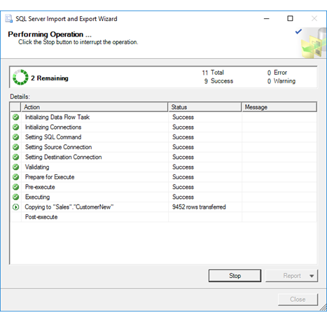
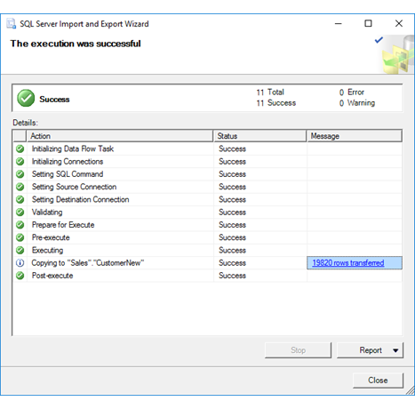

# Performing Operation (SQL Server Import and Export Wizard)
After you review the choices that you made in the wizard and click **Finish** on the **Complete the Wizard** page, the [!INCLUDE[ssNoVersion](../../includes/ssnoversion-md.md)] Import and Export Wizard shows **Performing Operation**. On this page, you see the progress and the result of the operation that you configured on the preceding pages. You don't have to take any action on this page.

## Screen shot - Operation in progress 
 The following screen shot shows the **Performing Operation** page of the wizard while the operation is still in progress.  
  
   

## Screen shot - Operation completed 
 The following screen shot shows the **Performing Operation** page of the wizard after the operation is complete. Click on an item in the **Message** column to get more info about the corresponding step.  
  
   
  
## Watch the progress of the operation
 **Action**  
 Displays each step of the operation.  
  
 **Status**  
 Displays the success or failure of each step.  
  
 **Message**  
 Displays informational and error messages about the step. Click on an item in this column to get more info about the corresponding step.

## Interrupt the operation or save the results
 **Stop**  
 Interrupt the operation, if necessary, by clicking the **Stop** button.  
  
 **Report**  
 View a report of the results, save the report to a file, copy the report to the clipboard, or send the report by e-mail.  
  
## What's next?  
 After the operation that you configured runs and completes successfully, you're finished running the [!INCLUDE[ssNoVersion](../../includes/ssnoversion-md.md)] Import and Export Wizard.  
-   If you ran the operation immediately, you can open the destination that you selected to review the data that the wizard copied.  
-   If you saved the SSIS package created by the wizard, you can open it in SQL Server Data Tools to customize it and reuse it. For info about how to customize the saved package and run it again later, see [Save SSIS Package](../../integration-services/import-export-data/save-ssis-package-sql-server-import-and-export-wizard.md).

## See also
[Get started with this simple example of the Import and Export Wizard](../../integration-services/import-export-data/get-started-with-this-simple-example-of-the-import-and-export-wizard.md)

