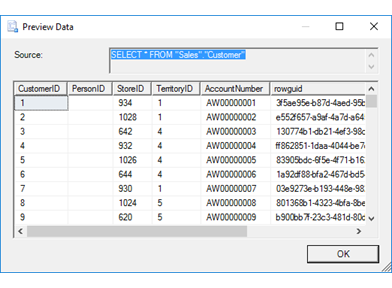

# Preview Data Dialog Box (SQL Server Import and Export Wizard)

[!INCLUDE[ssis-appliesto](../../includes/ssis-appliesto-ssvrpluslinux-asdb-asdw-xxx.md)]

  After you specify the data that you want to copy, you can optionally click **Preview** to open the **Preview Data** dialog box. On this page, you can preview up to 200 rows of sample data from your data source. This confirms that the wizard is going to copy the data that you want to copy.
  
## Screen shot of the Preview Data page 
 The following screen shot shows the **Preview Data** dialog box of the Wizard.  
 
  
  
## Preview sample data  
 **Source**  
Displays the query that the wizard is using to load data from the data source.

If you selected a table to copy, the **Source** field displays a `SELECT * FROM <table>` query instead of the table name. 
  
 **Sample data grid**  
 Displays up to 200 rows of sample data that the query returns from the data source.  

## That's not right, I want to change something
After you preview the data, you may want to change the options that you selected on previous pages of the wizard. To make these changes, click **OK** to return to the  **Select Source Tables and Views** page, and then click **Back** to return to previous pages where you can change your selections.

## What's next?  
 After you preview the data that you're going to copy and click **OK**, the **Preview Data dialog** box returns you to the **Select Source Tables and Views** page or the **Configure Flat File Destination** page. For more info, see [Select Source Tables and Views](../../integration-services/import-export-data/select-source-tables-and-views-sql-server-import-and-export-wizard.md) or [Configure Flat File Destination](../../integration-services/import-export-data/configure-flat-file-destination-sql-server-import-and-export-wizard.md).  
 
 ## See also
[Get started with this simple example of the Import and Export Wizard](../../integration-services/import-export-data/get-started-with-this-simple-example-of-the-import-and-export-wizard.md)
