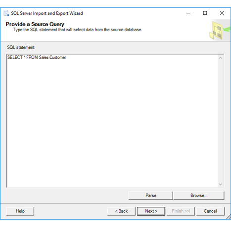

# Provide a Source Query (SQL Server Import and Export Wizard)
If you specified that you want to provide a query to select the data to copy, the [!INCLUDE[ssNoVersion](../../includes/ssnoversion-md.md)] Import and Export Wizard shows **Provide a Source Query**. On this page, you write and test the SQL query that selects the data to copy from the data source to the destination. You can also paste the text of a saved query, or load the query text from a file.

## Screen shot of the Source Query page  
The following screen shot shows the **Provide a Source Query** page of the Wizard.
 
In this simple example, the user has entered the query `SELECT * FROM Sales.Customer` to copy all rows and all columns from the **Sales.Customer** table in the source database.
-   `SELECT *` means copy all columns.
-   The absence of a `WHERE` clause means copy all rows.
  
   

## Provide the query and check its syntax
**SQL statement**  
 Type a SELECT query to retrieve specific rows and columns of data from the source database. You can also paste the text of a saved query, or load the query from a file by clicking **Browse**. 
  
 For example, the following query retrieves the **SalesPersonID**, **SalesQuota**, and **SalesYTD** from the AdventureWorks sample database for sales persons whose commission percentage is more than 1.5 percent.  
  
```sql
SELECT SalesPersonID, SalesQuota, SalesYTD  
FROM Sales.SalesPerson  
WHERE CommissionPct > 0.015  
```  

For more examples of SELECT queries, see [SELECT Examples &#40;Transact-SQL&#41;](../../t-sql/queries/select-examples-transact-sql.md) or search online.  

If your data source is Excel, see [Provide a source query for Excel](#excelQueries) later in this topic to learn how to specify Excel worksheets and ranges in a query.
  
 **Parse**  
 Check the syntax of the SQL statement that you entered in the **SQL statement** text box.  
  
> [!NOTE]
> If the time that's required to check the syntax of the statement exceeds the timeout value of 30 seconds, parsing stops and raises an error. You won't be able to move past this page of the wizard until parsing succeeds. One solution to avoid a timeout is to create a database view based on the query that you want to use, and then to query the view from the wizard, instead of entering the query text directly.  
  
 **Browse**  
 Select a saved file that contains the text of a SQL query by using the **Open** dialog box. Selecting a file copies the text from the file into the **SQL statement** text box.  
 
## <a name="excelQueries"></a> Provide a source query for Excel

> [!IMPORTANT]
> For detailed info about connecting to Excel files, and about limitations and known issues for loading data from or to Excel files, see [Load data from or to Excel with SQL Server Integration Services (SSIS)](../load-data-to-from-excel-with-ssis.md).

There are three types of Excel objects that you can query.
-   **Worksheet.** To query a worksheet, append the $ character to the end of the sheet name and add delimiters around the string - for example, **[Sheet1$]**.

    ```sql
    SELECT * FROM [Sheet1$]
    ```

-   **Named range.** To query a named range, simply use the range name - for example, **MyDataRange**.
    
    ```sql
    SELECT * FROM MyDataRange
    ```

-   **Unnamed range.** To specify a range of cells that you haven't named, append the $ character to the end of the sheet name, add the range specification, and add delimiters around the string - for example, **[Sheet1$A1:B4]**.

    ```sql
    SELECT * FROM [Sheet1$A1:B4]
    ```

## What's next?  
 After you write and test the SQL query that selects the data to copy, the next page depends on the destination for your data.  
  
-   For most destinations the next page is **Select Source Tables and Views**. On this page, you review the query that you provided and optionally choose columns to copy and preview sample data. For more info, see [Select Source Tables and Views](../../integration-services/import-export-data/select-source-tables-and-views-sql-server-import-and-export-wizard.md).  
  
-   If your destination is a flat file, the next page is **Configure Flat File Destination**. On this page, you specify formatting options for the destination flat file. (After you configure the flat file, the next page is then **Select Source Tables and Views**.) For more info, see [Configure Flat File Destination](../../integration-services/import-export-data/configure-flat-file-destination-sql-server-import-and-export-wizard.md).  


