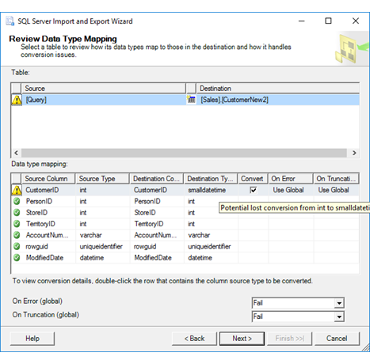
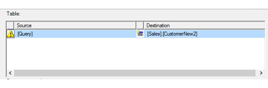
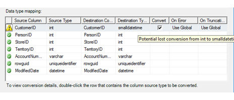

# Review Data Type Mapping (SQL Server Import and Export Wizard)

[!INCLUDE[sqlserver-ssis](../../includes/applies-to-version/sqlserver-ssis.md)]

If you specified a data type mapping that may not succeed in the **Mappings** list of the **Column Mappings** dialog box, the [!INCLUDE[ssNoVersion](../../includes/ssnoversion-md.md)] Import and Export Wizard shows the **Review Data Type Mapping** page. On this page, you review detailed information about data type conversions that the wizard has to perform to make the source data compatible with the destination. This information includes visual cues to distinguish data type conversions that are expected to succeed from conversions that may cause errors or truncations. For each conversion, you decide whether to accept the conversion that the wizard suggests, and you specify how to handle any errors that may occur.   
  
> [!TIP]
> You can't change data type mappings on the **Review Data Type Mapping** page. However, you can click **Back** to return to the **Select Source Tables and Views** page, and then click **Edit Mappings** to open the **Column Mappings** dialog box again. In the **Column Mappings** dialog box, you can specify data type mappings that are more likely to succeed. To take another look at the **Column Mappings** dialog box, see [Column Mappings](../../integration-services/import-export-data/column-mappings-sql-server-import-and-export-wizard.md).  
  
## Screen shot of the Review Data Type Mapping page
 The following screen shot shows an example of the **Review Data Type Mapping** page of the wizard.
 
 In this example:
 -   The user has specified a mapping in the **Column Mappings** dialog box that may not succeed.
 -   The warning icon on the row in the **Table** list indicates that there is a problem converting at least one column of data from the query results to a compatible data type in the destination table.
 -   The warning icon on the first row in the **Data type mapping** list indicates that the mapping from the **int** data type of the source column to the **smalldatetime** data type of the destination column may cause a loss of data.
 
  
 
## Review the source and destination tables  
 The upper section of the **Review Data Type Mapping** page is a **Table** list that lists the tables to be copied from the source to the destination. To see conversion information about an individual table, select a table in the **Table** list. The conversion information for the individual columns of the selected table appears in the lower part of the page in the **Data type mapping** grid.

In this example, the results of the query that the user provided will be copied to the Sales.CustomerNew2 table at the destination. The warning icon indicates that there is a problem converting at least one column of data from the query results to a compatible data type in the destination table.

  
 The following table describes the columns in the **Table** list.  
  
|Column|Description|  
|------------|-----------------|  
|(Source icon)|Indicates the probability of success for the data type conversions:  -   A **green** check mark icon indicates that the wizard expects all data type conversions for this table to succeed. -   A **yellow** warning icon indicates that you should review the individual conversions that the wizard will perform. To review these conversions, select the table, and then review the conversions for individual columns in the **Data type mapping** list. -   A **red** error icon indicates that the wizard is not able to perform some of the conversions for this table reliably.|  
|**Source**|The name of the source table.|  
|(Destination icon)|Indicates whether the destination already exists or will be created by the wizard:  -   A table icon indicates that the destination is an existing table. -   A table icon with a sunburst indicates that the destination is a new table that the wizard will create.|  
|**Destination**|The name of the destination table.|  
  
## Review the data type mappings  
 The middle section of the **Review Data Type Mapping** page is the **Data type mapping** list. This grid provides detailed conversion information about the columns in the source table that's selected in the **Table** list in the upper part of the page.

In this example, each column at the source will be copied to a column with the same name and data type at the destination. The warning icon on the first row in the **Data type mapping** list indicates that the mapping from the **int** data type of the source column to the **smalldatetime** data type of the destination column may cause a loss of data.
 
  

The following table describes the columns in the **Data type mapping** list. 

|Column|Description|  
|------------|-----------------|  
|(Conversion icon)|Indicates the probability of success for the data type conversions:  -   A **green** check mark icon indicates that the wizard expects the data type conversion for this column to succeed. -   A **yellow** warning icon indicates that you should review the conversion that the wizard will perform. To review the conversion, double-click on the column to view the **Column Conversion Details** dialog box. For more info, see [Column Conversion Details Dialog Box](../../integration-services/import-export-data/column-conversion-details-dialog-box-sql-server-import-and-export-wizard.md). -   A **red** error icon indicates that the wizard is not able to perform the conversion reliably.|  
|**Source Column**|The name of the source column.|  
|**Source Type**|The data type of the source column.|  
|**Destination Column**|The name of the destination column.|  
|**Destination Type**|The data type of the destination column.|  
|**Convert**|Specify whether to continue with the planned conversion:  -   Select the check box to have the wizard continue with the planned conversion. -   Clear the check box to cancel the data type conversion.|  
|**On Error**|Specify how the wizard handles errors:  -   Use the **On Error (global)** setting, which you can specify at the bottom of this page. -   Fail with an error, and stop the import or export process. -   Ignore the error.|  
|**On Truncation**|Specify how the wizard handles truncation:  -   Use the **On Truncation (global)** setting, which you can specify at the bottom of this page. -   Fail with an error, and stop the import or export process -   Ignore the truncation.|  

> [!TIP]
> To see detailed information about the conversion of a particular column of data, double-click any row in the list. The **Column Conversion Details** dialog box opens and displays more detailed conversion information for the column. For more info, see [Column Conversion Details Dialog Box](../../integration-services/import-export-data/column-conversion-details-dialog-box-sql-server-import-and-export-wizard.md).
 
## Specify global error handling options  
 The lower section of the **Review Data Type Mapping** page lets you specify error handling options that apply by default to all columns. These settings apply to all conversions that have **Use Global** selected in the **On Error** or **On Truncation** columns of the **Data type mapping** list.   

This example shows the default values for the two global error handling options.

 **On Error (global)**  
 Specify how the wizard handles errors:  
 -   Fail with an error, and stop the import or export process. This is the default value.
 -   Ignore the error, and continue the import or export process.  
  
 **On Truncation (global)**  
 Specify how the wizard handles data truncation:  
 -   Fail with an error, and stop the import or export process. This is the default value.
 -   Ignore the truncation, and continue the import or export process.  
   
## What's next?  
 After you review the warnings, specify conversion options, and specify how to handle errors, the **Review Data Type Mapping** page takes you back to the **Column Mappings** dialog box. For more info, see [Column Mappings](../../integration-services/import-export-data/column-mappings-sql-server-import-and-export-wizard.md).  
 
 ## See also
[Data Type Mapping in the SQL Server Import and Export Wizard](../../integration-services/import-export-data/data-type-mapping-in-the-sql-server-import-and-export-wizard.md)

