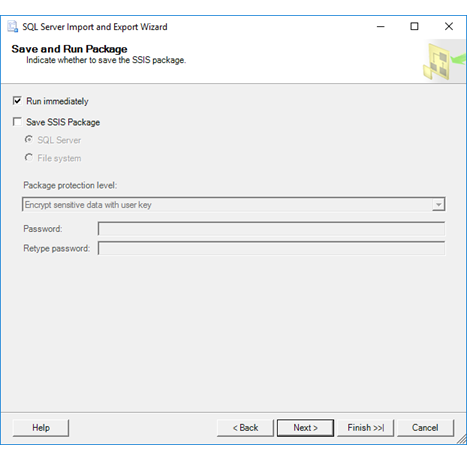

# Save and Run Package (SQL Server Import and Export Wizard)
  After you specify and configure your data source and destination, the [!INCLUDE[ssNoVersion](../../includes/ssnoversion-md.md)] Import and Export Wizard shows **Save and Run Package**. On this page, you specify whether you want to run the copy operation immediately. Depending on your configuration, you may also be able to save your settings as a [!INCLUDE[ssNoVersion](../../includes/ssnoversion-md.md)] [!INCLUDE[ssISnoversion](../../includes/ssisnoversion-md.md)] (SSIS) package to customize it and to reuse it later.
  
**What's a package?** The Wizard uses SQL Server Integration Services (SSIS) to copy data. In SSIS, the basic unit is the package. The wizard creates an SSIS package in memory as you move through the pages of the wizard and specify options.
  
## Screen shot of the Save and Run Package page  
The following screen shot shows the **Save and Run Package** page of the wizard. 
   
 
  
## Run and save the package 
 To continue, you have to select at least one of the following two options.  
  
 **Run immediately**  
 Select this option to import and export data immediately. By default, this check box is selected and the operation runs immediately.
  
 **Save SSIS Package**  
 Save your settings as an SSIS package. Later you can optionally customize the package and run it again. If you choose to save the package, there are additional options on the next page, **Save SSIS Package**.
 
The option to save the package is available only if you have [!INCLUDE[ssNoVersion](../../includes/ssnoversion-md.md)] Standard Edition or a higher edition installed.   
  
> [!NOTE]
> If you finish the wizard, run the operation, but stop the operation before it finishes running, the package is not saved, even if you selected the **Save SSIS Package** check box.  

### If you started the wizard from Visual Studio
If you started the wizard from an Integration Services project in Visual Studio with SQL Server Data Tools (SSDT):
-   You can't **run** the package until after you exit the wizard. Then you can run the package from Visual Studio.
-   The wizard **saves** the package in the Integration Services project from which you started the wizard.

## Specify options for saving the package
**SQL Server**  
 Select this option to save the package in SQL Server in the **msdb** database in the **sysssispackages** table.
 
> [!IMPORTANT]
> This option does not save the package to the SSIS Catalog database (SSISDB).  

 You select the target server and provide credentials to connect to the server on the next page, **Save SSIS Package**. For more info, see [Save SSIS Package](../../integration-services/import-export-data/save-ssis-package-sql-server-import-and-export-wizard.md).  
  
 **File system**  
 Select this option to save the package as a file with the **.dtsx** extension.  
  
 You select the target folder and file name for the package on the next page, **Save SSIS Package**. For more info, see [Save SSIS Package](../../integration-services/import-export-data/save-ssis-package-sql-server-import-and-export-wizard.md).  
 
 ## Specify the package protection level
 **Package protection level**  
 Select a protection level from the list to help protect the data in the package.  
  
 The protection level determines the protection method, the password or user key, and the scope of package protection. Protection can include all data or sensitive data only. For more info about the available options, see [Access Control for Sensitive Data in Packages](../../integration-services/security/access-control-for-sensitive-data-in-packages.md).  
  
 **Password**  
 Type a password.  
  
 **Retype password**  
 Type the password again.  
  
> [!NOTE]
> The password options are available only if specify a **Package protection level** that requires a password - that is, if you specify either **Encrypt sensitive data with password** or **Encrypt all data with password**.  

## About the two pages of options for saving the package  
 The **Save and Run Package** page is one of two pages on which you pick options for saving the SSIS package.  
  
-   On the current page, you pick whether to save the package in SQL Server or as a file. You also pick security settings for the saved package.  
  
-   Next, on the **Save SSIS Package** page, you provide a name for the package and more info about where to save it. For more info, see [Save SSIS Package](../../integration-services/import-export-data/save-ssis-package-sql-server-import-and-export-wizard.md).  
  
 These options are available only if you select the **Save SSIS Package** option on this page.  
  
## What's next?  
 After you specify whether to run the copy operation immediately and whether to save the package, the next page depends on the options that you choose.  
  
-   If you selected the option to run the package immediately, but not to save it, the next page is **Complete the Wizard**. On this page, you review the choices that you made in the wizard, and then start the copy operation. For more info, see [Complete the Wizard](../../integration-services/import-export-data/complete-the-wizard-sql-server-import-and-export-wizard.md).  
  
-   If you selected the option to save the package, the next page is **Save SSIS Package**. On this page, you specify additional options for saving the package. (Then, after you save the package, the following page is **Complete the Wizard**.) For more info, see [Save SSIS Package](../../integration-services/import-export-data/save-ssis-package-sql-server-import-and-export-wizard.md).  
  
## See Also  
[Save Packages](../../integration-services/save-packages.md)  
[Run Integration Services (SSIS) Packages](../../integration-services/packages/run-integration-services-ssis-packages.md)  
[SQL Server Integration Services](../../integration-services/sql-server-integration-services.md)  
[Get started with this simple example of the Import and Export Wizard](../../integration-services/import-export-data/get-started-with-this-simple-example-of-the-import-and-export-wizard.md)

  

