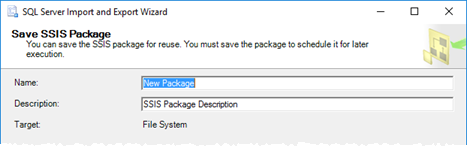
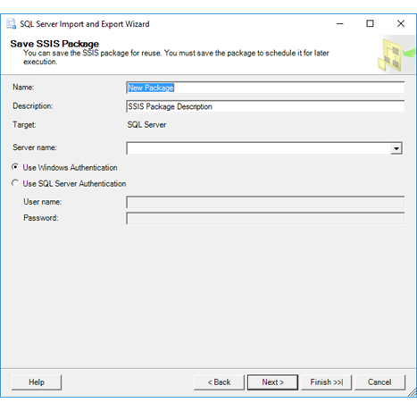
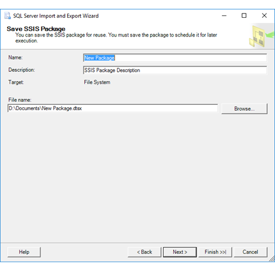

# Save SSIS Package (SQL Server Import and Export Wizard)
  If you specified on the **Save and Run Package** page that you want to save your settings as a SQL Server Integration Services (SSIS) package, the [!INCLUDE[ssNoVersion](../../includes/ssnoversion-md.md)] Import and Export Wizard shows **Save SSIS Package**. On this page, you specify additional options for saving the package created by the wizard.  

The options that you see on the **Save SSIS Package** page depend on the choice that you made previously on the **Save and Run Package** page to save the package to SQL Server or to the file system. To take another look at the **Save and Run Package** page, see [Save and Run Package](../../integration-services/import-export-data/save-and-run-package-sql-server-import-and-export-wizard.md).
 
**What's a package?** The Wizard uses SQL Server Integration Services (SSIS) to copy data. In SSIS, the basic unit is the package. The wizard creates an SSIS package in memory as you move through the pages of the wizard and specify options.

## Screen shot - Common options
The following screen shot shows the first part of the **Save SSIS Package** page of the wizard. The rest of the  page has a variable number of options which depend on the package destination that you chose.

## Provide a name and description for the package  
 **Name**  
 Provide a unique name for the package.  
  
 **Description**  
 Provide a description for the package. As a best practice, describe the purpose of the package, to make packages self-documenting and easier to maintain.  
  
 **Target**  
 The destination ( [!INCLUDE[ssNoVersion](../../includes/ssnoversion-md.md)] or File system) that you previously specified for the package. If you want to save the package to a different destination, go back to the **Save and Run Package** page.

## Screen shot - Save the package in SQL Server

 The following screen shot shows the **Save SSIS Package** page of the wizard if you selected the **SQL Server** option on the **Save and Run Package** page. 
  
  

## Options to specify (Target = SQL Server) 

 > [!NOTE]
 > The wizard saves the package in the **msdb** database in the **sysssispackages** table. This option does **not** save the package to the SSIS Catalog database (SSISDB).  
 
 **Server name**  
 Type or select the destination server name.  
   
 **Use Windows Authentication**  
Connect to the server by using Windows Integrated Authentication. This is the preferred authentication method.  
  
 **Use SQL Server Authentication**  
Connect to the server by using SQL Server Authentication.  
  
 **User name**  
If you specified SQL Server Authentication, enter the user name.  
  
 **Password**  
If you specified SQL Server Authentication, enter the password.  
    
## Screen shot - Save the package in the file system
 
The following screen shot shows the **Save SSIS Package** page of the wizard if you selected the **File system** option on the **Save and Run Package** page. 
  
  

## Options to specify (Target = File system)

 **File name**  
 Enter the path and filename for the destination file, or use the **Browse** button to select a destination.  
  
> [!TIP]
> Be sure to specify a destination folder, either by entering it or by browsing. If you only enter the filename without a path, you don't know where the wizard saves the package. Also, the wizard may try to save the package to a location where you don't have permission to save a file, and raise an error.  
>   
>  Remember where you save the package file.  
  
 **Browse**  
 Optionally, browse to select the path for the destination file in the **Save Package** dialog box.  

## About the two pages of options for saving the package  
 The **Save SSIS Package** page is one of two pages on which you pick options for saving the SSIS package.  
  
-   On the previous page, **Save and Execute Package**, you pick whether to save the package in SQL Server or as a file. You also pick security settings for the saved package. To take another look at the **Save and Run Package** page, see [Save and Run Package](../../integration-services/import-export-data/save-and-run-package-sql-server-import-and-export-wizard.md).  
  
-   On the current page, you provide a name for the package and more info about where to save it.  
 
## Run the saved package again later  
 To learn how to run the saved package again later, see one the following topics.  
  
-   To run a package by using a utility program with a friendly user interface, see [Execute Package Utility &#40;DtExecUI&#41; UI Reference](../../integration-services/packages/execute-package-utility-dtexecui-ui-reference.md).  
  
-   To run a package from the command line or from a batch file, see [dtexec Utility](../../integration-services/packages/dtexec-utility.md).  
  
-   If you saved the package in SQL Server in the **msdb** database, connect to the Integration Services service. Then, in SQL Server Management Studio, in Object Explorer, navigate to **Stored Packages | MSDB**, right-click on the package, and select **Run Package**.

-   If you saved the package in the file system, see [Run Integration Services (SSIS) Packages](../../integration-services/packages/run-integration-services-ssis-packages.md) to run the package in the development environment. You have to add the package to an Integration Services project before you can open and run it.  

## Customize the saved package  
 To learn how to customize the saved package, see [Integration Services &#40;SSIS&#41; Packages](../../integration-services/integration-services-ssis-packages.md).  
  
## What's next?  
 After you specify additional options for saving the package, the next page is **Complete the Wizard**. On this page, you review the choices that you made in the wizard, and then you start the operation. For more info, see [Complete the Wizard](../../integration-services/import-export-data/complete-the-wizard-sql-server-import-and-export-wizard.md).  
 
## See Also  
[Save Packages](../../integration-services/save-packages.md)  
[Run Integration Services (SSIS) Packages](../../integration-services/packages/run-integration-services-ssis-packages.md)  
[SQL Server Integration Services](../../integration-services/sql-server-integration-services.md)
 
 
