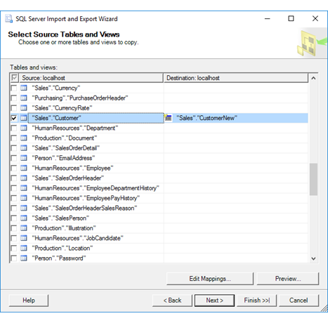
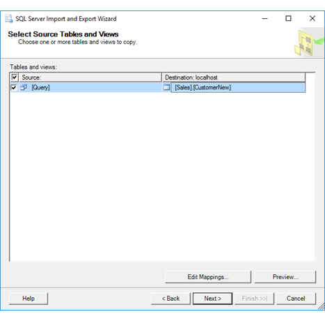

# Select Source Tables and Views (SQL Server Import and Export Wizard)
  After you specify that you want to copy an entire table, or after you provide a query, the [!INCLUDE[ssNoVersion](../../includes/ssnoversion-md.md)] Import and Export Wizard shows **Select Source Tables and Views**. On this page, you select the existing tables and views that you want to copy. Then you map the source tables to new or existing destination tables. Optionally, you also review the mapping of individual columns and preview sample data.

> [!TIP]
> If you have to copy more than one SQL Server database, or SQL Server database objects other than tables and views, use the Copy Database Wizard instead of the Import and Export Wizard. For more info, see [Use the Copy Database Wizard](../../relational-databases/databases/use-the-copy-database-wizard.md).  
  
## Screen shot - If you're going to copy tables  
 The following screen shot shows an example of the **Select Source Tables and Views** page of the wizard when you previously selected the **Copy data from one or more tables or views** option on the **Specify Table Copy or Query** page. In the list you see all the tables and views available from the data source.
 
In this example, the **Source** list contains all the tables in the AdventureWorks sample database. The selected row shows that the user wants to copy the **Sales.Customer** table from the source to the new **Sales.CustomerNew** table at the destination. 
   
 
  
## Screen shot - If you provided a query  
 The following screen shot shows an example of the **Select Source Tables and Views** page of the wizard when you previously selected the **Write a query to specify the data to transfer** option on the **Specify Table Copy or Query** page. The **Source** list contains only a single row, where the item named `[Query]` represents the query that you provided on the **Provide a Source Query** page.
 
In this example, the user wants to copy the query results from the source to the **Sales.CustomerNew** table at the destination.  
    
   

## Select source and destination tables 
**Source**  
Using the check boxes, select from the list of available tables and views to copy to the destination. By default, data from the data source is copied without changes. If you create a new destination table, the schema for the new table - that is, the list of columns and their properties - is also copied without change from the data source.

If you provided a query, the list contains only one item with the name `[Query]`. 

**Destination**  
 Select a destination table from the list for each source table or query, or enter the name of a new table that you want the wizard to create. If you select an existing destination table, the table has to have columns with data types that are compatible with the source data.  

> [!NOTE]
> If you pause at this point in the wizard to create a new table manually in the destination database by using an external tool (such as  [!INCLUDE[ssManStudioFull](../../includes/ssmanstudiofull-md.md)]), the new table is not immediately visible in the list of available destination tables. To refresh the list of destination tables, step back to the **Choose a Destination** page, re-select the destination database to refresh the list of available tables and views, and then step forward again to the **Select Source Tables and Views** page.  

## Optionally, review column mappings and preview data
**Edit mappings**   
Optionally, click **Edit mappings** to display the **Column Mappings** dialog box for the selected table. Use the **Column Mappings** dialog box to do the following things,
-   Review the mapping of individual columns between the source and the destination.
-   Copy only a subset of columns by selecting **ignore** for columns that you don't want to copy.

For more info, see [Column Mappings](../../integration-services/import-export-data/column-mappings-sql-server-import-and-export-wizard.md).  

**Preview**  
Optionally, click **Preview** to preview up to 200 rows of sample data in the **Preview Data** dialog box. This confirms that the wizard is going to copy the data that you want to copy. For more info, see [Preview Data](../../integration-services/import-export-data/preview-data-dialog-box-sql-server-import-and-export-wizard.md).  
  
After you preview the data, you may want to change the options that you selected on previous pages of the wizard. To make these changes, return to the **Select Source Tables and Views** page, and then click **Back** to return to previous pages where you can change your selections.  

## Select source and destination tables for Excel

> [!IMPORTANT]
> For detailed info about connecting to Excel files, and about limitations and known issues for loading data from or to Excel files, see [Load data from or to Excel with SQL Server Integration Services (SSIS)](../load-data-to-from-excel-with-ssis.md).

### Excel source tables
The list of source tables and views for an Excel data source includes two types of Excel objects.
-   **Worksheets**. Worksheet names are followed by the dollar sign ($) - for example, **'Sheet1$'**.
-   **Named ranges.** Named ranges, if any, are listed by name.

If you want to load data from or to a specific, unnamed range of cells - for example, from or to **[Sheet1$A1:B4]**, you have to write a query. Step back to the **Specify Table Copy or Query** page and select **Write a query to specify the data to transfer**.

### Excel destination tables
If you are exporting data to Excel, you can specify the destination in one of the following three ways.
-   **Worksheet.** To specify a worksheet, append the $ character to the end of the sheet name and add delimiters around the string - for example, **[Sheet1$]**.
-   **Named range.** To specify a named range, simply use the range name - for example, **MyDataRange**.
-   **Unnamed range.** To specify a range of cells that you haven't named, append the $ character to the end of the sheet name, add the range specification, and add delimiters around the string - for example, **[Sheet1$A1:B4]**.

> [!TIP]
> When you're using Excel as a source or destination, it's a good idea to click **Edit Mappings** and to review the data type mappings on the **Column Mappings** page. 

## What's next?  
 After you select the existing tables and views to copy and map them to their destinations, the next page is **Save and Run Package**. On this page, you specify whether you want to run the copy operation immediately. Depending on your configuration, you may also be able to save the [!INCLUDE[ssNoVersion](../../includes/ssnoversion-md.md)] [!INCLUDE[ssISnoversion](../../includes/ssisnoversion-md.md)] package created by the wizard to customize it and to reuse it later. For more info, see [Save and Run Package](../../integration-services/import-export-data/save-and-run-package-sql-server-import-and-export-wizard.md).
 
 ## See also
[Get started with this simple example of the Import and Export Wizard](../../integration-services/import-export-data/get-started-with-this-simple-example-of-the-import-and-export-wizard.md)  
[Load data from or to Excel with SQL Server Integration Services (SSIS)](../load-data-to-from-excel-with-ssis.md)

