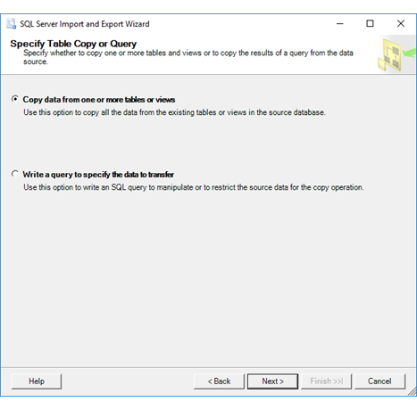

# Specify Table Copy or Query (SQL Server Import and Export Wizard)

[!INCLUDE[ssis-appliesto](../../includes/ssis-appliesto-ssvrpluslinux-asdb-asdw-xxx.md)]

  After you provide info about the destination for your data and about how to connect to it, the [!INCLUDE[ssNoVersion](../../includes/ssnoversion-md.md)] Import and Export Wizard shows **Specify Table Copy or Query**. On this page, you choose one of the following options.
-   **Copy data from one or more tables or views**. You want to pick a table or tables from a list.
-   **Write a query to specify the data to transfer**. You want to enter or paste in the text of a SQL query.
    
> [!TIP]
> If you have to copy more than one database, or database objects other than tables and views, use the Copy Database Wizard instead of the Import and Export Wizard. For more info, see [Use the Copy Database Wizard](../../relational-databases/databases/use-the-copy-database-wizard.md).     
 
## Screen shot of the Specify Table Copy or Query page    
 The following screen shot shows the **Specify Table Copy or Query** page of the Wizard.    
    
     
    
## Specify whether to copy an entire table or write a query 
 **Copy data from one or more tables or views**    
 Select this option if you want to copy data from the source without filtering or sorting records.   

When you select **Copy data from one or more tables or views**, you can copy from one table or view to one destination table, or from multiple tables or views to multiple destination tables.

 After you click **Next**, you select the tables to copy on the **Select Source Tables and Views** page. For more info, see [Select Source Tables and Views](../../integration-services/import-export-data/select-source-tables-and-views-sql-server-import-and-export-wizard.md).   
    
 **Write a query to specify the data to transfer**    
 Select this option if you want to filter or sort the source data before you copy it to the destination.    
    
When you select **Write a query to specify the data to transfer**, you can only copy the results of one query to one destination table.  

After you click **Next**, you provide a SQL statement to specify columns and select rows in the **Provide a Source Query** dialog box. For more info, see [Provide a Source Query](../../integration-services/import-export-data/provide-a-source-query-sql-server-import-and-export-wizard.md).   
    
## Why isn't the Copy option available?    
 The **Copy data from one or more tables or views** option may not be available when the wizard uses a [!INCLUDE[dnprdnshort](../../includes/dnprdnshort-md.md)] data provider to connect to your data source. This happens when the wizard doesn't have enough info about the data provider to request a list of tables and views from the data source. 
 
You can still use the **Write a query** option, even if you don't typically write SQL queries, as long as you know the name of the table that you want to export. In the **Provide a Source Query** dialog box, which you see after you click **Next**, enter the query as `SELECT * FROM <name of table>`. If the name of the table contains spaces or other special characters, surround the name with square brackets - `SELECT * FROM [<name of table>]`.

### More info
 The **Copy data from one or more tables or views** option is available only for those providers that have a ProviderDescription section in the ProviderDescriptors.xml file. (By default, this file is in \<*drive*>:\Program Files\Microsoft SQL Server\130\DTS\ProviderDescriptors.) Each ProviderDescription section in this file contains the information that's required to retrieve metadata from the corresponding provider.    
    
 By default, the ProviderDescriptors.xml file contains a ProviderDescription section only for the providers in the following list.    
    
-   .Net Framework Data Provider for SQL Server (System.Data.SqlClient)    
    
-   .Net Framework Data Provider for Oracle (System.Data.OracleClient)    
    
-   .Net Framework Data Provider for ODBC (System.Data.Odbc)    
    
-    System.Data.OleDb (which applies to all OLE DB providers)    
    
-   Microsoft Provider for DB2 installed by Microsoft Host Integration Server (Microsoft.HostIntegration.MsDb2Client.MsDb2Connection)    
    
 Third-party developers can make the **Copy data from one or more tables or views** option available for their provider by adding  a ProviderDescriptor section to the ProviderDescriptors.xml file. To review the requirements for the ProviderDescriptor section, see the ProviderDescriptors.xsd schema file which by default is in the same folder as the ProviderDescriptors.xml file.    
    
## What's next?    
 After you specify whether you want to copy an entire table or provide a query, the next page depends on the option that you chose on this page and also on the destination for your data.    
    
-   If you selected **Copy data from one or more tables or views**, for most destinations the next page is **Select Source Tables and Views**. On this page, you select the existing tables and views to copy from the data source to the destination. For more info, see [Select Source Tables and Views](../../integration-services/import-export-data/select-source-tables-and-views-sql-server-import-and-export-wizard.md).    
    
-   If you selected **Copy data from one or more tables or views** and your destination is a flat file, the next page is **Configure Flat File Destination**. On this page, you specify formatting options for the destination flat file. (Then, after you configure the flat file, the following page is **Select Source Tables and Views**.) For more info, see [Configure Flat File Destination](../../integration-services/import-export-data/configure-flat-file-destination-sql-server-import-and-export-wizard.md).    
    
-   If you selected **Write a query to specify the data to transfer**, the next page is **Provide a Source Query**. On this page, you write and test the SQL statement that selects the data to copy from the data source to the destination. (Then, after you provide a query, the following page is **Select Source Tables and Views**.) For more info, see [Provide a Source Query](../../integration-services/import-export-data/provide-a-source-query-sql-server-import-and-export-wizard.md).

## See also
[Get started with this simple example of the Import and Export Wizard](../../integration-services/import-export-data/get-started-with-this-simple-example-of-the-import-and-export-wizard.md)

