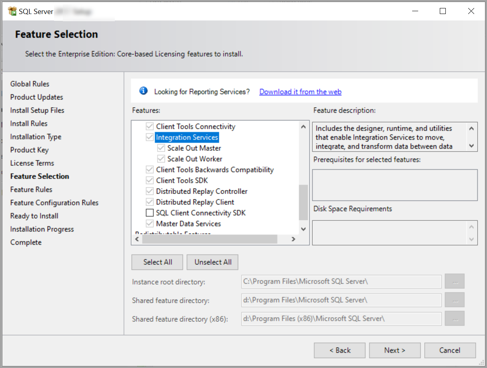

# Install Integration Services (SSIS)

[!INCLUDE[sqlserver-ssis](../../includes/applies-to-version/sqlserver-ssis.md)]

[!INCLUDE[ssNoVersion](../../includes/ssnoversion-md.md)] provides a single setup program to install any or all of its components, including [!INCLUDE[ssISnoversion](../../includes/ssisnoversion-md.md)]. Use SQL Server setup to install [!INCLUDE[ssISnoversion](../../includes/ssisnoversion-md.md)] with or without other [!INCLUDE[ssNoVersion](../../includes/ssnoversion-md.md)] components on a single computer.

This article highlights important considerations that you should know before you install [!INCLUDE[ssISnoversion](../../includes/ssisnoversion-md.md)]. Information in this article helps you evaluate your installation options so that your selection results in a successful installation.

## Get ready to install Integration Services

Before you install [!INCLUDE[msCoName](../../includes/msconame-md.md)] [!INCLUDE[ssNoVersion](../../includes/ssnoversion-md.md)] [!INCLUDE[ssISnoversion](../../includes/ssisnoversion-md.md)], review the following information:

- [Hardware and Software Requirements for Installing SQL Server](../../sql-server/install/hardware-and-software-requirements-for-installing-sql-server-2022.md)

- [Security Considerations for a SQL Server Installation](../../sql-server/install/security-considerations-for-a-sql-server-installation.md)

## Install standalone or side by side

You can install [!INCLUDE[ssNoVersion](../../includes/ssnoversion-md.md)] [!INCLUDE[ssISnoversion](../../includes/ssisnoversion-md.md)] in the following configurations:

- Install [!INCLUDE[ssNoVersion](../../includes/ssnoversion-md.md)] [!INCLUDE[ssISnoversion](../../includes/ssisnoversion-md.md)] on a computer that has no previous instances of [!INCLUDE[ssNoVersion](../../includes/ssnoversion-md.md)].

- Install [!INCLUDE[ssISnoversion](../../includes/ssisnoversion-md.md)] side by side with an existing instance of [!INCLUDE[ssNoVersion](../../includes/ssnoversion-md.md)].

When you upgrade to the latest version of [!INCLUDE[ssISnoversion](../../includes/ssisnoversion-md.md)] on a computer that has an earlier version of [!INCLUDE[ssISnoversion](../../includes/ssisnoversion-md.md)], the current version is installed side by side with the earlier version.

For more information about upgrading [!INCLUDE[ssISnoversion](../../includes/ssisnoversion-md.md)], see [Upgrade Integration Services](../../integration-services/install-windows/upgrade-integration-services.md).

## Install Integration Services

After you review the installation requirements for [!INCLUDE[ssNoVersion](../../includes/ssnoversion-md.md)] and ensure that your computer meets those requirements, you're ready to install [!INCLUDE[ssISnoversion](../../includes/ssisnoversion-md.md)].

1. If you don't already have Microsoft SQL Server, download a free **Developer Edition**, from [SQL Server downloads](https://www.microsoft.com/sql-server/sql-server-downloads). SSIS isn't included with the Express edition of SQL Server.

2. In the SQL Server Setup Wizard, select **New SQL stand-alone installation or add features to an existing installation**. To install [!INCLUDE[ssISnoversion](../../includes/ssisnoversion-md.md)], make selections on the **Feature Selection** page as follows:

   - Under **Shared Features**, select **Integration Services**.

   - Under **Shared features**, optionally select **Client Tools SDK** to install managed assemblies for [!INCLUDE[ssISnoversion](../../includes/ssisnoversion-md.md)] programming.

   - Under **Instance Features**, optionally select **Database Engine Services** to host the SSIS Catalog database, `SSISDB`, to store, manage, run, and monitor SSIS packages.

   

3. Consider installation additional components for Integration Services. For more information, see the [Install additional components](#complete) section of this article.

> [!NOTE]
> Some [!INCLUDE[ssNoVersion](../../includes/ssnoversion-md.md)] components that you can select for installation on the **Feature Selection** page of the Setup Wizard install a partial subset of [!INCLUDE[ssISnoversion](../../includes/ssisnoversion-md.md)] components. These components are useful for specific tasks, but the functionality of [!INCLUDE[ssISnoversion](../../includes/ssisnoversion-md.md)] is limited. For example, the **Database Engine Services** option installs the [!INCLUDE[ssISnoversion](../../includes/ssisnoversion-md.md)] components required for the [!INCLUDE[ssNoVersion](../../includes/ssnoversion-md.md)] Import and Export Wizard. To ensure a complete installation of [!INCLUDE[ssISnoversion](../../includes/ssisnoversion-md.md)], you must select **Integration Services** on the **Feature Selection** page.

### Install a dedicated server for ETL processes

To use a dedicated server for extraction, transformation, and loading (ETL) processes, install a local instance of the [!INCLUDE[ssDEnoversion](../../includes/ssdenoversion-md.md)] when you install [!INCLUDE[ssISnoversion](../../includes/ssisnoversion-md.md)]. [!INCLUDE[ssISnoversion](../../includes/ssisnoversion-md.md)] typically stores packages in an instance of the [!INCLUDE[ssDE](../../includes/ssde-md.md)] and relies on [!INCLUDE[ssNoVersion](../../includes/ssnoversion-md.md)] Agent for scheduling those packages. If the ETL server doesn't have an instance of the [!INCLUDE[ssDE](../../includes/ssde-md.md)], you have to schedule or run packages from a server that does have an instance of the [!INCLUDE[ssDE](../../includes/ssde-md.md)]. As a result, the packages aren't running on the ETL server, but instead on the server from which they're started. As a result, the resources of the dedicated ETL server aren't being used as intended. Furthermore, the resources of other servers may be strained by the running ETL processes

### Configure SSIS event logging

By default, in a new installation, [!INCLUDE[ssISnoversion](../../includes/ssisnoversion-md.md)] is configured not to log events that are related to the running of packages to the Application event log. This setting prevents too many event log entries when you use the Data Collector feature of [!INCLUDE[ssnoversion](../../includes/ssnoversion-md.md)]. The events that aren't logged are EventID 12288, "Package started," and EventID 12289, "Package finished successfully." To log these events to the Application event log, open the registry for editing. Then, in the registry, locate the **HKEY_LOCAL_MACHINE\SOFTWARE\Microsoft\Microsoft SQL Server\130\SSIS** node, and change the **DWORD** value of the **LogPackageExecutionToEventLog** setting from `0` to `1`.

## Install additional components

For a complete installation of [!INCLUDE[ssISnoversion](../../includes/ssisnoversion-md.md)], select the components that you need from the following list:

- **Integration Services**. Install SSIS with the SQL Server Setup Wizard. Selecting SSIS installs the following components:

  - Support for the SSIS Catalog on the SQL Server Database Engine.

  - The optional [Scale Out feature](../scale-out/walkthrough-set-up-integration-services-scale-out.md).

  - 32-bit and 64-bit SSIS components.

  Installing Integration Services alone does **NOT** install the tools required to design and develop SSIS packages.

- **Database Engine Services**. Install the Database Engine with the SQL Server Setup Wizard. Selecting the Database Engine Services allows you to create and host the SSIS Catalog database, `SSISDB`, to store, manage, run, and monitor SSIS packages.

- **SQL Server Data Tools (SSDT)** and appropriate extensions. Use SSDT to design and deploy SSIS packages. To download and install SSDT, see [Download SQL Server Data Tools (SSDT)](../../ssdt/download-sql-server-data-tools-ssdt.md). 

  After you install SSDT, you need to install the appropriate extensions.

  - For Visual Studio 2022, [SQL Server Integration Services Projects 2022](https://marketplace.visualstudio.com/items?itemName=SSIS.MicrosoftDataToolsIntegrationServices)
  - For earlier versions, [SQL Server Integration Services Projects](https://marketplace.visualstudio.com/items?itemName=SSIS.SqlServerIntegrationServicesProjects)

- **Integration Services Feature Pack for Azure**. To download and install the Feature Pack, see [Microsoft SQL Server Integration Services Feature Pack for Azure](../azure-feature-pack-for-integration-services-ssis.md). Installing the Feature Pack lets your packages connect to storage and analytics services in the Azure cloud, including the following services:

  - Azure Blob Storage.

  - Azure HDInsight.

  - Azure Data Lake Store.

  - Azure Synapse Analytics.

  - Azure Data Lake Storage (Gen2).

- **Optional additional components**. You can optionally download additional third-party components from the SQL Server Feature Package.

  - [Microsoft Connector for Oracle](../data-flow/oracle-connector.md)
  
  - [Microsoft Connector for Teradata (SSIS)](../data-flow/teradata-connector.md)

  - For Microsoft Connectors for Oracle and Teradata by Attunity for SQL Server 2017 and before, see [Attunity connectors](../attunity-connectors.md).

  - Microsoft Connector for SAP BW for Microsoft SQL Server. To get these components, see [Microsoft SQL Server 2017 Feature Pack](https://www.microsoft.com/download/details.aspx?id=55992).

## Next steps

For more information about Integration Services installation and feature updates, see the following articles:

- [Installing Integration Services Versions Side by Side](installing-integration-services-versions-side-by-side.md)

- [Integration Services Backward Compatibility](../integration-services-backward-compatibility.md)
