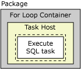
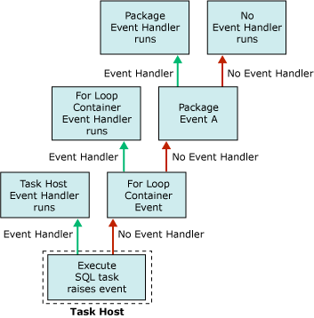

# Integration Services (SSIS) Event Handlers

[!INCLUDE[ssis-appliesto](../includes/ssis-appliesto-ssvrpluslinux-asdb-asdw-xxx.md)]

  At run time, executables (packages and Foreach Loop, For Loop, Sequence, and task host containers) raise events. For example, an OnError event is raised when an error occurs. You can create custom event handlers for these events to extend package functionality and make packages easier to manage at run time. Event handlers can perform tasks such as the following:  
  
-   Clean up temporary data storage when a package or task finishes running.  
  
-   Retrieve system information to assess resource availability before a package runs.  
  
-   Refresh data in a table when a lookup in a reference table fails.  
  
-   Send an e-mail message when an error or a warning occurs or when a task fails.  
  
 If an event has no event handler, the event is raised to the next container up the container hierarchy in a package. If this container has an event handler, the event handler runs in response to the event. If not, the event is raised to the next container up the container hierarchy.  
  
 The following diagram shows a simple package that has a For Loop container that contains one Execute SQL task.  
  
   
  
 Only the package has an event handler, for its **OnError** event. If an error occurs when the Execute SQL task runs, the **OnError** event handler for the package runs. The following diagram shows the sequence of calls that causes the **OnError** event handler for the package to execute.  
  
   
  
 Event handlers are members of an event handler collection, and all containers include this collection. If you create the package using [!INCLUDE[ssIS](../includes/ssis-md.md)] Designer, you can see the members of the event handler collections in the **Event Handlers** folders on the **Package Explorer** tab of [!INCLUDE[ssIS](../includes/ssis-md.md)] Designer.  
  
 You can configure the event handler container in the following ways:  
  
-   Specify a name and description for the event handler.  
  
-   Indicate whether the event handler runs, whether the package fails if the event handler fails, and the number of errors that can occur before the event handler fails.  
  
-   Specify an execution result to return instead of the actual execution result that the event handler returns at run time.  
  
-   Specify the transaction option for the event handler.  
  
-   Specify the logging mode that the event handler uses.  
  
## Event Handler Content  
 Creating an event handler is similar to building a package; an event handler has tasks and containers, which are sequenced into a control flow, and an event handler can also include data flows. The [!INCLUDE[ssIS](../includes/ssis-md.md)] Designer includes the **Event Handlers** tab for creating custom event handlers.  
  
 You can also create event handlers programmatically. For more information, see [Handling Events Programmatically](../integration-services/building-packages-programmatically/handling-events-programmatically.md).  
  
## Run-Time Events  
 The following table lists the event handlers that [!INCLUDE[ssISnoversion](../includes/ssisnoversion-md.md)] provides, and describes the run-time events that cause the event handler to run.  
  
|Event handler|Event|  
|-------------------|-----------|  
|**OnError**|The event handler for the **OnError** event. This event is raised by an executable when an error occurs.|  
|**OnExecStatusChanged**|The event handler for the **OnExecStatusChanged** event. This event is raised by an executable when its execution status changes.|  
|**OnInformation**|The event handler for the **OnInformation** event. This event is raised during the validation and execution of an executable to report information. This event conveys information only, no errors or warnings.|  
|**OnPostExecute**|The event handler for the **OnPostExecute** event. This event is raised by an executable immediately after it has finished running.|  
|**OnPostValidate**|The event handler for the **OnPostValidate** event. This event is raised by an executable when its validation is finished.|  
|**OnPreExecute**|The event handler for the **OnPreExecute** event. This event is raised by an executable immediately before it runs.|  
|**OnPreValidate**|The event handler for the **OnPreValidate** event. This event is raised by an executable when its validation starts.|  
|**OnProgress**|The event handler for the **OnProgress** event. This event is raised by an executable when measurable progress is made by the executable.|  
|**OnQueryCancel**|The event handler for the **OnQueryCancel** event. This event is raised by an executable to determine whether it should stop running.|  
|**OnTaskFailed**|The event handler for the **OnTaskFailed** event. This event is raised by a task when it fails.|  
|**OnVariableValueChanged**|The event handler for the **OnVariableValueChanged** event. This event is raised by an executable when the value of a variable changes. The event is raised by the executable on which the variable is defined. This event is not raised if you set the **RaiseChangeEvent** property for the variable to **False**. For more information, see [Integration Services &#40;SSIS&#41; Variables](../integration-services/integration-services-ssis-variables.md).|  
|**OnWarning**|The event handler for the **OnWarning** event. This event is raised by an executable when a warning occurs.|  

## Add an event handler to a package
At run time, containers and tasks raise events. You can create custom event handlers that respond to these events by running a workflow when the event is raised. For example, you can create an event handler that sends an e-mail message when a task fails.  
  
 An event handler is similar to a package. Like a package, an event handler can provide scope for variables, and includes a control flow and optional data flows. You can build event handlers for packages, the Foreach Loop container, the For Loop container, the Sequence container, and all tasks.  
  
 You create event handlers by using the design surface of the **Event Handlers** tab in [!INCLUDE[ssIS](../includes/ssis-md.md)] Designer.  
  
 When the **Event Handlers** tab is active, the **Control Flow Items** and **Maintenance Plan Tasks** nodes of the Toolbox in [!INCLUDE[ssIS](../includes/ssis-md.md)] Designer contain the task and containers for building the control flow in the event handler. The **Data Flow Sources**, **Transformations**, **and Data Flow Destinations** nodes contain the data sources, transformations, and destinations for building the data flows in the event handler. For more information, see [Control Flow](../integration-services/control-flow/control-flow.md) and [Data Flow](../integration-services/data-flow/data-flow.md).  
  
 The **Event Handlers** tab also includes the **Connections** Managers area where you can create and modify the connection managers that event handlers use to connect to servers and data sources. For more information, see [Create Connection Managers](https://msdn.microsoft.com/library/6ca317b8-0061-4d9d-b830-ee8c21268345).  
  
### Add an event handler on the Event Handlers tab  
  
1.  In [!INCLUDE[ssBIDevStudioFull](../includes/ssbidevstudiofull-md.md)], open the [!INCLUDE[ssISnoversion](../includes/ssisnoversion-md.md)] project that contains the package you want.  
  
2.  In Solution Explorer, double-click the package to open it.  
  
3.  Click the **Event Handlers** tab.  
  
       
  
     Creating the control flow and data flows in an event handler is similar to creating the control flow and data flows in a package. For more information, see [Control Flow](../integration-services/control-flow/control-flow.md) and [Data Flow](../integration-services/data-flow/data-flow.md).  
  
4.  In the **Executable** list, select the executable for which you want to create an event handler.  
  
5.  In the **Event handler** list, select the event handler you want to build.  
  
6.  Click the link on the design surface of the **Event Handler** tab.  
  
7.  Add control flow items to the event handler, and connect items using a precedence constraint by dragging the constraint from one control flow item to another. For more information, see [Control Flow](../integration-services/control-flow/control-flow.md).  
  
8.  Optionally, add a Data Flow task, and on the design surface of the **Data Flow** tab, create a data flow for the event handler. For more information, see [Data Flow](../integration-services/data-flow/data-flow.md).  
  
9. On the **File** menu, click **Save Selected Items** to save the package.  

## Set the properties of an event handler  
 You can set properties in the **Properties** window of [!INCLUDE[ssBIDevStudioFull](../includes/ssbidevstudiofull-md.md)] or programmatically.  
  
 For information about how to set these properties in [!INCLUDE[ssBIDevStudioFull](../includes/ssbidevstudiofull-md.md)], see [Set the Properties of a Task or Container](https://msdn.microsoft.com/library/52d47ca4-fb8c-493d-8b2b-48bb269f859b).  
  
 For information about programmatically setting these properties, see <xref:Microsoft.SqlServer.Dts.Runtime.DtsEventHandler>.  
  
## Related Tasks  
 For information about how to add an event handler to a package, see [Add an Event Handler to a Package](https://msdn.microsoft.com/library/5e56885d-8658-480a-bed9-3f2f8003fd78).  
  
  
