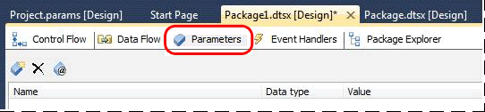
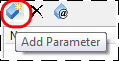
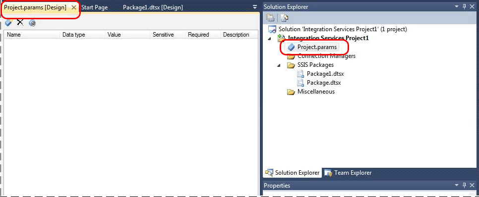

# Integration Services (SSIS) Package and Project Parameters
  [!INCLUDE[ssISnoversion](../includes/ssisnoversion-md.md)] (SSIS) parameters allow you to assign values to properties within packages at the time of package execution. You can create *project parameters* at the project level and *package parameters* at the package level. Project parameters are used to supply any external input the project receives to one or more packages in the project. Package parameters allow you to modify package execution without having to edit and redeploy the package.  
  
 In [!INCLUDE[ssBIDevStudio](../includes/ssbidevstudio-md.md)] you create, modify, or delete project parameters by using the **Project.params** window. You create, modify, and delete package parameters by using the **Parameters** tab in the [!INCLUDE[ssIS](../includes/ssis-md.md)] Designer. You associate a new or an existing parameter with a task property by using the **Parameterize** dialog box. For more about using the **Project.params** window and the **Parameters** tab, see [Create Parameters](https://msdn.microsoft.com/library/cd5d675b-dd5d-49cc-8b1f-dc717a973f99). For more information about the **Parameterize** dialog box, see [Parameterize Dialog Box](https://msdn.microsoft.com/library/fac02b6d-d247-447a-8940-e8700c7ac350).  
  
## Parameters and Package Deployment Model  
 In general, if you are deploying a package using the package deployment model, you should use configurations instead of parameters.  
  
 When you deploy a package that contains parameters using the package deployment model and then execute the package, the parameters are not called during execution. If the package contains package parameters and expressions within the package use the parameters, the resulting values are applied at runtime. If the package contains project parameters, the package execution may fail.  
  
## Parameters and Project Deployment Model  
 When you deploy a project to the Integration Services (SSIS) server, you use views, stored procedures, and the [!INCLUDE[ssManStudioFull](../includes/ssmanstudiofull-md.md)] UI to manage project and package parameters. For more information, see the following topics.  
  
-   [Views &#40;Integration Services Catalog&#41;](../integration-services/system-views/views-integration-services-catalog.md)  
  
-   [Stored Procedures &#40;Integration Services Catalog&#41;](../integration-services/system-stored-procedures/stored-procedures-integration-services-catalog.md)  
  
-   [Configure Dialog Box](../integration-services/service/configure-dialog-box.md)  
  
-   [Execute Package Dialog Box](../integration-services/packages/run-integration-services-ssis-packages.md#execute_package_dialog)  
  
### Parameter Values  
 You can assign up to three different types of values to a parameter. When a package execution is started, a single value is used for the parameter, and the parameter is resolved to its final literal value.  
  
 The following table lists the types of values.  
  
|Value Name|Description|Type of value|  
|----------------|-----------------|-------------------|  
|Execution Value|The value that is assigned to a specific instance of package execution. This assignment overrides all other values, but applies to only a single instance of package execution.|Literal|  
|Server Value|The value assigned to the parameter within the scope of the project, after the project is deployed to the Integration Services server. This value overrides the design default.|Literal or Environment Variable Reference|  
|Design Value|The value assigned to the parameter when the project is created or edited in [!INCLUDE[ssBIDevStudio](../includes/ssbidevstudio-md.md)]. This value persists with the project.|Literal|  
  
 You can use a single parameter to assign a value to multiple package properties. A single package property can be assigned a value only from a single parameter.  
  
###   Executions and Parameter Values  
 The *execution* is an object that represents a single instance of package execution. When you create an execution, you specify all of the details necessary to run a package such as execution parameter values. You can also modify the parameters values for existing executions.  
  
 When you explicitly set an execution parameter value, the value is applicable only to that particular instance of execution. The execution value is used instead of a server value or a design value. If you do not explicitly set an execution value, and a server value has been specified, the server value is used.  
  
 When a parameter is marked as required, a server value or execution value must be specified for that parameter. Otherwise, the corresponding package does not execute. Although the parameter has a default value at design time, it will never be used once the project is deployed.  
  
#### Environment Variables  
 If a parameter references an environment variable, the literal value from that variable is resolved through the specified environment reference and applied to the parameter. The final literal parameter value that is used for package execution is referred to as the execution parameter value. You specify the environment reference for an execution by using the **Execute** dialog box  
  
 If a project parameter references an environment variable and the literal value from the variable cannot be resolved at execution, the design value is used. The server value is not used.  
  
 To view the environment variables that are assigned to parameter values, query the catalog.object_parameters view. For more information, see [catalog.object_parameters &#40;SSISDB Database&#41;](../integration-services/system-views/catalog-object-parameters-ssisdb-database.md).  
  
#### Determining Execution Parameter Values  
 The following Transact-SQL views and stored procedure can be used to display and set parameter values.  
  
 [catalog.execution_parameter_values &#40;SSISDB Database&#41;](../integration-services/system-views/catalog-execution-parameter-values-ssisdb-database.md)(view)  
 Shows the actual parameter values that will be used by a specific execution  
  
 [catalog.get_parameter_values &#40;SSISDB Database&#41;](../integration-services/system-stored-procedures/catalog-get-parameter-values-ssisdb-database.md) (stored procedure)  
 Resolves and shows the actual values for the specified package and environment reference  
  
 [catalog.object_parameters &#40;SSISDB Database&#41;](../integration-services/system-views/catalog-object-parameters-ssisdb-database.md) (view)  
 Displays the parameters and properties for all packages and projects in the [!INCLUDE[ssISnoversion](../includes/ssisnoversion-md.md)] catalog, including the design default and server default values.  
  
 [catalog.set_execution_parameter_value &#40;SSISDB Database&#41;](../integration-services/system-stored-procedures/catalog-set-execution-parameter-value-ssisdb-database.md)  
 Sets the value of a parameter for an instance of execution in the [!INCLUDE[ssISnoversion](../includes/ssisnoversion-md.md)] catalog.  
  
 You can also use the **Execute Package** dialog box in [!INCLUDE[ssBIDevStudioFull](../includes/ssbidevstudiofull-md.md)] modify the parameter value. For more information, see [Execute Package Dialog Box](../integration-services/packages/run-integration-services-ssis-packages.md#execute_package_dialog).  
  
 You can also use the dtexec **/Parameter** option to modify a parameter value. For more information, see [dtexec Utility](../integration-services/packages/dtexec-utility.md).  
  
### Parameter Validation  
 If parameter values cannot be resolved, the corresponding package execution will fail. To help avoid failures, you can validate projects and packages by using the **Validate** dialog box in [!INCLUDE[ssBIDevStudioFull](../includes/ssbidevstudiofull-md.md)]. Validation allows you to confirm that all parameters have the necessary values or can resolve the necessary values with specific environment references. Validation also checks for other common package issues.  
  
 For more information, see [Validate Dialog Box](../integration-services/service/validate-dialog-box.md).  
  
### Parameter Example  
 This example describes a parameter named **pkgOptions** that is used to specify options for the package in which it resides.  
  
 During design time, when the parameter was created in [!INCLUDE[ssBIDevStudio](../includes/ssbidevstudio-md.md)], a default value of 1 was assigned to the parameter. This default value is referred to as the design default. If the project was deployed to the SSISDB catalog and no other values were assigned to this parameter, the package property corresponding to the **pkgOptions** parameter would be assigned the value of 1 during package execution. The design default persists with the project throughout its life cycle.  
  
 While preparing a specific instance of package execution, a value of 5 is assigned to the **pkgOptions** parameter. This value is referred to as the execution value because it applies to the parameter only for that particular instance of execution. When execution starts, the package property corresponding to the **pkgOptions** parameter is assigned the value of 5.  
  
## Create parameters
You use [!INCLUDE[ssBIDevStudioFull](../includes/ssbidevstudiofull-md.md)] to create project parameters and package parameters. The following procedures provide step-by-step instructions for creating package/project parameters.  
  
> **NOTE:** If you are converting a project that you created using an earlier version of [!INCLUDE[ssISnoversion](../includes/ssisnoversion-md.md)] to the project deployment model, you can use the **Integration Services Project Conversion Wizard** to create parameters based on configurations. For more information, see [Deploy Integration Services (SSIS) Projects and Packages](../integration-services/packages/deploy-integration-services-ssis-projects-and-packages.md).  
  
### Create package parameters  
  
1.  Open the package in [!INCLUDE[ssBIDevStudio](../includes/ssbidevstudio-md.md)], and then click the **Parameters** tab in the SSIS Designer.  
  
       
  
2.  Click the **Add Parameter** button on the toolbar.  
  
       
  
3.  Enter values for the **Name**, **Data Type**, **Value**, **Sensitive**, and **Required** properties in the list itself or in the **Properties** window. The following table describes these properties.  
  
    |Property|Description|  
    |--------------|-----------------|  
    |Name|The name of the parameter.|  
    |Data type|The data type of the parameter.|  
    |Default value|The default value for the parameter assigned at design time. This is also known as the design default.|  
    |Sensitive|Sensitive parameter values are encrypted in the catalog and appear as a NULL value when viewed with Transact-SQL or SQL Server Management Studio.|  
    |Required|Requires that a value, other than the design default, is specified before the package can execute.|  
    |Description|For maintainability, the description of the parameter. In [!INCLUDE[ssBIDevStudioFull](../includes/ssbidevstudiofull-md.md)], set the parameter description in the Visual Studio Properties window when the parameter is selected in the applicable parameters window.|  
  
    > **NOTE:** When you deploy a project to the catalog, several more properties become associated with the project. To see all properties for all parameters in the catalog, use the [catalog.object_parameters &#40;SSISDB Database&#41;](../integration-services/system-views/catalog-object-parameters-ssisdb-database.md) view.  
  
4.  Save the project to save changes to parameters. Parameter values are stored in the project file.  
  
    > **WARNING!!** You can in-place edit in the list or use the **Properties** window to modify the values of parameter properties. You can delete a parameter by using the **Delete (X)** toolbar button. Using the last toolbar button, you can specify a value for a parameter that is used only when you execute the package in [!INCLUDE[ssBIDevStudio](../includes/ssbidevstudio-md.md)].  
  
    > **NOTE:** If you re-open the package file without opening the project in [!INCLUDE[ssBIDevStudio](../includes/ssbidevstudio-md.md)], the **Parameters** tab will be empty and disabled.  
  
### Create project parameters  
  
1.  Open the project in [!INCLUDE[ssBIDevStudio](../includes/ssbidevstudio-md.md)].  
  
2.  Right-click **Project.params** in Solution Explorer, and then click **Open** (OR) double-click **Project.params** to open it.  
  
       
  
3.  Click the **Add Parameter** button on the toolbar.  
  
       
  
4.  Enter values for the **Name**, **Data Type**, **Value**, **Sensitive**, and **Required** properties.  
  
    |Property|Description|  
    |--------------|-----------------|  
    |Name|The name of the parameter.|  
    |Data type|The data type of the parameter.|  
    |Default value|The default value for the parameter assigned at design time. This is also known as the design default.|  
    |Sensitive|Sensitive parameter values are encrypted in the catalog and appear as a NULL value when viewed with Transact-SQL or SQL Server Management Studio.|  
    |Required|Requires that a value, other than the design default, is specified before the package can execute.|  
    |Description|For maintainability, the description of the parameter. In [!INCLUDE[ssBIDevStudio](../includes/ssbidevstudio-md.md)], set the parameter description in the Visual Studio Properties window when the parameter is selected in the applicable parameters window.|  
  
5.  Save the project to save changes to parameters. Parameter values are stored in configurations in the project file. Save the project file to commit to disk any changes in the parameter values.  
  
    > **WARNING!!!** You can in-place edit in the list or use the **Properties** window to modify the values of parameter properties. You can delete a parameter by using the **Delete (X)** toolbar button. Using the last toolbar button to open the **Manage Parameter Values** dialog box, you can specify a value for a parameter that is used only when you execute the package in [!INCLUDE[ssBIDevStudio](../includes/ssbidevstudio-md.md)].  
    
## Parameterize Dialog Box
The **Parameterize** dialog box lets you associate a new or an existing parameter with a property of a task. You open the dialog box by right-clicking a task or the Control Flow tab in [!INCLUDE[ssIS](../includes/ssis-md.md)] Designer and then by clicking **Parameterize**. The following list describes UI elements in the dialog box. For more information about parameters, see [Integration Services (SSIS) Parameters](https://msdn.microsoft.com/library/hh213214.aspx).
  
### Options  
 **Property**  
 Select the property of the task that you want to associate with a parameter. This list is populated with all the properties that can be parameterized.  
  
 **Use existing parameter**  
 Select this option to associate the property of task with an existing parameter and then select the parameter from drop-down list.  
  
 **Do not use parameter**  
 Select this option to remove a reference to a parameter. The parameter is not deleted.  
  
 **Create new parameter**  
 Select this option to create a new parameter that you want to associate with the property of the task.  
  
 **Name**  
 Specify the name of the parameter you want to create.  
  
 **Description**  
 Specify the description for parameter.  
  
 **Value**  
 Specify the default value for the parameter. This is also known as the design default, which can be overridden later at the deployment time.  
  
 **Scope**  
 Specify the scope of the parameter by selecting either **Project** or **Package** option. Project parameters are used to supply any external input the project receives to one or more packages in the project. Package parameters allow you to modify package execution without having to edit and redeploy the package.  
  
 **Sensitive**  
 Specify whether the parameter is a sensitive by checking or clearing the check box. Sensitive parameter values are encrypted in the catalog and appear as a NULL value when viewed with Transact-SQL or SQL Server Management Studio.  
  
 **Required**  
 Specify whether the parameter requires that a value, other than the design default, is specified before the package can execute.  
 
## Set parameter values after the project is deployed
The Deployment Wizard allows you to set server default parameter values when you deploy your project to the catalog. After your project is in the catalog, you can use SQL Server Management Studio (SSMS) Object Explorer or Transact-SQL to set server default values.  
  
### Set server defaults with SSMS Object Explorer  
  
1.  Select and right-click the project under the **Integration Services** node.  
  
2.  Click **Properties** to open the **Project Properties** dialog window.  
  
3.  Open the parameters page by clicking **Parameters** under **Select a page**.  
  
4.  Select the desired parameter in the **Parameters** list. Note: The **Container** column helps distinguish project parameters from package parameters.  
  
5.  In the **Value** column, specify the desired server default parameter value.  

### Set server defaults with Transact-SQL  
 To set server defaults with Transact-SQL, use the [catalog.set_object_parameter_value &#40;SSISDB Database&#41;](../integration-services/system-stored-procedures/catalog-set-object-parameter-value-ssisdb-database.md) stored procedure. To view current server defaults, query the [catalog.object_parameters &#40;SSISDB Database&#41;](../integration-services/system-views/catalog-object-parameters-ssisdb-database.md) view. To clear a server default value, use the [catalog.clear_object_parameter_value &#40;SSISDB Database&#41;](../integration-services/system-stored-procedures/catalog-clear-object-parameter-value-ssisdb-database.md) stored procedure.  
  
## Related Content  
 Blog entry, [SSIS Quick Tip: Required Parameters](https://go.microsoft.com/fwlink/?LinkId=239781), on mattmasson.com.  
  
  
