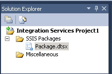

# Integration Services (SSIS) Projects and Solutions

[!INCLUDE[ssis-appliesto](../../includes/ssis-appliesto-ssvrpluslinux-asdb-asdw-xxx.md)]

  [!INCLUDE[ssNoVersion](../includes/ssnoversion-md.md)] provides [!INCLUDE[ssBIDevStudioFull](../includes/ssbidevstudiofull-md.md)] for the development of [!INCLUDE[ssISnoversion](../includes/ssisnoversion-md.md)] packages.  
  
[!INCLUDE[ssISnoversion](../includes/ssisnoversion-md.md)] packages reside in projects. To create and work with [!INCLUDE[ssISnoversion](../includes/ssisnoversion-md.md)] projects, you must install the [!INCLUDE[ssBIDevStudioFull](../includes/ssbidevstudiofull-md.md)] environment. For more information, see [Install Integration Services](../integration-services/install-windows/install-integration-services.md).  
  
 When you create a new [!INCLUDE[ssISnoversion](../includes/ssisnoversion-md.md)] project in [!INCLUDE[ssBIDevStudioFull](../includes/ssbidevstudiofull-md.md)], the **New Project** dialog box includes an **Integration Services Project** template. This project template creates a new project that contains a single package.  
  
## Projects and solutions  
 Projects are stored in solutions. You can create a solution first and then add an [!INCLUDE[ssISnoversion](../includes/ssisnoversion-md.md)] project to the solution. If no solution exists, [!INCLUDE[ssBIDevStudioFull](../includes/ssbidevstudiofull-md.md)] automatically creates one for you when you first create the project. A solution can contain multiple projects of different types.  
  
> [!TIP]  
>  By default, when you create a new project in [!INCLUDE[ssBIDevStudio](../includes/ssbidevstudio-md.md)], the solution is not shown in **Solution Explorer** pane. To change this default behavior, on the **Tools** menus, click **Options**. In the **Options** dialog box, expand **Projects and Solutions**, and then click **General**. On the **General** page, select **Always show solution**.  

## Solutions contain projects  
 A solution is a container that groups and manages the projects that you use when you develop end-to-end business solutions. A solution lets you handle multiple projects as one unit and to bring together one or more related projects that contribute to a business solution.  
  
 Solutions can include different types of projects. If you want to use [!INCLUDE[ssIS](../includes/ssis-md.md)] Designer to create an [!INCLUDE[ssISnoversion](../includes/ssisnoversion-md.md)] package, you work in an [!INCLUDE[ssISnoversion](../includes/ssisnoversion-md.md)] project in a solution provided by [!INCLUDE[ssBIDevStudioFull](../includes/ssbidevstudiofull-md.md)].  
  
 When you create a new solution, [!INCLUDE[ssBIDevStudioFull](../includes/ssbidevstudiofull-md.md)] adds a Solution folder to Solution Explorer, and creates files that have the extensions, .sln and .suo:  
  
-   The *.sln file contains information about the solution configuration and lists the projects in the solution.  
  
-   The *.suo file contains information about your preferences for working with the solution.  
  
 While [!INCLUDE[ssBIDevStudioFull](../includes/ssbidevstudiofull-md.md)] automatically creates a solution when you create a new project, you can also create a blank solution, and then add projects later.  
   
## Integration Services projects contain packages  
 A project is a container in which you develop [!INCLUDE[ssISnoversion](../includes/ssisnoversion-md.md)] packages.  
  
 In [!INCLUDE[ssBIDevStudioFull](../includes/ssbidevstudiofull-md.md)], an [!INCLUDE[ssISnoversion](../includes/ssisnoversion-md.md)] project stores and groups the files that are related to the package. For example, a project includes the files that are required to create a specific extract, transfer, and load (ETL) solution.  
  
 Before you create an [!INCLUDE[ssISnoversion](../includes/ssisnoversion-md.md)] project, you should become familiar with the basic contents of this kind of project. After you understand what a project contains, you can begin creating and working with an [!INCLUDE[ssISnoversion](../includes/ssisnoversion-md.md)] project.  
  
## Folders in Integration Services projects  
 The following diagram shows the folders in an [!INCLUDE[ssISnoversion](../includes/ssisnoversion-md.md)] project in [!INCLUDE[ssBIDevStudioFull](../includes/ssbidevstudiofull-md.md)].  
  
   
  
 The following table describes the folders that appear in an [!INCLUDE[ssISnoversion](../includes/ssisnoversion-md.md)] project.  
  
|Folder|Description|  
|------------|-----------------|  
|[!INCLUDE[ssIS](../includes/ssis-md.md)] Packages|Contains packages. For more information, see [Integration Services &#40;SSIS&#41; Packages](../integration-services/integration-services-ssis-packages.md).|  
|Miscellaneous|Contains files other than package files.|  
  
## Files in Integration Services projects  
 When you add a new or an existing [!INCLUDE[ssISnoversion](../includes/ssisnoversion-md.md)] project to a solution, [!INCLUDE[ssBIDevStudioFull](../includes/ssbidevstudiofull-md.md)] creates project files that have the extensions .dtproj and .dtproj.user and .database.  
  
-   The *.dtproj file contains information about project configurations and items such as packages.  
  
-   The *.dtproj.user file contains information about your preferences for working with the project.  
  
-   The *.database file contains information that [!INCLUDE[ssBIDevStudioFull](../includes/ssbidevstudiofull-md.md)] requires to open the [!INCLUDE[ssISnoversion](../includes/ssisnoversion-md.md)] project.  
  
## Version targeting in Integration Services projects  
 In [!INCLUDE[ssBIDevStudioFull](../includes/ssbidevstudiofull-md.md)], you can create, maintain, and run packages that target SQL Server 2016, SQL Server 2014, or SQL Server 2012.  
  
 In Solution Explorer, right-click on an Integration Services project and select **Properties** to open the property pages for the project. On the **General** tab of **Configuration Properties**, select the **TargetServerVersion** property,  and then choose SQL Server 2016, SQL Server 2014, or SQL Server 2012.  
  
   
 
## Create a new Integration Services project  
  
1.  Open [!INCLUDE[ssBIDevStudioFull](../includes/ssbidevstudiofull-md.md)].  
  
2.  On the **File** menu, point to **New**, and then click **Project**.  
  
3.  In the **New Project** dialog box, in the **Templates** pane, select the **Integration Services Project** template.  
  
     The **Integration Services Project** template creates an [!INCLUDE[ssISnoversion](../includes/ssisnoversion-md.md)] project that contains a single, empty package.  
  
4.  (Optional) Edit the project name and the location.  
  
     The solution name is automatically updated to match the project name.  
  
5.  To create a separate folder for the solution file, select **Create directory for solution**. This is the default option.  
  
6.  If source control software is installed on the computer, select **Add to source control**  to associate the project with source control.  
  
7.  If the source control software is [!INCLUDE[msCoName](../includes/msconame-md.md)] Visual SourceSafe, the **Visual SourceSafe Login** dialog box opens. In **Visual SourceSafe Login**, provide a user name, a password, and the name of the [!INCLUDE[msCoName](../includes/msconame-md.md)] Visual SourceSafe database. Click **Browse** to locate the database.  
  
    > **NOTE:** To view and change the selected source control plug-in and to configure the source control environment, click **Options** on the **Tools** menu, and then expand the **Source Control** node.  
  
8.  Click **OK** to add the solution to **Solution Explorer** and add the project to the solution.  
  
## Choose the target version of a project and its packages  
  
1.  In Solution Explorer, right-click on an Integration Services project and select **Properties** to open the property pages for the project.  
  
2.  On the **General** tab of **Configuration Properties**, select the **TargetServerVersion** property,  and then choose SQL Server 2016, SQL Server 2014, or SQL Server 2012.  
  
       
  
 You can create, maintain, and run packages that target SQL Server 2016, SQL Server 2014, or SQL Server 2012.  

## Import an existing project with the Import Project Wizard
  
1.  In [!INCLUDE[vsprvs](../includes/vsprvs-md.md)], click **New** > **Project** on the **File** menu.  
  
2.  In the **Installed Templates** area of the **New Project** window, expand **Business Intelligence**, and click **Integration Services**.  
  
3.  Select **Integration Services Import Project Wizard** from the project types list.  
  
4.  Type a name for the new project to be created in the **Name** text box.  
  
5.  Type the path or location for the project in the **Location** text box, or click **Browse** to select one.  
  
6.  Type a name for the solution in the **Solution name** text box.  
  
7.  Click **OK** to launch the **Integration Services Import Project Wizard** dialog box.  
  
8.  Click **Next** to switch to the **Select Source** page.  
  
9. If you are importing from an **.ispac** file, type the path including file name in the **Path** text box. Click **Browse** to navigate to the folder where you want the solution to be stored and type file name in the **File name** text box, and click **Open**.  
  
     If you are importing from an **Integration Services Catalog**, type the database instance name in the **Server name** text box or click **Browse** and select the database instance that contains the catalog.  
  
     Click **Browse** next to **Path** text box, expand folder in the catalog, select the project you want to import, and click **OK**.  
  
     Click **Next** to switch to the **Review** page.  
  
10. Review the information and click **Import** to create a project based on the existing project you selected.  
  
11. Optional: click **Save Report** to save the results to a file  
  
12. Click **Close** to close the **Integration Services Import Project Wizard** dialog box.  

## Add a project to a solution 
 When you add a project, you can have [!INCLUDE[ssISnoversion](../includes/ssisnoversion-md.md)] create a new, blank project, or you can add a project that you have already created for a different solution. You can only add a project to an existing solution when the solution is visible in [!INCLUDE[ssBIDevStudioFull](../includes/ssbidevstudiofull-md.md)].  
  
### Add a new project to a solution  
  
1.  In [!INCLUDE[ssBIDevStudioFull](../includes/ssbidevstudiofull-md.md)], open the solution to which you want to add a new [!INCLUDE[ssISnoversion](../includes/ssisnoversion-md.md)] project, and do one of the following:  
  
    -   Right-click the solution, click **Add**, and then click **New Project**.  
  
    -   On the **File** menu, point to **Add**, and then click **New Project**.  
  
2.  In the **Add New Project** dialog box, click **Integration Services Project** in the **Templates** pane.  
  
3.  Optionally, edit the project name and location.  
  
4.  Click **OK**.  
  
### Add an existing project to a solution  
  
1.  In [!INCLUDE[ssBIDevStudioFull](../includes/ssbidevstudiofull-md.md)], open the solution to which you want to add an existing [!INCLUDE[ssISnoversion](../includes/ssisnoversion-md.md)] project, and do one of the following:  
  
    -   Right-click the solution, point to **Add**, and then click **Existing Project**.  
  
    -   On the **File** menu, click **Add**, and then click **Existing Project**.  
  
2.  In the **Add Existing Project** dialog box, browse to locate the project you want to add, and then click **Open**.  
  
3.  The project is added to the solution folder in **Solution Explorer**.  
  
## Remove a project from a solution
 You can only remove a project from a solution when the solution is visible in [!INCLUDE[ssBIDevStudioFull](../includes/ssbidevstudiofull-md.md)]. After the solution is visible, you can remove all except one project. As soon as only one project remains, [!INCLUDE[ssBIDevStudioFull](../includes/ssbidevstudiofull-md.md)] no longer displays the solution folder and you cannot remove the last project.  
   
1.  In [!INCLUDE[ssBIDevStudioFull](../includes/ssbidevstudiofull-md.md)], open the solution from which you want to remove an [!INCLUDE[ssISnoversion](../includes/ssisnoversion-md.md)] project.  
  
2.  In Solution Explorer, right-click the project, and then click **Unload Project**.  
  
3.  Click **OK** to confirm the removal.  

## Add an item to a project  
  
1.  In [!INCLUDE[ssBIDevStudioFull](../includes/ssbidevstudiofull-md.md)], open the solution that contains the [!INCLUDE[ssISnoversion](../includes/ssisnoversion-md.md)] project to which you want to add an item.  
  
2.  In Solution Explorer, right-click the project, point to **Add**, and do one of the following:  
  
    -   Click **New Item**, and then select a template from the **Templates** pane in the **Add New Item** dialog box.  
  
    -   Click **Existing Item**, browse in the **Add Existing Item** dialog box to locate the item you want to add to the project, and then click **Add**.  
  
3.  The new item appears in the appropriate folder in Solution Explorer.  

## Copy project items  
You can copy objects within an [!INCLUDE[ssISnoversion](../includes/ssisnoversion-md.md)] project or between [!INCLUDE[ssISnoversion](../includes/ssisnoversion-md.md)] projects. You can also copy objects between the other types of [!INCLUDE[ssBIDevStudioFull](../includes/ssbidevstudiofull-md.md)] projects, [!INCLUDE[ssRSnoversion](../includes/ssrsnoversion-md.md)] and [!INCLUDE[ssASnoversion](../includes/ssasnoversion-md.md)]. To copy between projects, the project must be part of the same [!INCLUDE[ssBIDevStudioFull](../includes/ssbidevstudiofull-md.md)] solution.

1.  In [!INCLUDE[ssBIDevStudioFull](../includes/ssbidevstudiofull-md.md)], open the [!INCLUDE[ssISnoversion](../includes/ssisnoversion-md.md)] project or solution that you want to work with.  
  
2.  Expand the project and item folder to copy from.  
  
3.  Right-click the item and click **Copy**.  
  
4.  Right-click the [!INCLUDE[ssISnoversion](../includes/ssisnoversion-md.md)] project to copy to and click **Paste**.  
  
     The items are automatically copied to the correct folder. If you copy items to the [!INCLUDE[ssISnoversion](../includes/ssisnoversion-md.md)] project that are not packages, the items are copied to the **Miscellaneous** folder.  
     
