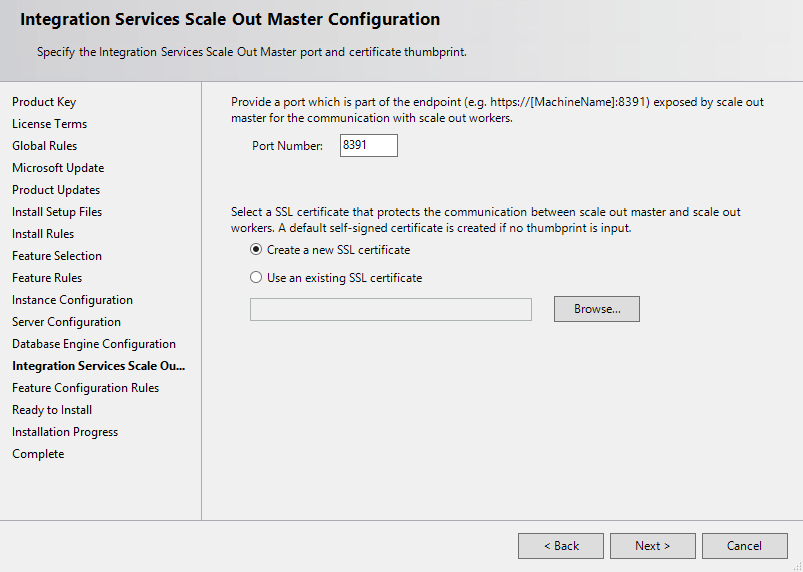
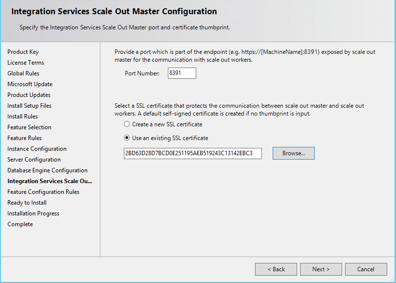
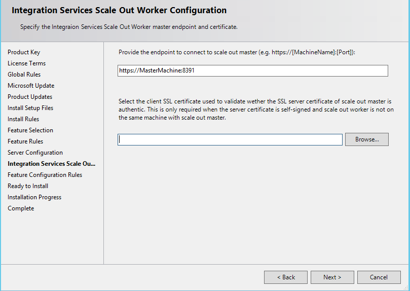
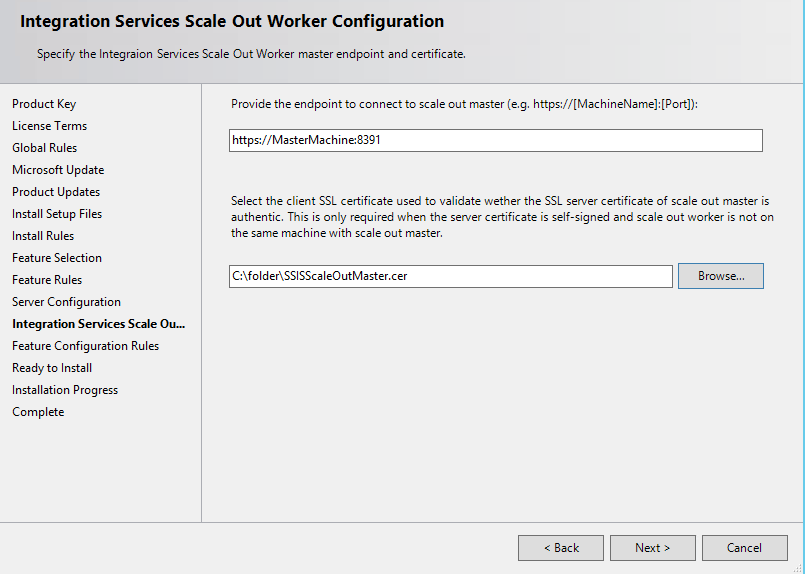

# Integration Services (SSIS) Scale Out
[!INCLUDE[ssISnoversion](../includes/ssisnoversion-md.md)] Scale Out provides high performance package execution by distributing executions to multiple machines. You are able to submit a request for multiple package executions in SQL Server Management Studio. These packages will be executed in parallel, in a scale out mode.  

[!INCLUDE[ssIS_md](../includes/ssis-md.md)] Scale Out consists of a [!INCLUDE[ssIS_md](../includes/ssis-md.md)] Scale Out Master and several [!INCLUDE[ssIS_md](../includes/ssis-md.md)] Scale Out Workers. The Scale Out Master is responsible for Scale Out management and receives package execution requests from users. Scale Out Workers pull execution tasks from the Scale Out Master and do the package execution work. For more information, see [Scale Out Master](#master), [Scale Out Worker](#worker).

[!INCLUDE[ssISnoversion](../includes/ssisnoversion-md.md)] Scale Out can run on one machine, where a Scale Out Master and a Scale Out Worker are set up side-by-side on the machine. Scale Out can also run on multiple machines, where each Scale Out Worker is on a different machine.
- [Walkthrough: Set up Integration Services Scale Out](#walkthrough)

Scale Out supports running multiple packages in the SSISDB catalog in parallel. For more details, see [Run packages in Scale Out](#run_scale_out).

## <a name="walkthrough"></a> Walkthrough: Set Up Integration Services Scale Out
Set up [!INCLUDE[ssISnoversion_md](../includes/ssisnoversion-md.md)] Scale Out by completing the following tasks. 

> [!NOTE]
> If you are installing Scale Out on one computer, install the Scale Out Master and Scale Out Worker features at the same time. When you install the features at the same time, the endpoint is automatically generated to connect to Scale Out Master. 

* [Install Scale Out Master](#InstallMaster)

* [Install Scale Out Worker](#InstallWorker)

* [Install Scale Out Worker client certificate](#InstallCert)

* [Open firewall port](#Firewall)

* [Start SQL Server Scale Out Master and Worker service](#Start)

* [Enable Scale Out Master](#EnableMaster)

* [Enable SQL Server Authentication mode](#EnableAuth)

* [Enable Scale Out Worker](#EnableWorker)

### <a name="InstallMaster"></a> Install Scale Out Master

To enable the functionality of Scale Out Master, you must install Database Engine Services, [!INCLUDE[ssISnoversion_md](../includes/ssisnoversion-md.md)], and its Scale Out Master feature when you set up [!INCLUDE[ssNoVersion_md](../includes/ssnoversion-md.md)]. 

For information on setting up Database Engine Services and [!INCLUDE[ssISnoversion_md](../includes/ssisnoversion-md.md)], see [Install SQL Server Database Engine](../database-engine/install-windows/install-sql-server-database-engine.md), and [Install Integration Services](../integration-services/install-windows/install-integration-services.md).
> [!NOTE]
> During Database Engine installation, select Mixed Mode for Authentication mode on the Database Engine Configuration page. 

**To install the Scale Out Master feature, use the [!INCLUDE[ssNoVersion_md](../includes/ssnoversion-md.md)] installation wizard or the command prompt.**

- Steps for the [!INCLUDE[ssNoVersion_md](../includes/ssnoversion-md.md)] installation wizard
  1.  On the **Feature Selection** page, select **Scale Out Master**, which is listed under [!INCLUDE[ssISnoversion](../includes/ssisnoversion-md.md)].   
  
  
  2.  On the **Server Configuration** page, select the account to run **SQL Server Integration Services Scale Out Master service** and select the **Startup Type**.  
  
  3.  On the **Integration Services Scale Out Master Configuration** page, specify the port number that Scale Out Master uses to communicate with Scale Out Worker. The default port number is 8391.  
  
  4.  Specify the SSL certificate used to protect the communication between Scale Out Master and Scale Out Worker by doing one of the following.
    * Let the setup process create a default, self-signed SSL certificate by clicking **Create a new SSL certificate**. The default certificate is installed under Trusted Root Certification Authorities, Local Computer.
    * Select an existing SSL Certicate on the local computer by clicking **Use an existing SSL certificate** and then clicking **Browse**. The thumbprint of the certificate appears in the text box. Clicking **Browse** displays certificates that are stored in Trusted Root Certification Authorities, Local Computer. The certificate you select must be stored here.       

  5.  Finish the [!INCLUDE[ssNoVersion_md](../includes/ssnoversion-md.md)] installation wizard.
- Steps for the command prompt

    Follow the instructions in [Install SQL Server from the Command Prompt](../database-engine/install-windows/install-sql-server-2016-from-the-command-prompt.md). Set the Scale Out Master related parameters by doing the following.
  1.  Add IS_Master to the parameter /FEATURES
  2.  Configure Scale Out Master by specifying the following parameters and their values: /ISMASTERSVCACCOUNT, /ISMASTERSVCPASSWORD, /ISMASTERSVCSTARTUPTYPE, /ISMASTERSVCPORT, /ISMASTERSVCTHUMBPRINT(optional).
  
### <a name="InstallWorker"></a> Install Scale Out Worker
 
To enable the functionality of Scale Out Worker, you must install [!INCLUDE[ssISnoversion_md](../includes/ssisnoversion-md.md)] and its Scale Out Worker feature in [!INCLUDE[ssNoVersion_md](../includes/ssnoversion-md.md)] setup.

**To install the Scale Out Worker feature, use the [!INCLUDE[ssNoVersion_md](../includes/ssnoversion-md.md)] installation wizard or the command prompt.**

- Steps for the [!INCLUDE[ssNoVersion_md](../includes/ssnoversion-md.md)] installation wizard
  1.  On the **Feature Selection** page, select **Scale Out Worker**, which is listed under [!INCLUDE[ssISnoversion](../includes/ssisnoversion-md.md)].   
  
  2. On the **Server Configuration** page, select the account to run **SQL Server Integration Services Scale Out Worker service** and select the **Startup Type**.    
  
  3. On the **Integration Services Scale Out Worker Configuration** page, specify the endpoint to connect to Scale Out Master. 
    - For a **one computer** environment, the endpoint is automatically generated when Scale Out Master and Scale Out Worker are installed at the same time. 
    - For a **multiple computers** environment, the endpoint consists of the name or IP of the computer with Scale Out Master installed and the port number specified during the Scale Out Master installation.    
   
    
  4. For a **multiple computers** environment, specify the client SSL certificate that is used to validate Scale Out Master. For a **one computer** environment, there's no need to specify the client SSL certificate. 
  
     > [!NOTE]
     > When the SSL certificate used by Scale Out Master is self-signed, a corresponding client SSL certificate is required to be installed on the computer with Scale Out Worker. If you provide the file path for the client SSL Certificate on the **Integration Services Scale Out Worker Configuration** page, the certificate will be installed automatically; otherwise, you have to install the certificate manually later. 
     
     Click **Browse** to find the certificate file (*.cer). To use the default SSL certificate, select the SSISScaleOutMaster.cer file located under \<drive\>:\Program Files\Microsoft SQL Server\140\DTS\Binn on the computer on which Scale Out Master is installed.   
   
  5. Finish the [!INCLUDE[ssNoVersion_md](../includes/ssnoversion-md.md)] installation wizard.
- Steps for the command prompt

    Follow the instructions in [Install SQL Server from the Command Prompt](../database-engine/install-windows/install-sql-server-2016-from-the-command-prompt.md). Set the Scale Out Worker related parameters by doing the following.
    1.  Add IS_Worker to the parameter /FEATURES
    2. Configure Scale Out Worker specifying the following parameters and their values: /ISWORKERSVCACCOUNT, /ISWORKERSVCPASSWORD, /ISWORKERSVCSTARTUPTYPE, /ISWORKERSVCMASTER(optional), /ISWORKERSVCCERT(optional).

 
### <a name="InstallCert"></a> Install Scale Out Worker client certificate

During the installation of Scale Out Worker, a worker certificate will be automatically created and installed on the computer. Also, a corresponding client certificate, SSISScaleOutWorker.cer, is installed under \<driver\>:\Program Files\Microsoft SQL Server\140\DTS\Binn. For Scale Out Master to authenticate the Scale Out Worker, you must add this client certificate to the Root store of the local computer with Scale Out Master.
  
To add the client certificate to the Root store, double click the .cer file and then click **Install Certificate** in the Certificate dialog box. The **Certificate Import Wizard** displays.  

## <a name="Firewall"></a> Open firewall port

Open the port specified during the Scale Out Master installation and the port of SQL Server (1433, by default), using Windows Firewall on the Scale Out Master computer.
    
## <a name="Start"></a> Start SQL Server Scale Out Master and Worker services

If the startup type of the services is not set to Automatic during installation, start the services: SQL Server Integration Services Scale Out Master 14.0 (SSISScaleOutMaster140) and SQL Server Integration Services Scale Out Worker 14.0 (SSISScaleOutWorker140). 

> [!NOTE]
> After you open the firewall port, you also need to restart the Scale Out Worker service.
   
### <a name="EnableMaster"></a> Enable Scale Out Master

Click **Enable this server as SSIS scale out master** in the **Create Catalog** dialog when you create the SSISDB catalog in [!INCLUDE[ssNoVersion_md](../includes/ssnoversion-md.md)] [!INCLUDE[ssManStudio_md](../includes/ssmanstudio-md.md)].

## <a name="EnableAuth"></a> Enable SQL Server Authentication mode
If [!INCLUDE[ssNoVersion_md](../includes/ssnoversion-md.md)] authentication is not enabled during the Database Engine installation, enable SQL Server authentication mode on the [!INCLUDE[ssNoVersion_md](../includes/ssnoversion-md.md)] instance that hosts the SSISDB catalog. 

Package execution is not blocked when SQL Server authentication is disabled. However, the execution log will not be able to write to SSISDB.

### <a name="EnableWorker"></a> Enable Scale Out Worker
To enable a Scale Out Worker, execute the *[catalog].[enable_worker_agent]* stored procedure with **WorkerAgentId** as the parameter. 

You get the **WorkerAgentId** value from the *[catalog].[worker_agents]* database view in SSISDB, after Scale Out Worker registers with Scale Out Master. Registration takes several minutes once the the Scale Out Master and Worker services are started.

#### Example
This example enables the Scale Out Worker on computerA.
```tsql
SELECT WorkerAgentId, computerName FROM [catalog].[worker_agents]
GO
-- Result: --
-- WorkerAgentId                           computerName --
-- 6583054A-E915-4C2A-80E4-C765E79EF61D    computerA    --

EXEC [catalog].[enable_worker_agent] '6583054A-E915-4C2A-80E4-C765E79EF61D'
GO 
```
### Next Steps
The set up of the Scale Out feature is finished. You can now run packages in Scale Out. For more information, see [Execute Packages in Integration Services (SSIS) Scale Out](#run_scale_out).

## <a name="master"></a> Integration Services (SSIS) Scale Out Master
Scale Out Master manages the Scale Out system through the SSISDB Catalog and the Scale Out Master service. 

The SSISDB Catalog stores all the information for Scale Out Workers, packages and executions. It provides the interface to enable a Scale Out Worker and execute packages in Scale Out. For more information, see [Walkthrough: Set up Integration Services Scale Out](#walkthrough), [Run Packages in Integration Services](#run_scale_out).

Scale Out Master service is a Windows service that is responsible for the communication with Scale Out Workers. It exchanges the status of package executions with Scale Out Workers through HTTPS and operates on the data in SSISDB. 

### Scale Out related SQL views and stored procedures in SSISDB

#### Views:
[[catalog].[master_properties]](../integration-services/system-views/catalog-master-properties-ssisdb-database.md), [[catalog].[worker_agents]](../integration-services/system-views/catalog-worker-agents-ssisdb-database.md).

#### Stored procedures:

- For Scale Out Worker management:  
 [[catalog].[disable_worker_agent]](../integration-services/system-stored-procedures/catalog-disable-worker-agent-ssisdb-database.md), [[catalog].[enable_worker_agent]](../integration-services/system-stored-procedures/catalog-enable-worker-agent-ssisdb-database.md).
- For executing packages in Scale Out:   
[[catalog].[create_execution]](../integration-services/system-stored-procedures/catalog-create-execution-ssisdb-database.md), [[catalog].[add_execution_worker]](../integration-services/system-stored-procedures/catalog-add-execution-worker-ssisdb-database.md), [[catalog].[start_execution]](../integration-services/system-stored-procedures/catalog-start-execution-ssisdb-database.md).   

### Configure SQL Server Integration Services Scale Out Master service
Scale Out Master service can be configured using the \<driver\>:\Program Files\Microsoft SQL Server\140\DTS\Binn\MasterSettings.config file. The service must be restarted after updating the configuration file.


Configuration  |Description  |Default Value  
---------|---------|---------
PortNumber|The network port number used to communicate with a Scale Out Worker.|8391         
SSLCertThumbprint|The thumbprint of the SSL certificate used to protect  the communication with a Scale Out Worker.|The thumbprint of the SSL certificate specified during the Scale Out Master installation         
InstanceName|The name of the [!INCLUDE[ssNoVersion_md](../includes/ssnoversion-md.md)] instance that contains the SSISDB catalog. MSSQLSERVER is the name of the default [!INCLUDE[ssNoVersion_md](../includes/ssnoversion-md.md)] instance. |The name of the SQL Server instance that is installed with the Scale Out Master         
CleanupCompletedJobsIntervalInMs|The interval for cleaning up completed execution jobs, in milliseconds.|43200000         
DealWithExpiredTasksIntervalInMs|The interval for dealing with expired execution jobs, in milliseconds.|300000
MasterHeartbeatIntervalInMs|The interval for the Scale Out Master heartbeat, in milliseconds. This specifies the interval that Scale Out Master updates it's online status in the SSISDB catalog.|30000        

### View Scale Out Master service log
The Scale Out Master service log file is located in the \<driver\>:\Users\\*[account]*\AppData\Local\SSIS\Cluster\Master folder path. 

The *[account]* folder refers to the account running Scale Out Master service. By default, this account is SSISScaleOutMaster140.

## <a name="worker"></a> Integration Services (SSIS) Scale Out Worker
Scale Out Worker runs a [!INCLUDE[ssNoVersion_md](../includes/ssnoversion-md.md)] [!INCLUDE[ssISnoversion_md](../includes/ssisnoversion-md.md)] Scale Out Worker service to pull execution tasks from Scale Out Master and, executes the packages locally with ISServerExec.exe.

### Configure SQL Server Integration Services Scale Out Worker service
Scale Out Worker service can be configured using the \<driver\>:\Program Files\Microsoft SQL Server\140\DTS\Binn\WorkerSettings.config file. The service must be restarted after updating the configuration file.

Configuration  |Description  |Default value  
---------|---------|---------
DisplayName|The display name of the Scale Out Worker. **NOT in use in [!INCLUDE[ssNoVersion_md](../includes/ssnoversion-md.md)] 2017 CTP1.**|Machine name         
Description|The description of the Scale Out Worker. **NOT in use in [!INCLUDE[ssNoVersion_md](../includes/ssnoversion-md.md)] 2017 CTP1.**|Empty         
MasterEndpoint|The endpoint to connect to Scale Out Master.|The endpoint set during the Scale Out Worker installation         
MasterHttpsCertThumbprint|The thumbprint of the client SSL certificate used to authenticate Scale Out Master|The thumbprint of the client certificate specified during the Scale Out Worker installation.          
WorkerHttpsCertThumbprint|The thumbprint of the certificate for Scale Out Master used to authenticate the Scale Out Worker.|The thumbprint of a certificate created and installed automatically during the Scale Out Worker installation          
StoreLocation|The store location of worker certificate.|LocalMachine       
StoreName|The store name that worker certificate is in.|My         
AgentHeartbeatInterval|The interval of the Scale Out Worker heartbeat.|00:01:00         
TaskHeartbeatInterval|The interval of the Scale Out Worker reporting task state.|00:00:10         
HeartbeatErrorTollerance|After this time period from last successful task heartbeat, the task is terminated if error response of heartbeat is received.|00:10:00      
TaskRequestMaxCPU|The upper limit of CPU for Scale Out Worker to request tasks. **NOT in use in [!INCLUDE[ssNoVersion_md](../includes/ssnoversion-md.md)] 2017 CTP1.**|70.0         
TaskRequestMinMemory|The lower limit of memory in MB for Scale Out Worker to request tasks. **NOT in use in [!INCLUDE[ssNoVersion_md](../includes/ssnoversion-md.md)] 2017 CTP1.**|100.0         
MaxTaskCount|The max number of tasks the Scale Out Worker can hold.|10         
LeaseInternval|The lease interval of a task holding by the Scale Out Worker.|00:01:00         
TasksRootFolder|The folder of task logs. The \<driver\>:\Users\\*[account]*\AppData\Local\SSIS\Cluster\Tasks folder path is used if the value is empty. [account] is the account running Scale Out Worker service. By default, the account is SSISScaleOutWorker140.|Empty         
TaskLogLevel|The task log level of the Scale Out Worker. (Verbose 0x01, Information 0x02, Warning 0x04, Error 0x08, Progress 0x10, CriticalError 0x20, Audit 0x40)|126 (Information,Warning,Error,Progress,CriticalError,Audit)     
TaskLogSegment|The time span of a task log file.|00:00:00         
TaskLogEnabled|Specifies whether the task log is enabled.|true         
ExecutionLogCacheFolder|The folder used to cache package execution log. The \<driver\>:\Users\\*[account]*\AppData\Local\SSIS\Cluster\Agent\ELogCache folder path is used if the value is empty. [account] is the account running Scale Out Worker service. By default, the account is SSISScaleOutWorker140.|Empty         
ExecutionLogMaxBufferLogCount|The max number of execution logs cached, in one execution log buffer in memory.|10000        
ExecutionLogMaxInMemoryBufferCount|The max number of execution log buffers in memory for execution logs.|10         
ExecutionLogRetryCount|The retry count if execution logging fails.|3         
AgentId|Worker agent Id of the Scale Out Worker|Generated automatically        

### View Scale Out Worker log
The log file of Scale Out Worker service is in the \<driver\>:\Users\\*[account]*\AppData\Local\SSIS\Cluster\Agent folder path.

The log location of each individual task is configured in the WorkerSettings.config file by TasksRootFolder. If it is not specified, the log is in the \<driver\>:\Users\\*[account]*\AppData\Local\SSIS\Cluster\Tasks folder path. 

The *[account]* folder is the account running Scale Out Worker service. By default, the account is SSISScaleOutWorker140.

## <a name="run_scale_out"></a> Run Packages in Integration Services (SSIS) Scale Out
After the packages are deployed to the Integration Services server, you can execute them in Scale Out.

### Run packages with **Execute Package In Scale Out** dialog 

1. ### Open the Execute Package In Scale Out dialog box ###
    In [!INCLUDE[ssManStudioFull_md](../includes/ssmanstudiofull-md.md)], connect to the Integration Services server. In Object Explorer, expand the tree to display the nodes under **Integration Services Catalogs**. Right-click the **SSISDB** node or the project or the package you want to run, and then click **Execute in Scale Out**.
2. ### Select packages and set the options ###
    On the **Package Selection** page, you select multiple packages to run and set the environment, parameters, connection managers, and advanced options for each package. Click a package to set these options.
    
    In the **Advanced** tab, you set a Scale Out option called **Retry count**. It sets the number of times a package execution will retry if it fails.
3. ### Select machines ###
    On the **Machine Selection** page, you select the Scale Out Worker machines to run the packages. By default, any machine is allowed to run the packages. 

   > [!NOTE]
> The packages are executed with the credential of the user accounts of the Scale Out Worker services, which are shown on the **Machine Selection** page. By default, the account is NT Service\SSISScaleOutWorker140. You may want to change to your own lab accounts.

4. ### Run the packages and view reports 
    Click **OK** to start the package executions. To view the execution report for a package, right-click the package in Object Explorer, click **Reports**, click **All Executions**, and find the execution.
    
### Run packages with stored procedures

1. ### Create executions ###
    Call [catalog].[create_execution] for each package. Set parameter **@runincluster** to True. If not all Scale Out Worker machines are allowed to run the package, set parameter **@useanyworker** to False.   
2. ### Set execution parameters ###
    Call [catalog].[set_execution_parameter_value] for each execution.
3. ### Set Scale Out Workers ###
    Call [catalog].[add_execution_worker]. If any machine is allowed to run the package, you do not need to call this stored procedure. 
4. ### Start executions ###
    Call [catalog].[start_execution]. Set parameter **@retry_count** to set the number of times a package execution will retry if it fails.
    
#### Example
The following example runs two packages, package1.dtsx and package2.dtsx, in Scale Out with one Scale Out Worker.  

```sql
Declare @execution_id bigint
EXEC [SSISDB].[catalog].[create_execution] @package_name=N'package1.dtsx', @execution_id=@execution_id OUTPUT, @folder_name=N'folder1', @project_name=N'project1', @use32bitruntime=False, @reference_id=Null, @useanyworker=False, @runincluster=True
Select @execution_id
DECLARE @var0 smallint = 1
EXEC [SSISDB].[catalog].[set_execution_parameter_value] @execution_id,  @object_type=50, @parameter_name=N'LOGGING_LEVEL', @parameter_value=@var0
EXEC [SSISDB].[catalog].[add_execution_worker] @execution_id,  @workeragent_id=N'64c020e2-f819-4c2d-a22f-efb31a91e70a'
EXEC [SSISDB].[catalog].[start_execution] @execution_id,  @retry_count=0
GO

Declare @execution_id bigint
EXEC [SSISDB].[catalog].[create_execution] @package_name=N'package2.dtsx', @execution_id=@execution_id OUTPUT, @folder_name=N'folder2', @project_name=N'project2', @use32bitruntime=False, @reference_id=Null, @useanyworker=False, @runincluster=True
Select @execution_id
DECLARE @var0 smallint = 1
EXEC [SSISDB].[catalog].[set_execution_parameter_value] @execution_id,  @object_type=50, @parameter_name=N'LOGGING_LEVEL', @parameter_value=@var0
EXEC [SSISDB].[catalog].[add_execution_worker] @execution_id,  @workeragent_id=N'64c020e2-f819-4c2d-a22f-efb31a91e70a'
EXEC [SSISDB].[catalog].[start_execution] @execution_id,  @retry_count=0
GO
```

### Permissions
Running packages in Scale Out requires one the following permissions:

-   Membership in the **ssis_admin** database role  

-   Membership in the **ssis_cluster_executor** database role  
  
-   Membership in the **sysadmin** server role  
