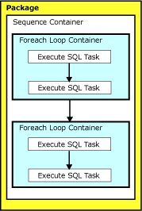

# Integration Services Transactions
  Packages use transactions to bind the database actions that tasks perform into atomic units, and by doing this maintain data integrity. All [!INCLUDE[msCoName](../includes/msconame-md.md)] [!INCLUDE[ssISnoversion](../includes/ssisnoversion-md.md)] container types-packages, the For Loop, Foreach Loop, and Sequence containers, and the task hosts that encapsulate each task-can be configured to use transactions. [!INCLUDE[ssISnoversion](../includes/ssisnoversion-md.md)] provides three options for configuring transactions: **NotSupported**, **Supported**, and **Required**.  
  
-   **Required** indicates that the container starts a transaction, unless one is already started by its parent container. If a transaction already exists, the container joins the transaction. For example, if a package that is not configured to support transactions includes a Sequence container that uses the **Required** option, the Sequence container would start its own transaction. If the package were configured to use the **Required** option, the Sequence container would join the package transaction.  
  
-   **Supported** indicates that the container does not start a transaction, but joins any transaction started by its parent container. For example, if a package with four Execute SQL tasks starts a transaction and all four tasks use the **Supported** option, the database updates performed by the Execute SQL tasks are rolled back if any task fails. If the package does not start a transaction, the four Execute SQL tasks are not bound by a transaction, and no database updates except the ones performed by the failed task are rolled back.  
  
-   **NotSupported** indicates that the container does not start a transaction or join an existing transaction. A transaction started by a parent container does not affect child containers that have been configured to not support transactions. For example, if a package is configured to start a transaction and a For Loop container in the package uses the **NotSupported** option, none of the tasks in the For Loop can roll back if they fail.  
  
 You configure transactions by setting the TransactionOption property on the container. You can set this property by using the **Properties** window in [!INCLUDE[ssBIDevStudioFull](../includes/ssbidevstudiofull-md.md)], or you can set the property programmatically.  
  
> [!NOTE]  
>  The **TransactionOption** property influences whether or not the value of the **IsolationLevel** property requested by a container is applied. For more information, see the description of the **IsolationLevel** property in the topic, [Setting Package Properties](../integration-services/set-package-properties.md).  
  
## Configure a package to use transactions
When you configure a package to use transactions, you have two options:  
  
-   Have a single transaction for the package. In this case, it is the package itself that *initiates* this transaction, whereas individual tasks and containers in the package participate in this single transaction.  
  
-   Have multiple transactions in the package. In this case, the package supports transactions, but individual tasks and containers in the package actually initiate the transactions.  
  
 The following procedures describe how to configure both options.  
  
### Configure a package to use a single transaction  
 In this option, the package itself initiates a single transaction. You configure the package to initiate this transaction by setting the TransactionOption property of the package to **Required**.  
  
 Next, you enlist specific tasks and containers in this single transaction. To enlist a task or container in a transaction, you set the TransactionOption property of that task or container to **Supported**.  
  
1.  In [!INCLUDE[ssBIDevStudioFull](../includes/ssbidevstudiofull-md.md)], open the [!INCLUDE[ssISnoversion](../includes/ssisnoversion-md.md)] project that contains the package you want to configure to use a transaction.  
  
2.  In Solution Explorer, double-click the package to open it.  
  
3.  Click the **Control Flow** tab.  
  
4.  Right-click anywhere in the background of the control flow design surface, and then click **Properties**.  
  
5.  In the **Properties** window, set the TransactionOption property to **Required**.  
  
6.  On the design surface of the **ControlFlow** tab, right-click the task or the container that you want to enroll in the transaction, and then click **Properties**.  
  
7.  In the **Properties** window, set the TransactionOption property to **Supported**.  
  
    > [!NOTE]  
    >  To enlist a connection in a transaction, enroll the tasks that use the connection in the transaction. For more information, see [Integration Services &#40;SSIS&#41; Connections](../integration-services/connection-manager/integration-services-ssis-connections.md).  
  
8.  Repeat steps 6 and 7 for each task and container that you want to enroll in the transaction.  
  
### Configure a package to use multiple transactions  
 In this option, the package itself supports transactions but does not start a transaction. You configure the package to support transactions by setting the TransactionOption property of the package to **Supported**.  
  
 Next, you configure the desired tasks and containers inside the package to initiate or participate in transactions. To configure a task or container to initiate a transaction, you set the TransactionOption property of that task or container to **Required**.   
  
1.  In [!INCLUDE[ssBIDevStudioFull](../includes/ssbidevstudiofull-md.md)], open the [!INCLUDE[ssISnoversion](../includes/ssisnoversion-md.md)] project that contains the package you want to configure to use transaction.s  
  
2.  In Solution Explorer, double-click the package to open it.  
  
3.  Click the **Control Flow** tab.  
  
4.  Right-click anywhere in the background of the control flow design surface, and then click **Properties**.  
  
5.  In the **Properties** window, set the TransactionOption property to **Supported**.  
  
    > [!NOTE]  
    >  The package supports transactions, but the transactions are started by task or containers in the package.  
  
6.  On the design surface of the **ControlFlow** tab, right-click the task or the container in the package for which you want to start a transaction, and then click **Properties**.  
  
7.  In the **Properties** window, set the TransactionOption property to **Required**.  
  
8.  If a transaction is started by a container, right-click the task or the container that you want to enroll in the transaction, and then click **Properties**.  
  
9. In the **Properties** window, set the TransactionOption property to **Supported**.  
  
    > [!NOTE]  
    >  To enlist a connection in a transaction, enroll the tasks that use the connection in the transaction. For more information, see [Integration Services &#40;SSIS&#41; Connections](../integration-services/connection-manager/integration-services-ssis-connections.md).  
  
10. Repeat steps 6 through 9 for each task and container that starts a transaction.  

## Multiple transactions in a package
It is possible for a package to include unrelated transactions in an [!INCLUDE[ssISnoversion](../includes/ssisnoversion-md.md)] package. Any time a container in the middle of a nested container hierarchy does not support transactions, the containers above or below it in the hierarchy start separate transactions if they are configured to support transactions. The transactions commit or roll back in order from the innermost task in the nested container hierarchy to the package. However, after the inner transaction commits, it does not roll back if an outer transaction is aborted.  
  
### Example of multiple transactions in a package 
 For example, a package has a Sequence container that holds two Foreach Loop containers, and each container include two Execute SQL tasks. The Sequence container supports transactions, the Foreach Loop containers do not, and the Execute SQL tasks do. In this example, each Execute SQL task would start its own transaction and would not roll back if the transaction on the Sequence task was aborted.  
  
 The TransactionOption properties of the Sequence container, Foreach Loop container and the Execute SQL tasks are set as follows:  
  
-   The TransactionOption property of the Sequence container is set to **Required**.  
  
-   The TransactionOption properties of the Foreach Loop containers are set to **NotSupported**.  
  
-   The TransactionOption properties of the Execute SQL tasks are set to **Required**.  
  
 The following diagram shows the five unrelated transactions in the package. One transaction is started by the Sequence container and four transactions are started by the Execute SQL tasks.  
  
   
 
## Inherited transactions
 A package can run another package by using the Execute Package task. The child package, which is the package run by the Execute Package task, may create its own package transaction, or it may inherit the parent package transaction.  
  
 A child package inherits the parent package transaction if both of the following are true:  
  
-   The package is invoked by an Execute Package task.  
  
-   The Execute Package task that invoked the package also joined the parent package transaction.  
  
 Containers and tasks in the child package cannot join the parent package transaction unless the child package itself joins the transaction.  
  
### Example of inherited transactions  
 In the following diagram, there are three packages that all use transactions. Each package contains multiple tasks. To emphasize the behavior of the transactions, only the Execute Package tasks are shown. Package A runs packages B and C. In turn, package B runs packages D and E, and package C runs package F.  
  
 Packages and tasks have the following transaction attributes:  
  
-   **TransactionOption** is set to **Required** on packages A and C  
  
-   **TransactionOption** is set to **Supported** on packages B and D, and on the tasks Execute Package B, Execute Package D, and Execute Package F.  
  
-   **TransactionOption** is set to **NotSupported** on package E, and on the tasks Execute Package C and Execute Package E.  
  
   
  
 Only packages B, D, and F can inherit transactions from their parent packages.  
  
 Packages B and D inherit the transaction that was started by package A.  
  
 Package F inherits the transaction that was started by package C.  
  
 Packages A and C control their own transactions.  
  
 Package E does not use transactions.  
 
  
## External Resources  
  
-   Blog entry, [How to Use Transactions in SQL Server Integration Services SSIS](https://go.microsoft.com/fwlink/?LinkId=157783), on www.mssqltips.com  
  
## See Also  
 [Inherited Transactions](https://msdn.microsoft.com/library/90db5564-d41e-4cfe-8c9e-4e68d41eff1c)   
 [Multiple Transactions](https://msdn.microsoft.com/library/c3664a94-be89-40c0-a3a0-84b74a7fedbe)  
  
  
