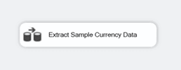

# Lesson 1-9: Test the Lesson 1 package

[!INCLUDE[ssis-appliesto](../../includes/ssis-appliesto-ssvrpluslinux-asdb-asdw-xxx.md)]

In this tutorial, you've done the following tasks:  
  
-   Created a new [!INCLUDE[ssIS](../includes/ssis-md.md)] project.  
  
-   Configured the connection managers for the package to connect to the source and destination data.  
  
-   Added a data flow that takes the data from a flat file source, performs the necessary Lookup transformations on the data, and configures the data for the destination.  
  
Your package is now complete and ready to test!
  
## Check the package components
  
Before you test the package, verify that the control and data flows in the Lesson 1 package contain the objects shown in the following diagrams.  
  
**Control Flow** 
  
  
  
**Data Flow**  
  
  
  
## Run the Lesson 1 package  
  
1.  On the **Debug** menu, select **Start Debugging**.  
  
    The package runs, resulting in 1,097 rows successfully added into the **NewFactCurrencyRate** fact table in **AdventureWorksDW2012**. To verify this result, select the **Data Flow** tab.
  
2.  After the package has completed running, on the **Debug** menu, select **Stop Debugging**.  
  
## Go to next lesson
[Lesson 2: Add looping with SSIS](../integration-services/lesson-2-adding-looping-with-ssis.md)  
  
## See also  
[Execution of projects and packages](packages/run-integration-services-ssis-packages.md) 
  
  
  
