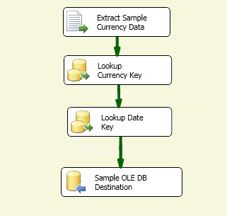

# Lesson 3-3: Test the Lesson 3 tutorial package

[!INCLUDE[ssis-appliesto](../includes/ssis-appliesto-ssvrpluslinux-asdb-asdw-xxx.md)]

In this task, you run the **Lesson 3.dtsx** package. As the package runs, the **Log Events** window lists the log entries that SSIS writes to the log file by the log provider. After the package finishes execution, you can view the contents of the log file.  
  
## Check the package layout  
Before you test the package, verify the control and data flows in the Lesson 3 package resemble the objects shown in the following diagrams. The control flow should be the same as lesson 2, and the data flow should be the same as lessons 1 and 2.  
  
**Control Flow**  
  
  
  
**Data Flow**  
  
  
  
## Run the Lesson 3 tutorial package  
  
1.  On the SSIS menu, select **Log Events**.  
  
2.  On **Debug** menu, select **Start Debugging**.  
  
3.  After the package has completed running, on the **Debug** menu, select **Stop Debugging**.  
  
## Examine the generated log file  
  
-   Using Notepad or any other text editor, open the TutorialLog.log file.  
  
-   A complete description of the information generated for the **PipelineExecutionPlan** and **PipelineExecutionTrees** events is beyond the scope of this tutorial.  In the log file, you can see that the first line lists the information fields specified in the **Details** tab of the **Configure SSIS Logs** dialog box. You can also see that [!INCLUDE[ssISnoversion](../includes/ssisnoversion-md.md)] logged the two events that you selected, **PipelineExecutionPlan** and **PipelineExecutionTrees**, for each iteration of the Foreach Loop.  
  
## Next lesson  
[Lesson 4: Add error flow redirection with SSIS](../integration-services/lesson-4-add-error-flow-redirection-with-ssis.md)  
  
  
  
