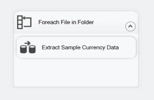
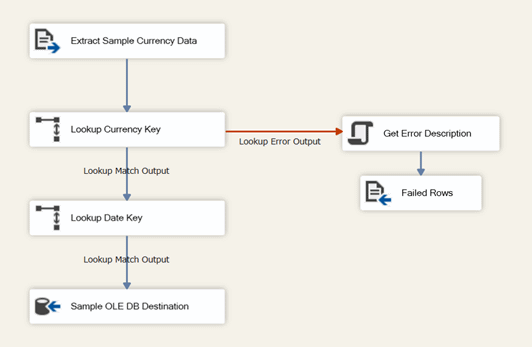

# Lesson 4-5: Test the Lesson 4 package

At run time, the corrupted file **Currency_BAD.txt** fails to generate a match within the Currency Key Lookup transformation. Because you configured the error output of Currency Key Lookup to redirect failed rows to the new Failed Rows destination, the component doesn't fail, and the package runs successfully. [!INCLUDE[ssISnoversion](../includes/ssisnoversion-md.md)] writes all failed error rows to **ErrorOutput.txt**.  
  
In this task, you test the revised error output configuration by running the package. After successful package execution, you view the contents of the **ErrorOutput.txt** file.  
  
> [!NOTE]  
> If you don't want to accumulate error rows in the **ErrorOutput.txt** file, manually delete the file content between package runs.  
  
## Check the package layout  
Before you test the package, verify that the control flow and the data flow in the Lesson 4 package are similar to the following diagrams: 
  
**Control Flow**  
  
  
  
**Data Flow**  
  
  
  
## Run the Lesson 4 tutorial package  
  
1.  On the **Debug** menu, select **Start Debugging**.  
  
2.  After the package has completed running, on the **Debug** menu, select **Stop Debugging**.  
  
## View the contents of the ErrorOutput.txt file  
  
In Notepad or any other text editor, open the **ErrorOutput.txt** file. The default column order is: AverageRate, CurrencyID, CurrencyDate, EndOfDateRate, ErrorCode, ErrorColumn, ErrorDescription.  
 
All the rows in the file contain the unmatched CurrencyID value "BAD", ErrorCode value -1071607778, ErrorColumn value 0, and ErrorDescription value "Row yielded no match during lookup". The value of ErrorColumn is 0 because the error isn't column-specific, rather, the lookup operation failed.
  
  
## Next lesson
[Lesson 5: Add SSIS package configurations for the package deployment model](../integration-services/lesson-5-add-ssis-package-configurations-for-the-package-deployment-model.md)  
