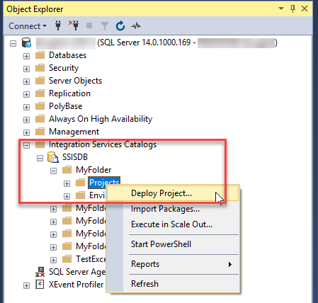
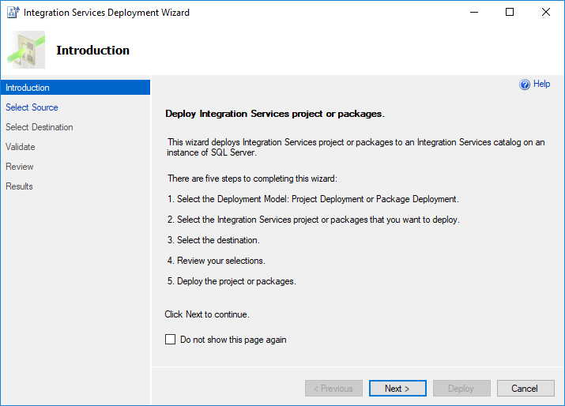

# Tutorial: Deploy and run a SQL Server Integration Services (SSIS) package in Azure

[!INCLUDE[sqlserver-ssis](../../includes/applies-to-version/sqlserver-ssis.md)]


This tutorial shows you how to deploy a SQL Server Integration Services (SSIS) project to the SSIS Catalog in Azure SQL Database, run a package in the Azure-SSIS Integration Runtime, and monitor the running package.

## Prerequisites

Before you start, make sure you have version 17.2 or later of SQL Server Management Studio. To download the latest version of SSMS, see [Download SQL Server Management Studio (SSMS)](../../ssms/download-sql-server-management-studio-ssms.md).

Also make sure that you have set up the SSISDB database in Azure and provisioned the Azure-SSIS Integration Runtime. For info about how to provision SSIS on Azure, see [Deploy SQL Server Integration Services packages to Azure](/azure/data-factory/tutorial-deploy-ssis-packages-azure).

## For Azure SQL Database, get the connection info

To run the package on Azure SQL Database, get the connection information you need to connect to the SSIS Catalog database (SSISDB). You need the fully qualified server name and login information in the procedures that follow.

1. Log in to the [Azure portal](https://portal.azure.com/).
2. Select **SQL Databases** from the left-hand menu, and then select the SSISDB database on the **SQL databases** page. 
3. On the **Overview** page for your database, review the fully qualified server name. To see the **Click to copy** option, hover over the server name. 
4. If you forget your Azure SQL Database server login information, navigate to the SQL Database server page to view the server admin name. You can reset the password if necessary.

## Connect to the SSISDB database

Use SQL Server Management Studio to connect to the SSIS Catalog on your Azure SQL Database server. For more info and screenshots, see [Connect to the SSISDB Catalog database on Azure](ssis-azure-connect-to-catalog-database.md).

Here are the two most important things to remember. These steps are described in the following procedure.
-   Enter the fully qualified name of the Azure SQL Database server in the format **mysqldbserver.database.windows.net**.
-   Select `SSISDB` as the database for the connection.

> [!IMPORTANT]
> An Azure SQL Database server listens on port 1433. If you are attempting to connect to an Azure SQL Database server from within a corporate firewall, this port must be open in the corporate firewall for you to connect successfully.

1. Open SQL Server Management Studio.

2. **Connect to the server**. In the **Connect to Server** dialog box, enter the following information:

   | Setting       | Suggested value | Description | 
   | ------------ | ------------------ | ------------------------------------------------- | 
   | **Server type** | Database Engine | This value is required. |
   | **Server name** | The fully qualified server name | The name should be in this format: **mysqldbserver.database.windows.net**. If you need the server name, see [Connect to the SSISDB Catalog database on Azure](ssis-azure-connect-to-catalog-database.md). |
   | **Authentication** | SQL Server Authentication | You can't connect to Azure SQL Database with Windows authentication. |
   | **Login** | The server admin account | The account that you specified when you created the server. |
   | **Password** | The password for your server admin account | The password that you specified when you created the server. |

3. **Connect to the SSISDB database**. Select **Options** to expand the **Connect to Server** dialog box. In the expanded **Connect to Server** dialog box, select the **Connection Properties** tab. In the **Connect to database** field, select or enter `SSISDB`.

4. Then select **Connect**. The Object Explorer window opens in SSMS. 

5. In Object Explorer, expand **Integration Services Catalogs** and then expand **SSISDB** to view the objects in the SSIS Catalog database.

## Deploy a project with the Deployment Wizard

To learn more about deploying packages and about the Deployment Wizard, see [Deploy Integration Services (SSIS) Projects and Packages](../packages/deploy-integration-services-ssis-projects-and-packages.md) and [Integration Services Deployment Wizard](../packages/deploy-integration-services-ssis-projects-and-packages.md#integration-services-deployment-wizard).

> [!NOTE]
> Deployment to Azure only supports the project deployment model.

### Start the Integration Services Deployment Wizard
1. In Object Explorer in SSMS, with the **Integration Services Catalogs** node and the **SSISDB** node expanded, expand a project folder.

2.  Select the **Projects** node.

3.  Right-click on the **Projects** node and select **Deploy project**. The Integration Services Deployment Wizard opens. You can deploy a project from an SSIS Catalog database or from the file system.

    

    

### Deploy a project with the Deployment Wizard
1. On the **Introduction** page of the Deployment Wizard, review the introduction. Select **Next** to open the **Select Source** page.

2. On the **Select Source** page, select the existing SSIS project to deploy.
    -   To deploy a project deployment file that you created, select **Project deployment file** and enter the path to the .ispac file.
    -   To deploy a project that resides in an SSIS catalog, select **Integration Services catalog**, and then enter the server name and the path to the project in the catalog. Only projects that reside in SSISDB hosted by SQL Server can be redeployed in this step.
    -   Select **Next** to see the **Select Destination** page.
  
3.  On the **Select Destination** page, select the destination for the project.
    -   Enter the fully qualified server name in the format `<server_name>.database.windows.net`.
    -   Provide authentication information, and then select **Connect**.
    -   Then select **Browse** to select the target folder in SSISDB.
    -   Then select **Next** to open the **Review** page. (The **Next** button is enabled only after you select **Connect**.)
  
4.  On the **Review** page, review the settings you selected.
    -   You can change your selections by selecting **Previous**, or by selecting any of the steps in the left pane.
    -   Select **Deploy** to start the deployment process.

    > [!NOTE]
    > If you get the error message **There is no active worker agent. (.Net SqlClient Data Provider)**, make sure the Azure-SSIS Integration Runtime is running. This error occurs if you try to deploy while the Azure-SSIS IR is in a stopped state.

5.  After the deployment process is complete, the **Results** page opens. This page displays the success or failure of each action.
    -   If the action failed, select **Failed** in the **Result** column to display an explanation of the error.
    -   Optionally, select **Save Report...** to save the results to an XML file.
    -   Select **Close** to exit the wizard.

## Deploy a project with PowerShell

To deploy a project with PowerShell to SSISDB on Azure SQL Database, adapt the following script to your requirements. The script enumerates the child folders under `$ProjectFilePath` and the projects in each child folder, then creates the same folders in SSISDB and deploys the projects to those folders.

This script requires SQL Server Data Tools version 17.x or SQL Server Management Studio installed on the computer where you run the script.

```powershell
# Variables
$ProjectFilePath = "C:\<folder>"
$SSISDBServerEndpoint = "<servername>.database.windows.net"
$SSISDBServerAdminUserName = "<username>"
$SSISDBServerAdminPassword = "<password>"

# Load the IntegrationServices Assembly
[System.Reflection.Assembly]::LoadWithPartialName("Microsoft.SqlServer.Management.IntegrationServices") | Out-Null;

# Store the IntegrationServices Assembly namespace to avoid typing it every time
$ISNamespace = "Microsoft.SqlServer.Management.IntegrationServices"

Write-Host "Connecting to server ..."

# Create a connection to the server
$sqlConnectionString = "Data Source=" + $SSISDBServerEndpoint + ";User ID="+ $SSISDBServerAdminUserName +";Password="+ $SSISDBServerAdminPassword + ";Initial Catalog=SSISDB"
$sqlConnection = New-Object System.Data.SqlClient.SqlConnection $sqlConnectionString

# Create the Integration Services object
$integrationServices = New-Object $ISNamespace".IntegrationServices" $sqlConnection

# Get the catalog
$catalog = $integrationServices.Catalogs['SSISDB']

write-host "Enumerating all folders..."

$folders = ls -Path $ProjectFilePath -Directory

if ($folders.Count -gt 0)
{
    foreach ($filefolder in $folders)
    {
        Write-Host "Creating Folder " + $filefolder.Name + " ..."

        # Create a new folder
        $folder = New-Object $ISNamespace".CatalogFolder" ($catalog, $filefolder.Name, "Folder description")
        $folder.Create()

        $projects = ls -Path $filefolder.FullName -File -Filter *.ispac
        if ($projects.Count -gt 0)
        {
            foreach($projectfile in $projects)
            {
                $projectfilename = $projectfile.Name.Replace(".ispac", "")
                Write-Host "Deploying " + $projectfilename + " project ..."

                # Read the project file, and deploy it to the folder
                [byte[]] $projectFileContent = [System.IO.File]::ReadAllBytes($projectfile.FullName)
                $folder.DeployProject($projectfilename, $projectFileContent)
            }
        }
    }
}

Write-Host "All done." 
```

## Run a package

1. In Object Explorer in SSMS, select the package that you want to run.

2. Right-click and select **Execute** to open the **Execute Package** dialog box.

3.  In the **Execute Package** dialog box, configure the package execution by using the settings on the **Parameters**, **Connection Managers**, and **Advanced** tabs.

4.  Select **OK** to run the package.

## Monitor the running package in SSMS

To view the status of currently running Integration Services operations on the Integration Services server, such as deployment, validation, and package execution, use the **Active Operations** dialog box in SSMS. To open the **Active Operations** dialog box, right-click **SSISDB**, and then select **Active Operations**.

You can also select a package in Object Explorer, right-click and select **Reports**, then **Standard Reports**, then **All Executions**.

For more info about how to monitor running packages in SSMS, see [Monitor Running Packages and Other Operations](../performance/monitor-running-packages-and-other-operations.md).

## Monitor the Execute SSIS Package activity

If you're running a package as part of an Azure Data Factory pipeline with the Execute SSIS Package activity, you can monitor the pipeline runs in the Data Factory UI. Then you can get the SSISDB execution ID from the output of the activity run, and use the ID to check more comprehensive execution logs and error messages in SSMS.


## Monitor the Azure-SSIS Integration Runtime

To get status info about the Azure-SSIS Integration Runtime in which packages are running, use the following PowerShell commands. For each of the commands, provide the names of the Data Factory, the Azure-SSIS IR, and the resource group.

For more info, see [Monitor Azure-SSIS integration runtime](/azure/data-factory/monitor-integration-runtime#azure-ssis-integration-runtime).

### Get metadata about the Azure-SSIS Integration Runtime

```powershell
Get-AzDataFactoryV2IntegrationRuntime -DataFactoryName $DataFactoryName -Name $AzureSsisIRName -ResourceGroupName $ResourceGroupName
```

### Get the status of the Azure-SSIS Integration Runtime

```powershell
Get-AzDataFactoryV2IntegrationRuntime -Status -DataFactoryName $DataFactoryName -Name $AzureSsisIRName -ResourceGroupName $ResourceGroupName
```

## Next steps
- Learn how to schedule package execution. For more info, see [Schedule SSIS package execution on Azure](ssis-azure-schedule-packages.md)
