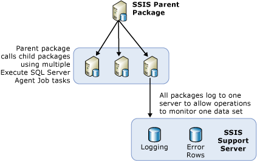

# Load-Balancing Packages on Remote Servers by Using SQL Server Agent
  When many packages have to be run, it is convenient to use other servers that are available. This method of using other servers to run packages when the packages are all under the control of one parent package is called load balancing. In [!INCLUDE[ssNoVersion](../../includes/ssnoversion-md.md)] [!INCLUDE[ssISnoversion](../../includes/ssisnoversion-md.md)], load balancing is a manual procedure that must be architected by the owners of the packages. Load balancing is not performed automatically by the servers. Also, the packages that are run on the remote servers must be whole packages, not individual tasks in other packages.  
  
 Load balancing is useful in the following scenarios:  
  
-   Packages can run at the same time.  
  
-   Packages are large and, if run sequentially, can run longer than the time allowed for processing.  
  
 Administrators and architects can determine whether using additional servers for processing would benefit their processes.  
  
## Illustration of Load-Balancing  
 The following diagram shows a parent package on a server. The parent package contains multiple Execute SQL Job Agent tasks. Each task in the parent package calls a SQL Server Agent on a remote server. Those remote servers contain SQL Server Agent jobs that include a step that calls a package on that server.  
  
   
  
 The steps required for load balancing in this architecture are not new concepts. Instead, load balancing is achieved by using existing concepts and common SSIS objects in a new way.  
  
## Execution of Packages on a Remote Instance by using SQL Server Agent  
 In the basic architecture for remote package execution, a central package resides on the instance of SQL Server that controls the other remote packages. The diagram shows this central package, named the SSIS Parent. The instance where this parent package resides controls execution of the SQL Server Agent jobs that run the child packages. The child packages are not run according to a fixed schedule controlled by the SQL Server Agent on the remote server. Instead, the child packages are started by the SQL Server Agent when called by the parent package and are run on the same instance of SQL Server on which the SQL Server Agent resides.  
  
 Before you can run a remote package by using SQL Server Agent, you must configure the parent and child packages and set up the SQL Server Agent jobs that control the child packages. The following sections provide more information about how to create, configure, run, and maintain packages that run on remote servers. There are several steps to this process:  
  
-   Creating the child packages and installing them on remote servers.  
  
-   Creating the SQL Server Agent jobs on the remote instances that will run the packages.  
  
-   Creating the parent package.  
  
-   Determine the logging scenario for the child packages.  
  
## Implementation of Child Packages
  When you implement load balancing using [!INCLUDE[ssISnoversion](../../includes/ssisnoversion-md.md)], child packages are installed on other servers to take advantage of the available CPU or server time. To create and run the child packages requires the following steps:  
  
-   Designing the child packages.  
  
-   Moving the packages to the remote server.  
  
-   Creating a SQL Server Agent Job on the remote server that contains a step that runs the child package.  
  
-   Testing and debugging the SQL Server Agent Job and child packages.  
  
 When you design the child packages, the packages have no limitations in their design, and you can put in any functionality you desire. However, if the package accesses data, you must ensure that the server that runs the package has access to the data.  
  
 To identify the parent package that executes child packages, in [!INCLUDE[ssBIDevStudioFull](../../includes/ssbidevstudiofull-md.md)] right click the package in Solution Explorer and then click **Entry-point Package**.  
  
 After the child packages have been designed, the next step is to deploy them on the remote servers.  
  
### Moving the Child Package to the Remote Instance  
 There are multiple ways to move packages to other servers. The two suggested methods are:  
  
-   Exporting packages by using [!INCLUDE[ssManStudioFull](../../includes/ssmanstudiofull-md.md)].  
  
-   Deploying packages by building a deployment utility for the project that contains the packages you want to deploy, and then running the Package Installation Wizard to install the packages to the file system or to an instance of [!INCLUDE[ssNoVersion](../../includes/ssnoversion-md.md)]. For more information, see [Legacy Package Deployment &#40;SSIS&#41;](../../integration-services/packages/legacy-package-deployment-ssis.md).  
  
 You must repeat the deployment to each remote server you want to use.  
  
### Creating the SQL Server Agent Jobs  
 After the child packages have been deployed to the various servers, create a SQL Server Agent job on each server that contains a child package. The SQL Server Agent job contains a step that runs the child package when the job agent is called. The SQL Server Agent jobs are not scheduled jobs; they run the child packages only when they are called by the parent package. Notification of success or failure of the job back to the parent package reflects the success or failure of the SQL Server Agent job and whether it was called successfully, not the success or failure of the child package or whether it was executed.  
  
### Debugging the SQL Server Agent Jobs and Child Packages  
 You can test the SQL Server Agent jobs and their child packages by using one of the following methods:  
  
-   Running each child package in SSIS Designer, by clicking **Debug** / **Start Without Debugging**.  
  
-   Running the individual SQL Server Agent job on the remote computer by using [!INCLUDE[ssManStudioFull](../../includes/ssmanstudiofull-md.md)], to make sure that the package runs.  
  
 For information about how to troubleshoot packages that you run from [!INCLUDE[ssNoVersion](../../includes/ssnoversion-md.md)] Agent jobs, see [An SSIS package does not run when you call the SSIS package from a SQL Server Agent job step](https://support.microsoft.com/kb/918760) in the [!INCLUDE[msCoName](../../includes/msconame-md.md)] Support Knowledge Base.  
  
 The SQL Server Agent checks subsystem access for a proxy and gives access to the proxy every time the job step runs.  
  
 You can create a proxy in [!INCLUDE[ssManStudioFull](../../includes/ssmanstudiofull-md.md)].  

## Implementation of the Parent Package
  When load balancing SSIS packages across various servers, the next step after the child packages have been created, deployed, and remote SQL Server Agent Jobs created to run them, is to create the parent package. The parent package will contain many Execute SQL Server Agent Job tasks, each task responsible for calling a different SQL Server Agent job that runs one of the child packages. The Execute SQL Server Agent Job tasks in the parent package in turn run the various SQL Server Agent jobs. Each task in the parent package contains information such as how to connect to the remote server and what job to run on that server. For more information, see [Execute SQL Server Agent Job Task](../../integration-services/control-flow/execute-sql-server-agent-job-task.md).  
  
 To identify the parent package that executes child packages, in [!INCLUDE[ssBIDevStudioFull](../../includes/ssbidevstudiofull-md.md)] right click the package in Solution Explorer and then click **Entry-point Package**.  
  
### Listing Child Packages  
 If you deploy your project that contains a parent package and child package(s) to the [!INCLUDE[ssISnoversion](../../includes/ssisnoversion-md.md)] server, you can view a list of the child packages that are executed by the parent package. When you run the parent package, an **Overview** report for the parent package is automatically generated in [!INCLUDE[ssManStudioFull](../../includes/ssmanstudiofull-md.md)]. The report lists the child packages that were executed by the Execute Package task contained in the parent package, as shown in the following image.  
  
   
  
 For information about accessing the **Overview** report, see [Reports for the Integration Services Server](../../integration-services/performance/monitor-running-packages-and-other-operations.md#reports).  
  
### Precedence Constraints in the Parent Package  
 When you create precedence constraints between the Execute SQL Server Agent Job tasks in the parent package, these precedence constraints control only the time that the SQL Server Agent jobs on the remote servers are started. Precedence constraints cannot receive information regarding the success or failure of the child packages that are run from the steps of the SQL Server Agent jobs.  
  
 This means that success or failure of a child package does not propagate to the parent, because the sole function of the Execute SQL Server Agent job in the parent package is to request the SQL Server Agent job to run the child package. After the SQL Server Agent job is called successfully, the parent package receives a result of <xref:Microsoft.SqlServer.Dts.Runtime.DTSExecResult.Success>.  
  
 Failure in this scenario means only that there has been a failure in calling the remote SQL Server Agent Job task. One situation where this can occur is when the remote server is down and the agent does not respond. However, as long as the agent fires, the parent package has successfully completed its task.  
  
> [!NOTE]  
>  You can use an Execute SQL Task that contains a Transact-SQL statement of **sp_start_job N'package_name'**. For more information, see [sp_start_job &#40;Transact-SQL&#41;](../../relational-databases/system-stored-procedures/sp-start-job-transact-sql.md).  
  
### Debugging Environment  
 When testing the parent package, use the debugging environment of the designer by running it using Debug / Start Debugging (F5). Alternatively, you can use the command prompt utility, **dtexec**. For more information, see [dtexec Utility](../../integration-services/packages/dtexec-utility.md).  

## Logging for Load Balanced Packages on Remote Servers
  It is easier for an administrator to manage the logs for all the child packages that are running on various servers when all the child packages use the same log provider and they all write to the same destination. One way that you can create a common log file for all child packages is to configure the child packages to log their events to a SQL Server log provider. You can configure all the packages to use the same database, the same server, and the same instance of the server.  
  
 To view the log files, the administrator only has to log on to a single server to view the log files for all child packages.  
  
 For information about how to enable logging in a package, see [Integration Services (SSIS) Logging](../../integration-services/performance/integration-services-ssis-logging.md).  

## Related Tasks  
 [SQL Server Agent Jobs for Packages](../../integration-services/packages/sql-server-agent-jobs-for-packages.md)  
  
  
