# Reuse Control Flow across Packages by Using Control Flow Package Parts
  Save a commonly used control flow task or container to a standalone part file - a ".dtsxp" file - and reuse it multiple times in one or more packages by using control flow package parts. This reusability makes SSIS packages easier to design and maintain.  
  
## Create a new control flow package part  
 To create a new control flow package part, in Solution Explorer, expand the **Package Parts** folder. Right-click on **Control Flow** and select **New Control Flow Package Part**.  
  
 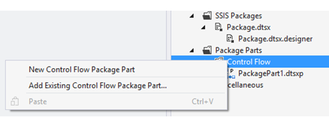  
  
 A new part file with the ".dtsxp" extension is created under the **Package Parts | Control Flow** folder. At the same time, a new item with the same name is also added to the SSIS toolbox. (The toolbox item is only visible while you have a project that contains the part open in Visual Studio.)  
  
 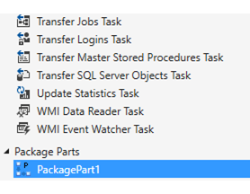  
  
## Design a control flow package part  
 To open the package part editor, double-click on the part file in Solution Explorer. You can design the part just like you design a package.  
  
 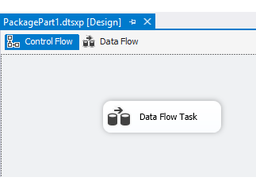  
  
 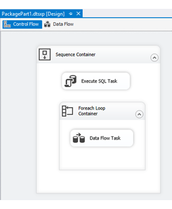  
  
 Control flow package parts have the following limitations.  
  
-   A part can have only one top-level task or container. If you want to include multiple tasks or containers, put them all in a single sequence container.  
  
-   You can't run or debug a part directly in the designer.  
  
## Add an existing control flow package part to a package  
 You can reuse parts that are saved in the current Integration Services project or in a different project.  
  
-   To reuse a part that's part of the current project, drag and drop the part from the toolbox.  
  
-   To reuse a part that's part of a different project, use the **Add Existing Control Flow Package Part** command.  
  
### Drag and drop a control flow package part  
 To reuse a part in a project, simply drag and drop the part item from the toolbox just like any other task or container. You can  drag and drop the part into a package multiple times to reuse the logic in multiple locations in the package. Use this method to reuse a part that is part of the current project.  
  
 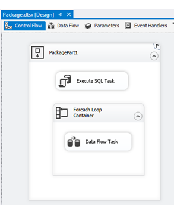  
  
 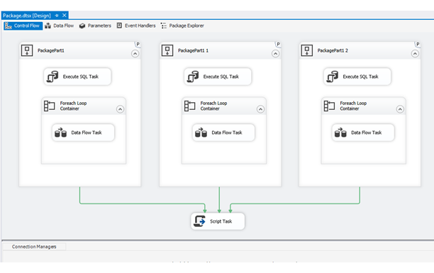  
  
 When you save the package, SSIS designer checks whether there are any part instances in the package.  
  
-   If the package contains part instances, the designer generates a new .dtsx.designer file which contains all part-related information.  
  
-   If the package does not use parts, the designer deletes any previously created .dtsx.designer file for the package (that is, any .dtsx.designer file that has the same name as the package).  
  
 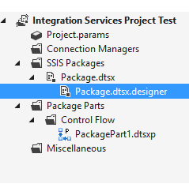  
  
### Add a copy of an existing control flow package part or a reference to an existing part  
 To add a copy of an existing part in the file system to a package, in Solution Explorer, expand the **Package Parts** folder. Right-click on **Control Flow** and select **Add Existing Control Flow Package Part**.  
  
   
  
 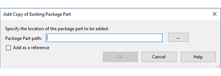  
  
 **Options**  
  
 **Package Part path**  
 Type the path to the part file, or click the browse button (...) and locate the part file to copy or to reference.  
  
 **Add as a reference**  
 -   If selected, the part is added to the Integration Services project as a reference. Select this option when you  when want to reference a single copy of a  part file in multiple Integration Services projects.  
  
-   If cleared, a copy of the part file is  added to the project.  
  
## Configure a control flow package part  
 To configure control flow package parts after you've added them to the control flow of a package, use the **Package Part Configuration**  dialog box.  
  
#### To open the Package Part Configuration dialog box  
  
1.  To configure a part instance, double-click the part instance in the control flow. Or right-click on the part instance and select **Edit**. The **Package Part Configuration** dialog box opens.  
  
2.  Configure the properties and connection managers for the part instance.  
  
### Properties tab  
 Use the **Properties** tab of the **Package Part Configuration**  dialog box to specify the properties of the part.  
  
 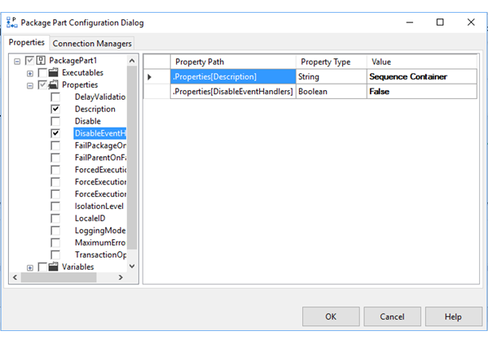  
  
 The tree view hierarchy in the left pane lists all configurable properties of the part instance.  
  
-   If cleared, the property is not configured in the part instance. The part instance uses the default value for the property, which is defined in the control flow package part.  
  
-   If selected, the value that you enter or select overrides the default value.  
  
 The table in the right pane lists the properties to configure.  
  
-   **Property Path**. The property path of the property.  
  
-   **Property Type**. The data type of the property.  
  
-   **Value**. The configured value. This value overrides the default value.  
  
### Connection Managers tab  
 Use the **Connection Managers** tab of the **Package Part Configuration**  dialog box to specify the properties of connection managers for the part instance.  
  
 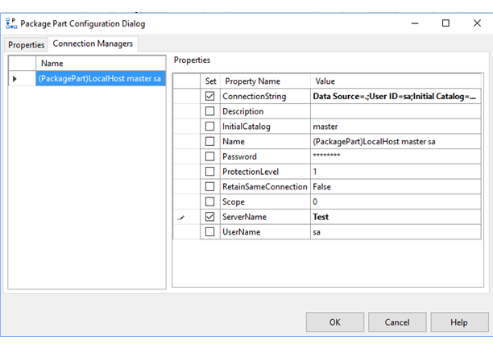  
  
 The table in the left pane lists all the connection managers defined in the control flow part. Choose the connection manager that you want to configure.  
  
 The list in the right pane lists the properties of the selected connection manager.  
  
-   **Set**. Checked if the property is configured for the part instance.  
  
-   **Property Name**. The name of the property.  
  
-   **Value**. The configured value. This value overrides the default value.  
  
## Delete a control flow part  
 To delete a part, in Solution Explorer, right-click the part, and then select **Delete**. Select **OK** to confirm the deletion or select **Cancel** to keep the part.  
  
 If you delete a part from a project, it is deleted permanently from the file system and it cannot be restored.  
  
> [!NOTE]  
>  If you want to remove a part from an Integration Services project, but continue to use it in other projects, use the **Exclude from Project**  option instead of the **Delete** option.  
  
## Package parts are a design-time feature only  
 Package parts are purely a design-time feature. SSIS designer creates, opens, saves, and updates parts,  and adds, configures, or deletes part instances in a package. However, the SSIS runtime is not aware of the parts. Here is how the designer achieves this separation.  
  
-   The designer saves package part instances with their configured properties to a ".dtsx.designer" file.  
  
-   When the designer saves the ".dtsx.designer" file, it also extracts the content from the parts referenced by this file and replaces the part instances in the package with the content of the parts.  
  
-   Finally all the content, which no longer includes part information, is saved back to the ".dtsx" package file. This is the file that the SSIS runtime runs.  
  
 The diagram below demonstrates the relationship among parts (".dtsxp" files), SSIS designer, and the SSIS runtime.  
  
 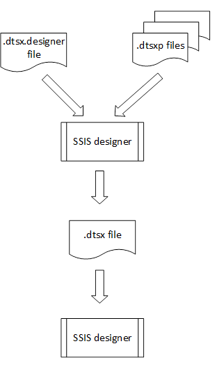  
  
  
