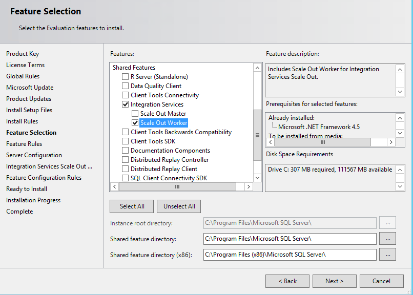
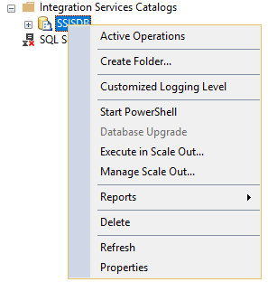

# Add a Scale Out Worker with Scale Out Manager

[!INCLUDE[sqlserver-ssis](../../includes/applies-to-version/sqlserver-ssis.md)]

Integration Services Scale Out Manager simplifies the process of adding a Scale Out Worker to your existing Scale Out environment. 

Follow these steps to add a Scale Out Worker to your Scale Out topology:

## 1. Install Scale Out Worker
In the SQL Server installation wizard, select Integration Services and Scale Out Worker on the **Feature Selection** page. 

On the **Integration Services Scale Out Configuration - Worker Node** page, you can click **Next** to skip configuration at this time and use **Scale Out Manager** to do the configuration after installation.

Finish the installation wizard.

## 2. Open the firewall on the Scale Out Master computer
Open the port specified during the Scale Out Master installation (8391, by default), and the port for SQL Server (1433, by default), in the Windows Firewall on the Scale Out Master computer.

## 3. Add a Scale Out Worker with Scale Out Manager
Run SQL Server Management Studio as administrator and connect to the SQL Server instance of Scale Out Master.

In Object Explorer, right-click **SSISDB** and select **Manage Scale Out**. 

In the **Scale Out Manager** dialog box, switch to **Worker Manager**. Select **+** and follow the instructions in the **Connect Worker** dialog box. 

## Next steps
For more info, see [Scale Out Manager](integration-services-ssis-scale-out-manager.md).
