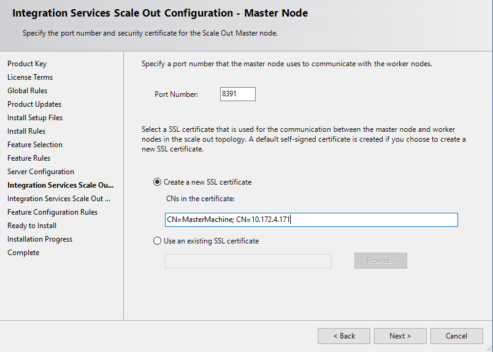

# Manage certificates for SQL Server Integration Services Scale Out

To secure the communication between Scale Out Master and Scale Out Workers, SSIS Scale Out uses two certificates - one for the Master and one for the Workers. 

## Scale Out Master certificate

In most cases, the Scale Out Master certificate is configured during the installation of Scale Out Master.

In the **Integration Services Scale Out Configuration - Master Node** page of the SQL Server Installation wizard, you can choose to create a new self-signed SSL certificate or use an existing SSL certificate.



**New certificate**. If you don't have special requirements for certificates, you can choose to create a new self-signed SSL certificate. You can further specify the CNs in the certificate. Make sure the host name of the master endpoint to be used later by Scale Out Workers is included in the CNs. By default, the computer name and IP address of the master node are included. 

**Existing certificate**. If you choose to use an existing certificate, click **Browse** to select an SSL certificate from the **Root** certificate store of the local computer.

### Change the Scale Out Master certificate

You may want to change your Scale Out Master certificate due to certificate expiration or for other reasons. To change the Scale Out Master certificate, do the following things:

#### 1. Create an SSL certificate.
Create and install a new SSL certificate on the Master node with the following command:

```dos
MakeCert.exe -n CN={master endpoint host} SSISScaleOutMaster.cer -r -ss Root -sr LocalMachine -a sha1
```
For example:

```dos
MakeCert.exe -n CN=MasterMachine SSISScaleOutMaster.cer -r -ss Root -sr LocalMachine -a sha1
```

#### 2. Bind the certificate to the Master port
Check the original binding with the following command:

```dos
netsh http show sslcert ipport=0.0.0.0:{Master port}
```

For example:

```dos
netsh http show sslcert ipport=0.0.0.0:8391
```

Delete the original binding and set up the new binding with the following commands:

```dos
netsh http delete sslcert ipport=0.0.0.0:{Master port}
netsh http add sslcert ipport=0.0.0.0:{Master port} certhash={SSL Certificate Thumbprint} certstorename=Root appid={original appid}
```

For example:

```dos
netsh http delete sslcert ipport=0.0.0.0:8391
netsh http add sslcert ipport=0.0.0.0:8391 certhash=01d207b300ca662f479beb884efe6ce328f77d53 certstorename=Root appid={a1f96506-93e0-4c91-9171-05a2f6739e13}
```

#### 3. Update the Scale Out Master service configuration file
Update the Scale Out Master service configuration file, `\<drive\>:\Program Files\Microsoft SQL Server\140\DTS\Binn\MasterSettings.config`, on the Master node. Update **SSLCertThumbprint** to the thumbprint of the new SSL certificate.

#### 4. Restart the Scale Out Master service

#### 5. Reconnect Scale Out Workers to Scale Out Master
For each Scale Out Worker, either delete the Worker and then add it back with [Scale Out Manager](integration-services-ssis-scale-out-manager.md), or do the following things:

a.  Install the client SSL certificate to the Root store of the local computer on the Worker node.

b.  Update the Scale Out Worker service configuration file.

Update the Scale Out Worker service configuration file, `\<drive\>:\Program Files\Microsoft SQL Server\140\DTS\Binn\WorkerSettings.config`, on the Worker node. Update **MasterHttpsCertThumbprint** to the thumbprint of the new SSL certificate.

c.  Restart the Scale Out Worker service.

## Scale Out Worker certificate

Scale Out Worker certificate is generated automatically during the installation of Scale Out Worker. 

### Change the Scale Out Worker certificate

If you want to change Scale Out Worker certificate, do the following things:

#### 1. Create a certificate
Create and install a certificate with the following command:

```dos
MakeCert.exe -n CN={worker machine name};CN={worker machine ip} SSISScaleOutWorker.cer -r -ss My -sr LocalMachine
```

For example:

```dos
MakeCert.exe -n CN=WorkerMachine;CN=10.0.2.8 SSISScaleOutWorker.cer -r -ss My -sr LocalMachine
```

#### 2. Install the client certificate to the Root store of the local computer on the Worker node

#### 3. Grant service access to the certificate
Delete the old certificate and grant Scale Out Worker service access to the new certificate with following command:

```dos
certmgr.exe /del /c /s /r localmachine My /n {CN of the old certificate}
winhttpcertcfg.exe -g -c LOCAL_MACHINE\My -s {CN of the new certificate} -a {the account running Scale Out Worker service}
```

For example:

```dos
certmgr.exe /del /c /s /r localmachine My /n WorkerMachine
winhttpcertcfg.exe -g -c LOCAL_MACHINE\My -s WorkerMachine -a SSISScaleOutWorker140
```

#### 4. Update the Scale Out Worker service configuration file
Update the Scale Out Worker service configuration file, `\<drive\>:\Program Files\Microsoft SQL Server\140\DTS\Binn\WorkerSettings.config`, on the Worker node. Update **WorkerHttpsCertThumbprint** to the thumbprint of the new certificate.

#### 5. Install the client certificate to the Root store of the local computer on the Master node

#### 6. Restart the Scale Out Worker service

## Next steps
For more info, see the following articles:
-   [Integration Services (SSIS) Scale Out Master](integration-services-ssis-scale-out-master.md)
-   [Integration Services (SSIS) Scale Out Worker](integration-services-ssis-scale-out-worker.md)
