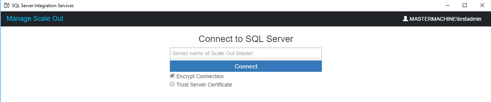
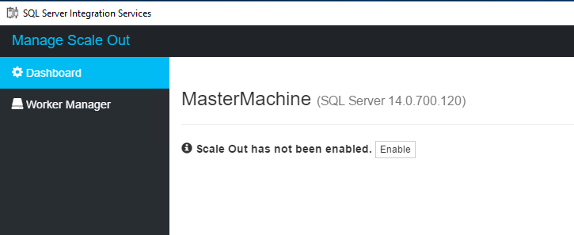
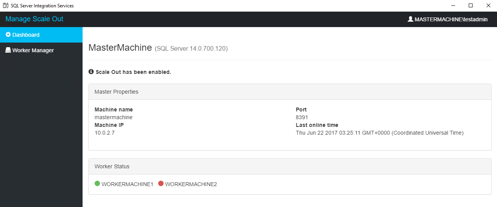
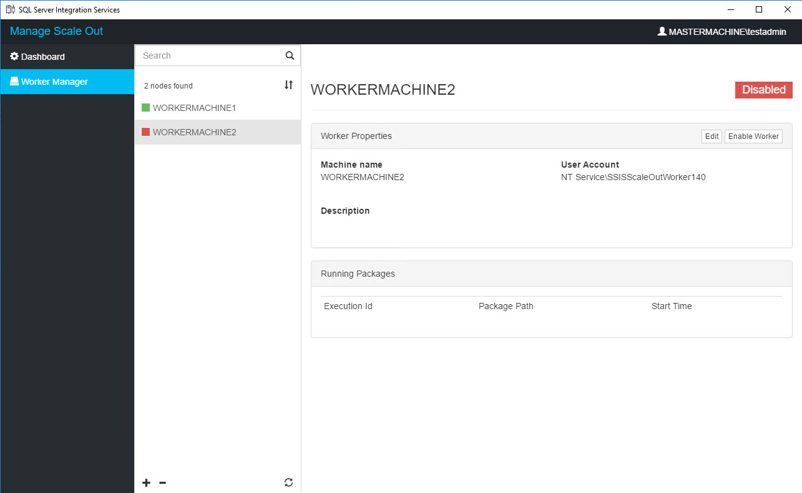
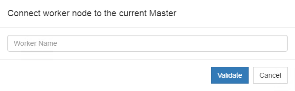
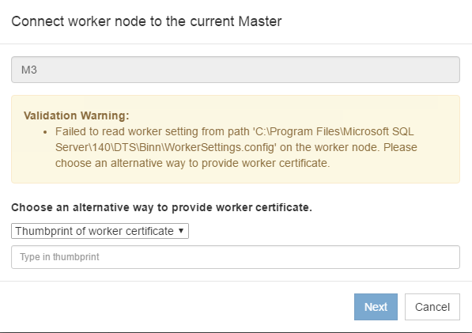
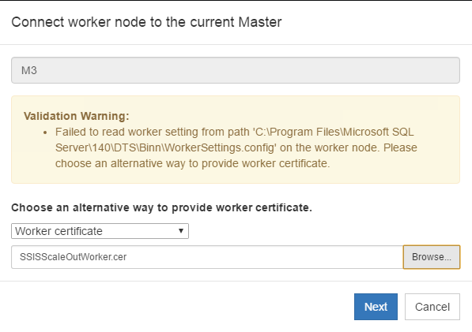
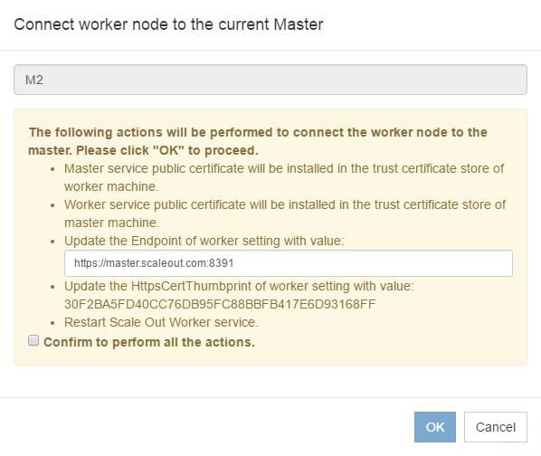
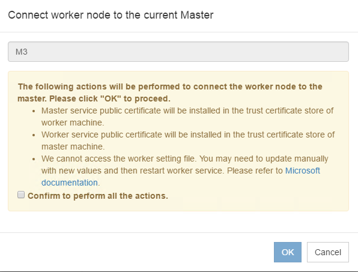
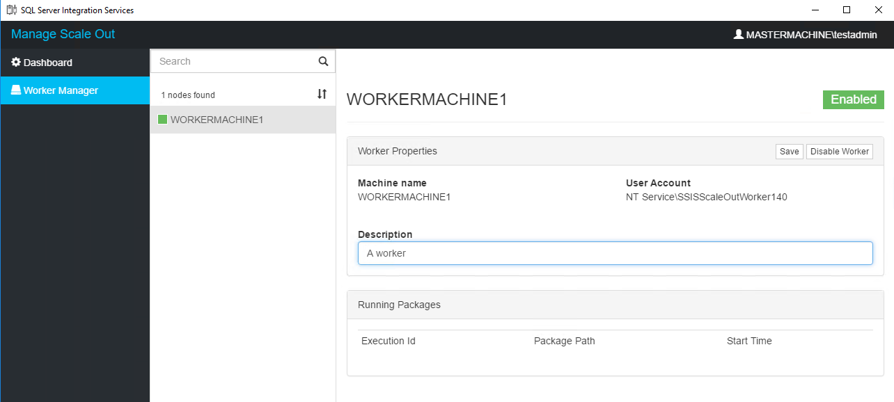

# Integration Services Scale Out Manager

Scale Out Manager is a management tool which allows you to manage your full SSIS Scale Out topology at a single location. It removes the burden of operating on multiple machines and dealing with TSQL commands. 

There are two ways to trigger the Scale Out Manager.

## 1. Open Scale Out Manager from SQL Server Management Studio
Open SQL Server Management Studio and connect to the SQL Server instance of Scale Out Master.

Right-click **SSISDB** in the object explorer and select **Manage Scale Out...**. 

> [!NOTE]
> It is suggested to run SQL Server Management Studio as administrator  as some of the Scale Out management operations such as "adding a Scale Out Worker" will require administrative privilege.

## 2. Open Scale Out Manager by runing ISManager.exe directly

ISManager.exe locates under %SystemDrive%\Program Files (x86)\Microsoft SQL Server\140\DTS\Binn\Management. Right click **ISManager.exe** and select "Run as administrator". 

After it opens, you need to input the Sql Server name of Scale Out Master and connect to it before managing your Scale Out.

Scale Out Manager provides various functionalities as below. 

## Enable Scale Out
After connecting to SQL Server, if Scale Out is not enabled, you can click the "Enable" button to enable it.

 
## View Scale Out Master status
The status of Scale Out Master is shown on the **Dashboard** page.

## View Scale Out Worker status
The status of Scale Out Worker is shown on the **Worker Manager** page. You can click on each worker to see the individual status.

## Add Scale Out Worker
To add a Scale Out Worker, click the "+" button at the bottom of Scale Out Worker list. 

Input the machine name of the Scale Out Worker you want to add and click "Validate". The Scale Out Manager will check if the current user has access to the certificate stores on the machines of Scale Out Master and Scale Out Worker.

If validation passes, Scale Out Manager will try to read your worker config file and get the certificate thumbprint of the worker. For more information, see [Scale Out Worker](integration-services-ssis-scale-out-worker.md). If it is not able to read the worker config file, there are two alternative ways for you to provide the worker certificate. 

You can either input the thumbprint of worker certificate directly 

or provide the certificate file. 

After gathering all information, Scale Out Manager will provide the actions to be performed. Tyically, it includes certificate installation, worker config file update and worker service restart. 

In case the worker certificate is not accessible, you need to update it manually by yourself and restart the worker service.

Click the confirm checkbox and start adding Scale Out Worker.

## Delete Scale Out Worker
To delete a Scale Out Worker, select the Scale Out Worker and click the "-" button at the bottom of the Scale Out Worker list.

## Enable/Disable Scale Out
To enable or disable a Scale Out Worker, select the Scale Out Worker and click the "Enable Worker" or "Disable Worker" button. The worker status on Scale Out Manager will change accordingly if the worker is not offline.

## Edit Scale Out Worker description
To edit the description of a Scale Out Worker, select the Scale Out Worker and click the "Edit" button. 
After you finish editing, click the "Save" button.

