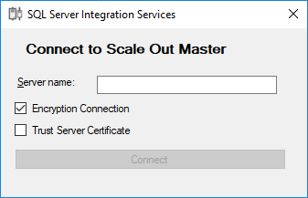
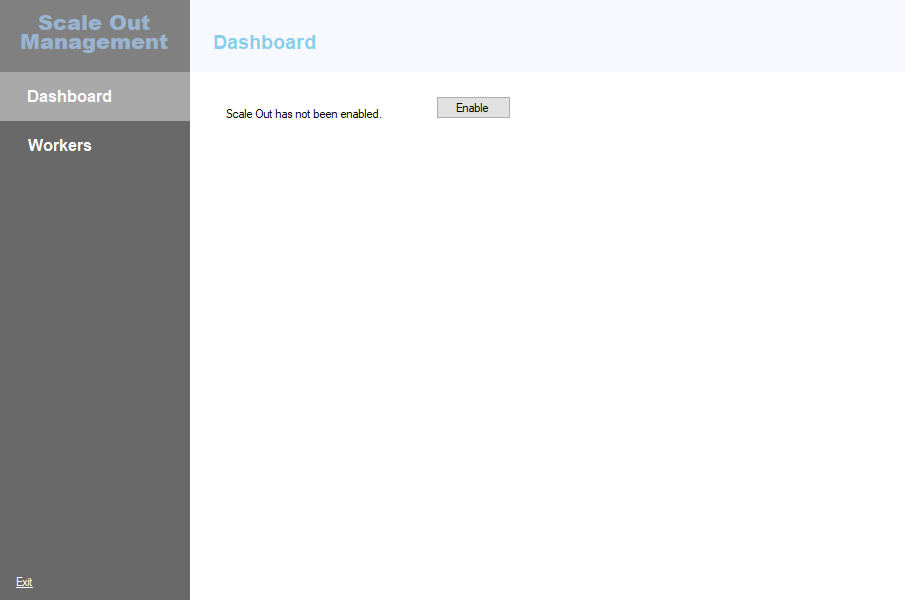
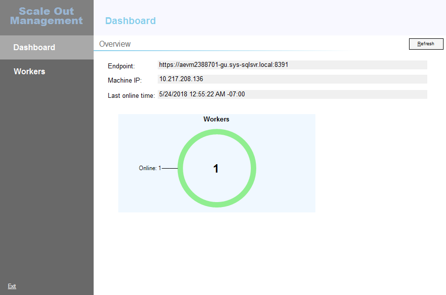
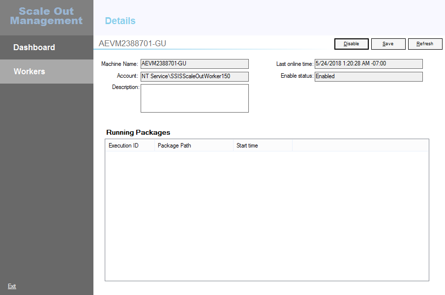
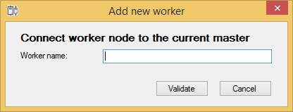
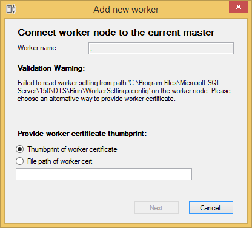
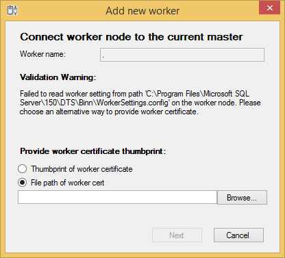
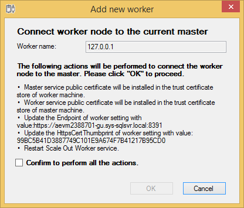
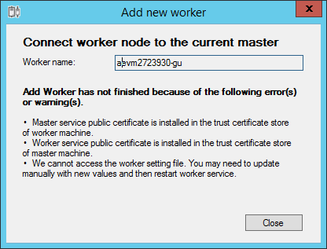
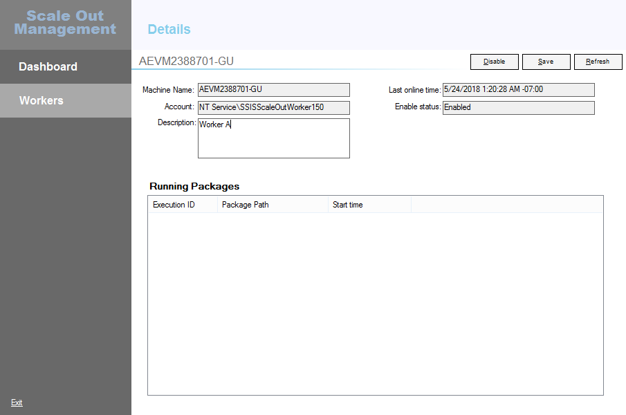

# Integration Services Scale Out Manager

[!INCLUDE[ssis-appliesto](../../includes/ssis-appliesto-ssvrpluslinux-asdb-asdw-xxx.md)]

Scale Out Manager is a management tool that lets you manage your entire SSIS Scale Out topology from a single app. It removes the burden of doing management tasks and running Transact-SQL commands on multiple computers.

## Open Scale Out Manager

There are two ways to open Scale Out Manager.

### 1. Open Scale Out Manager from SQL Server Management Studio
Open SQL Server Management Studio (SSMS) and connect to the SQL Server instance of Scale Out Master.

In Object Explorer, right-click **SSISDB**, and select **Manage Scale Out**.

> [!NOTE]
> We recommend running SSMS as an administrator, since some Scale Out management operations, such as adding a Scale Out Worker, require administrative privilege.

### 2. Open Scale Out Manager by running ManagementTool.exe

Locate `ManagementTool.exe` under `%SystemDrive%\Program Files (x86)\Microsoft SQL Server\150\DTS\Binn\Management`. Right-click **ManagementTool.exe** and select **Run as administrator**. 

After Scale Out Manager opens, enter the SQL Server instance name of Scale Out Master and connect to it to manage your Scale Out environment.

## Tasks available in Scale Out Manager
In Scale Out Manager, you can do the following things:

### Enable Scale Out
After connecting to SQL Server, if Scale Out is not enabled, you can select **Enable** to enable it.

 

### View Scale Out Master status
The status of Scale Out Master is shown on the **Dashboard** page.

### View Scale Out Worker status
The status of Scale Out Worker is shown on the **Worker Manager** page. You can select each worker to see the individual status.

### Add a Scale Out Worker
To add a Scale Out Worker, select **+** at the bottom of the Scale Out Worker list. 

Enter the computer name of the Scale Out Worker you want to add and click **Validate**. The Scale Out Manager checks whether the current user has access to the certificate stores on the Scale Out Master and Scale Out Worker computers

If validation succeeds, Scale Out Manager tries to read the  worker server configuration file and get the certificate thumbprint of the worker. For more info, see [Scale Out Worker](integration-services-ssis-scale-out-worker.md). If Scale Out Manager can't read the worker service configuration file, there are two alternative ways for you to provide the worker certificate. 

- You can enter the thumbprint of worker certificate directly.

    

- Or, you can provide the certificate file.

    

After gathering information, Scale Out Manager describes the actions to be performed. Typically, these actions include installing the certificate, updating the worker service configuration file, and restarting the worker service.

In case the worker setting is not accessible, you have to update it manually and restart the worker service.

Select the **Confirm** checkbox and then select **OK** to start adding a Scale Out Worker.

### Delete a Scale Out Worker
To delete a Scale Out Worker, select the Scale Out Worker and then select **-** at the bottom of the Scale Out Worker list.

### Enable or disable a Scale Out Worker
To enable or disable a Scale Out Worker, select the Scale Out Worker and then select **Enable Worker** or **Disable Worker.** If the worker is not offline, the status of the worker displayed in Scale Out Manager changes accordingly.

## Edit a Scale Out Worker description
To edit the description of a Scale Out Worker, select the Scale Out Worker and then select **Edit**. 
After you finish editing the description, select **Save**.

## Next steps
For more info, see the following articles:
-   [Integration Services (SSIS) Scale Out Master](integration-services-ssis-scale-out-master.md)
-   [Integration Services (SSIS) Scale Out Worker](integration-services-ssis-scale-out-worker.md)
