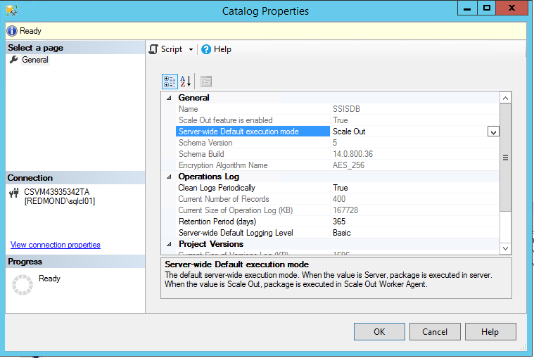

# Run packages in Integration Services (SSIS) Scale Out
After you deploy packages to the Integration Services server, you can run them in Scale Out by using one of the following methods:

-   [Execute Package in Scale Out dialog box](#scale_out_dialog)

-   [Stored procedures](#stored_proc)

-   [SQL Server Agent jobs](#sql_agent)

## <a name="scale_out_dialog"></a> Run packages with the Execute Package in Scale Out dialog box

1. Open the Execute Package In Scale Out dialog box.

    In [!INCLUDE[ssManStudioFull_md](../../includes/ssmanstudiofull-md.md)], connect to the Integration Services server. In Object Explorer, expand the tree to display the nodes under **Integration Services Catalogs**. Right-click the **SSISDB** node or the project or the package you want to run, and then click **Execute in Scale Out**.

2. Select packages and set the options.

    On the **Package Selection** page, select one or more  packages to run. Set the environment, parameters, connection managers, and advanced options for each package. Click a package to set these options.
    
    On the **Advanced** tab, set a Scale Out option called **Retry count** to specify the number of times a package execution will retry if it fails.

    > [!NOTE]
    > The **Dump on errors** option only works when the account running Scale Out Worker service is an administrator on the local computer.

3. Select worker computers.

    On the **Machine Selection** page, select the Scale Out Worker computers to run the packages. By default, any computer is allowed to run the packages. 

   > [!NOTE] 
   > The packages are executed with the credentials of the user accounts of the Scale Out Worker services. Review these credentials on the **Machine Selection** page. By default, the account is `NT Service\SSISScaleOutWorker140`.

   > [!WARNING]
   > Package executions triggered by different users on the same worker run with the same credentials. There is no security boundary between or among them. 

4. Run the packages and view reports.

    Click **OK** to start the package executions. To view the execution report for a package, right-click the package in Object Explorer, click **Reports**, click **All Executions**, and find the execution.
    
## <a name="stored_proc"></a> Run packages with stored procedures

1.  Create executions.

    Call `[catalog].[create_execution]` for each package. Set the parameter **@runinscaleout** to `True`. If not all Scale Out Worker computers are allowed to run the package, set the parameter **@useanyworker** to `False`. For more info about this stored procedure and the **@useanyworker** parameter, see [catalog.create_execution](../system-stored-procedures/catalog-create-execution-ssisdb-database.md). 

2. Set execution parameters.

    Call `[catalog].[set_execution_parameter_value]` for each execution.

3. Set the Scale Out Workers.

    Call `[catalog].[add_execution_worker]`. If all computers are allowed to run the package, you don't have to call this stored procedure. 

4. Start the executions.

    Call `[catalog].[start_execution]`. Set the parameter **@retry_count** to set the number of times a package execution will retry if it fails.
    
### Example
The following example runs two packages, `package1.dtsx` and `package2.dtsx`, in Scale Out with one Scale Out Worker.  

```sql
Declare @execution_id bigint
EXEC [SSISDB].[catalog].[create_execution] @package_name=N'package1.dtsx', @execution_id=@execution_id OUTPUT, @folder_name=N'folder1', @project_name=N'project1', @use32bitruntime=False, @reference_id=Null, @useanyworker=False, @runinscaleout=True
Select @execution_id
DECLARE @var0 smallint = 1
EXEC [SSISDB].[catalog].[set_execution_parameter_value] @execution_id,  @object_type=50, @parameter_name=N'LOGGING_LEVEL', @parameter_value=@var0
EXEC [SSISDB].[catalog].[add_execution_worker] @execution_id,  @workeragent_id=N'64c020e2-f819-4c2d-a22f-efb31a91e70a'
EXEC [SSISDB].[catalog].[start_execution] @execution_id,  @retry_count=0
GO

Declare @execution_id bigint
EXEC [SSISDB].[catalog].[create_execution] @package_name=N'package2.dtsx', @execution_id=@execution_id OUTPUT, @folder_name=N'folder2', @project_name=N'project2', @use32bitruntime=False, @reference_id=Null, @useanyworker=False, @runinscaleout=True
Select @execution_id
DECLARE @var0 smallint = 1
EXEC [SSISDB].[catalog].[set_execution_parameter_value] @execution_id,  @object_type=50, @parameter_name=N'LOGGING_LEVEL', @parameter_value=@var0
EXEC [SSISDB].[catalog].[add_execution_worker] @execution_id,  @workeragent_id=N'64c020e2-f819-4c2d-a22f-efb31a91e70a'
EXEC [SSISDB].[catalog].[start_execution] @execution_id,  @retry_count=0
GO
```

### Permissions
To run packages in Scale Out, you have to have one the following permissions:

-   Membership in the **ssis_admin** database role  

-   Membership in the **ssis_cluster_executor** database role  
  
-   Membership in the **sysadmin** server role  

## Set default execution mode
To set the default execution mode for packages to **Scale Out**, do the following things:

1.  In SSMS, in Object Explorer, right-click the **SSISDB** node and select **Properties**.

2.  In the **Catalog Properties** dialog box, set **Server-wide Default execution mode** to **Scale Out**.

After you set this default execution mode, you no longer have to specify the **@runinscaleout** parameter when you call the `[catalog].[create_execution]` stored procedure. Packages are run in Scale Out automatically. 



To switch the default execution mode back so that packages no longer run by default in Scale Out mode, set  **Server-wide Default execution mode** to **Server**.

## <a name="sql_agent"></a> Run package in SQL Server Agent job
In a SQL Server Agent job, you can run an SSIS package as one step of the job. To run the package in Scale Out, set the default execution mode to **Scale Out**. After you set the default execution mode to **Scale Out**, packages in SQL Server Agent jobs run in Scale Out mode.

## Next steps
-   [Troubleshoot Scale Out](troubleshooting-scale-out.md)
