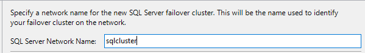

# Scale Out support for high availability via SQL Server failover cluster instance

[!INCLUDE[ssis-appliesto](../../includes/ssis-appliesto-ssvrpluslinux-asdb-asdw-xxx.md)]

To set up high availability on the Scale Out Master side with SQL Server failover cluster instance, do the following things:

## 1. Prerequisites
Set up a Windows failover cluster. See the blog post [Installing the Failover Cluster Feature and Tools for Windows Server 2012](https://blogs.msdn.com/b/clustering/archive/2012/04/06/10291601.aspx) for instructions. Install the feature and tools on all cluster nodes.

## 2. Install SQL Server failover cluster
Install a SQL Server failover cluster. See [SQL Server Failover Cluster Installation](../../sql-server/failover-clusters/install/sql-server-failover-cluster-installation.md) for instructions. During the installation, select Database Engine Services on Feature Selection page. Log the SQL Server network name for future configuration.

Add secondary node to the SQL Server failover cluster.

## 3. Install Scale Out Master on the primary node
Install Integration Services and Scale Out Master on the primary node with the setup wizard for non-clustered installation. 

During installation, include the SQL Server network name in the CNs of the Scale Out Master certificate.

> [!NOTE]
> If you want to failover SSISDB and Scale Out Master service separately, follow [2. Install Scale Out Master on the primary node](scale-out-support-for-high-availability.md#2-install-scale-out-master-on-the-primary-node) for Scale Out Master configuration.

## 4. Install Scale Out Master on the secondary node
Follow [3. Install Scale Out Master on the secondary node](scale-out-support-for-high-availability.md#3-install-scale-out-master-on-the-secondary-node)

## 5. Update the Scale Out Master service configuration file
Update the Scale Out Master service configuration file, 
\<drive\>:\Program Files\Microsoft SQL Server\140\DTS\Binn\MasterSettings.config, on the primary and secondary nodes. Update **SqlServerName** to [SQL Server network name]//[Instance name] or [SQL Server network name] for default instance.

## 6. Add Scale Out Master service to SQL Server role in Windows failover cluster
In Failover Cluster Manager, connect to the cluster for Scale Out. Select Roles in the explorer, right-click the SQL Server role, and select Add Resource, Generic Service. 

In the New Resource Wizard, select Scale Out Master service and finish the wizard. 

Bring the Scale Out Master service online.

> [!NOTE]
> If you want to failover SSISDB and Scale Out Master service separately, follow [7. Configure the Scale Out Master service role of the Windows failover cluster](scale-out-support-for-high-availability.md#7-configure-the-scale-out-master-service-role-of-the-windows-server-failover-cluster)

## 7. Install Scale Out Workers
Install Scale Out Worker on worker nodes. During the installation, specify https://[Sql Server network name]:[master port] for master endpoint. 

> [!NOTE]
> If you want to failover SSISDB and Scale Out Master service separately, specify Scale Out Master service DNS host name instead of Sql Server network name.

## 8. Install Scale Out Worker client certificate
Install the worker certificate on all nodes in the SQL Server failover cluster. See [Install Scale Out Worker client certificate](walkthrough-set-up-integration-services-scale-out.md#InstallCert).

> [!NOTE]
> Scale Out Manager has not supported SQL Server failover cluster. If you use Scale Out Manager to add Scale Out Worker, you still need to install worker certificate to all master nodes manually.

## Next steps
For more info, see the following articles:
-   [Integration Services (SSIS) Scale Out Master](integration-services-ssis-scale-out-master.md)
-   [Integration Services (SSIS) Scale Out Worker](integration-services-ssis-scale-out-worker.md)
