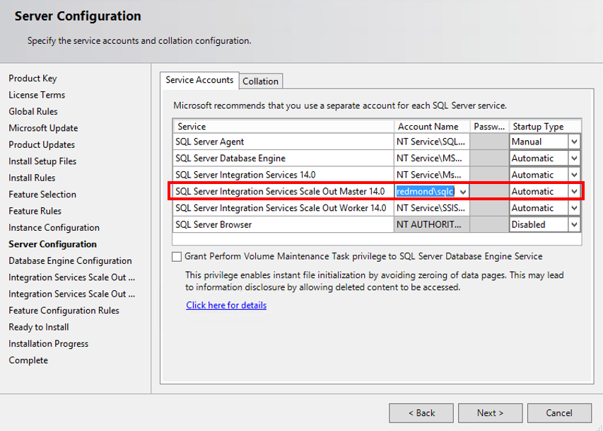
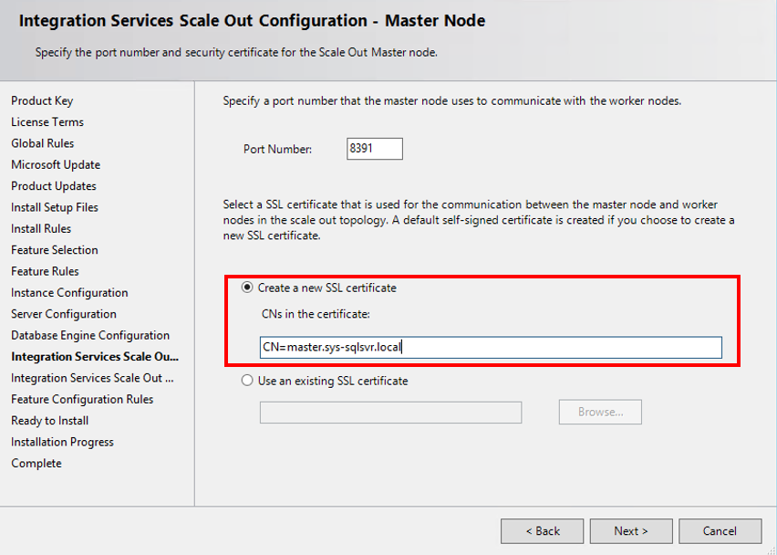
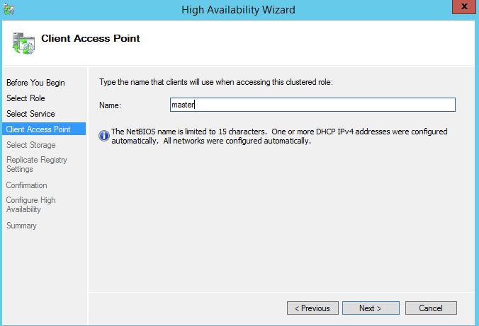

# Scale Out support for high availability

[!INCLUDE[ssis-appliesto](../../includes/ssis-appliesto-ssvrpluslinux-asdb-asdw-xxx.md)]

In SSIS Scale Out, high availability on the Scale Out Worker side is provided by executing packages with multiple Scale Out Workers.

High availability on the Scale Out Master side is achieved with [Always On for SSIS Catalog](../catalog/ssis-catalog.md#always-on-for-ssis-catalog-ssisdb) and Windows failover clustering. In this solution, multiple instances of Scale Out Master are hosted in a Windows failover cluster. When the Scale Out Master service or SSISDB is down on the primary node, the service or SSISDB on the secondary node continues to accept user requests and communicate with Scale Out Workers.

Alternatively, high availability on the Scale Out Master side can be achieved with SQL Server failover cluster instance. See [Scale Out support for high availability via SQL Server failover cluster instance](scale-out-failover-cluster-instance.md).

To set up high availability on the Scale Out Master side with always on for SSIS catalog, do the following things:

## 1. Prerequisites
Set up a Windows failover cluster. See the blog post [Installing the Failover Cluster Feature and Tools for Windows Server 2012](https://blogs.msdn.com/b/clustering/archive/2012/04/06/10291601.aspx) for instructions. Install the feature and tools on all cluster nodes.

## 2. Install Scale Out Master on the primary node
Install SQL Server Database Engine Services, Integration Services, and Scale Out Master on the primary node for Scale Out Master. 

During the installation, do the following things:

### 2.1 Set the account running Scale Out Master service to a domain account
This account must be able to access SSISDB on the secondary node in the Windows failover cluster in the future. As the Scale Out Master service and SSISDB can fail over separately, they may not be on the same node after failover.

### 2.2 Include the DNS host name for the Scale Out Master service in the CNs of the Scale Out Master certificate

This host name is the Scale Out Master endpoint, which is created as a clustered Generic Service in the failover cluster (see Step 7).   (Be sure to provide a DNS host name and not a server name.)

## 3. Install Scale Out Master on the secondary node
Install SQL Server Database Engine Services, Integration Services, and Scale Out Master on the secondary node for Scale Out Master. 

Use the same Scale Out Master certificate that you used on the primary node. Export the Scale Out Master SSL certificate on the primary node with a private key and install it to the Root certificate store of the local computer on the secondary node. Select this certificate when installing Scale Out Master on the secondary node.

> [!NOTE]
> You can set up multiple backup Scale Out Masters by repeating these operations for Scale Out Master on other secondary nodes.

## 4. Set up and configure SSISDB support for Always On

Follow the instructions to set up and configure SSISDB support for Always On in [Always On for SSIS Catalog (SSISDB)](../catalog/ssis-catalog.md#always-on-for-ssis-catalog-ssisdb).

In addition, you have to create an availability group listener for the availability group to which you add SSISDB. See [Create or Configure an Availability Group Listener](../../database-engine/availability-groups/windows/create-or-configure-an-availability-group-listener-sql-server.md).

## 5. Update the Scale Out Master service configuration file
Update the Scale Out Master service configuration file, `\<drive\>:\Program Files\Microsoft SQL Server\140\DTS\Binn\MasterSettings.config`, on the primary and secondary nodes. Update **SqlServerName** to *Availability Group Listener DNS name],[Port]*.

## 6. Enable package execution logging

Logging in SSISDB is done by the login **##MS_SSISLogDBWorkerAgentLogin##**, for which the password is auto generated. To make logging work for all replicas of SSISDB, do the following things

### 6.1 Change the password of **##MS_SSISLogDBWorkerAgentLogin##** on the primary Sql Server

### 6.2 Add the login to the secondary Sql Server

### 6.3 Update the connection string used for logging.
Call the stored procedure `[catalog].[update_logdb_info]` with the following parameter values:

-   `@server_name = '[Availability Group Listener DNS name],[Port]'`

-   `@connection_string = 'Data Source=[Availability Group Listener DNS name],[Port];Initial Catalog=SSISDB;User Id=##MS_SSISLogDBWorkerAgentLogin##;Password=[Password]];'`

## 7. Configure the Scale Out Master service role of the Windows Server failover cluster

1.  In Failover Cluster Manager, connect to the cluster for Scale Out. Select the cluster. Select **Action** in the menu and then select **Configure Role**.

2.  In the **High Availability Wizard** dialog box, select **Generic Service** on the **Select Role** page. Select SQL Server Integration Services Scale Out Master 14.0 on the **Select Service** page.

3.  On the **Client Access Point** page, enter the DNS host name of the Scale Out Master service.

    

4.  Finish the wizard.

On Azure virtual machines, this configuration step requires additional steps. A full explanation of these concepts and these steps is beyond the scope of this article.

1.  You have to set up an Azure domain. Windows Server Failover Clustering requires all computers in the cluster to be members of the same domain. For more info, see [Enable Azure Active Directory Domain Services using the Azure portal](https://docs.microsoft.com/azure/active-directory-domain-services/active-directory-ds-getting-started).

2. You have to set up an Azure load balancer. This is a requirement for the availability group listener. For more info, see [Tutorial: Load balance internal traffic with Basic Load Balancer to VMs using the Azure portal](https://docs.microsoft.com/azure/load-balancer/tutorial-load-balancer-basic-internal-portal).

## 8. Update the Scale Out Master address in SSISDB

On the primary SQL Server, run the stored procedure `[catalog].[update_master_address]` with the parameter value `@MasterAddress = N'https://[Scale Out Master service DNS host name]:[Master Port]'`. 

## 9. Add the Scale Out Workers

Now, you can add Scale Out Workers with the help of [Integration Services Scale Out Manager](integration-services-ssis-scale-out-manager.md). Enter `[SQL Server Availability Group Listener DNS name],[Port]` on the connection page.

## Upgrade Scale Out in high availability environment
To upgrade Scale Out in high availability environment, follow the [upgrade steps of Always On for SSIS catalog](../catalog/ssis-catalog.md#Upgrade), upgrade Scale Out Master and Scale Out Worker on each machine, and recreate Windows Server failover cluster role in above step 7 with new version of Scale Out Master service.

## Next steps
For more info, see the following articles:
-   [Integration Services (SSIS) Scale Out Master](integration-services-ssis-scale-out-master.md)
-   [Integration Services (SSIS) Scale Out Worker](integration-services-ssis-scale-out-worker.md)
