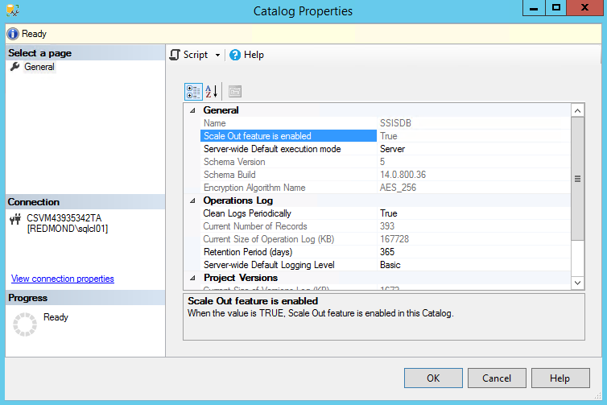

# Troubleshoot Scale Out

SSIS Scale Out involves communication among the SSIS Catalog database `SSISDB`, the Scale Out Master service, and the Scale Out Worker service. Sometimes this communication breaks due to configuration mistakes, lack of access permissions, and other reasons. This article helps you to troubleshoot issues with your Scale Out configuration.

To investigate the symptoms you encounter, follow the steps below one by one until your problem is resolved.

## Scale Out Master fails

### Symptoms 
-   Scale Out Master cannot connect to SSISDB. 

-   Master properties cannot show in Scale Out Manager.

-   Master properties are not populated in the view `[catalog].[master_properties]`.

### Solution
1.  Check whether Scale Out is enabled.

    In SSMS, in Object Explorer, right-click **SSISDB** and check **Scale Out feature is enabled**.

    

    If the property value is False, enable Scale Out by calling the stored procedure `[catalog].[enable_scaleout]`.

2.  Check whether the SQL Server name specified in the Scale Out Master configuration file is correct, and restart the Scale Out Master service.

## Scale Out Worker fails

### Symptoms 
-   Scale Out Worker cannot connect to Scale Out Master.

-   Scale Out Worker does not show after adding it in Scale Out Manager.

-   Scale Out Worker does not show in the view `[catalog].[worker_agents]`.

-   The Scale Out Worker service is running, but the Scale Out Worker is offline.

### Solution
Check the error messages in the Scale Out Worker service log under `\<drive\>:\Users\\*[account running worker service]*\AppData\Local\SSIS\Cluster\Agent`.

## No endpoint listening

### Symptoms

*"System.ServiceModel.EndpointNotFoundException: There was no endpoint listening at https://*[MachineName]:[Port]*/ClusterManagement/ that could accept the message."*

### Solution

1.  Check whether the port number specified in the Scale Out Master service configuration file is correct, and restart the Scale Out Master service. 

2.  Check whether the master endpoint specified in the Scale Out Worker service configuration is correct, and restart the Scale Out Worker service.

3.  Check whether the firewall port is open on the Scale Out Master node.

4.  Resolve any other connection issues between the Scale Out Master node and the Scale Out Worker node.

## Could not establish trust relationship

### Symptoms
*""System.ServiceModel.Security.SecurityNegotiationException: Could not establish trust relationship for the SSL/TLS secure channel with authority '[Machine Name]:[Port]'."*

*"System.Net.WebException: The underlying connection was closed: Could not establish trust relationship for the SSL/TLS secure channel."*

*"System.Security.Authentication.AuthenticationException: The remote certificate is invalid according to the validation procedure."*

### Solution
1.  Install the Scale Out Master certificate to the Root certificate store of the local computer on the Scale Out Worker node, if the certificate is not yet installed, and restart the Scale Out Worker service.

2.  Check whether the host name in the master endpoint is included in the CNs of the Scale Out Master certificate. If not, reset the master endpoint in the Scale Out Worker configuration file, and restart the Scale Out Worker service. 

    > [!NOTE]
    > If it's not possible to change the host name of the master endpoint due to DNS settings, you have to change the Scale Out Master certificate. See [Manage certificates for SSIS Scale Out](deal-with-certificates-in-ssis-scale-out.md).

3.  Check whether the master thumbprint specified in the Scale Out Worker configuration matches the thumbprint of the Scale Out Master certificate. 

## Could not establish secure channel

### Symptoms

*"System.ServiceModel.Security.SecurityNegotiationException: Could not establish secure channel for SSL/TLS with authority '[Machine Name]:[Port]'."*

*"System.Net.WebException: The request was aborted: Could not create SSL/TLS secure channel."*

### Solution
Check whether the account running the Scale Out Worker service has access to the Scale Out Worker certificate by running the following command:

```dos
winhttpcertcfg.exe -l -c LOCAL_MACHINE\MY -s {CN of the worker certificate}
```

If the account does not have access, grant access by running the following command, and restart Scale Out Worker service.

```dos
winhttpcertcfg.exe -g -c LOCAL_MACHINE\My -s {CN of the worker certificate} -a {the account running Scale Out Worker service}
```

## HTTP request forbidden

### Symptoms

*"System.ServiceModel.Security.MessageSecurityException: The HTTP request was forbidden with client authentication scheme 'Anonymous'."*

*"System.Net.WebException: The remote server returned an error: (403) Forbidden."*

### Solution
1.  Install the Scale Out Worker certificate to the Root certificate store of the local computer on the Scale Out Master node, if the certificate is not yet installed, and restart the Scale Out Worker service.

2.  Clean up useless certificates in the Root certificate store of the local computer on the Scale Out Master node.

3.  Configure Schannel to no longer send the list of trusted root certification authorities during the TLS/SSL handshake process by adding the following registry entry on the Scale Out Master node.

    `HKEY_LOCAL_MACHINE\SYSTEM\CurrentControlSet\Control\SecurityProviders\SCHANNEL`

    Value name: **SendTrustedIssuerList** 

    Value type: **REG_DWORD** 

    Value data: **0 (False)**

4.  If it is not possible to clean up all non-self-signed certificates as described in step 2, set the value of the following registry key to 2.

    `HKEY_LOCAL_MACHINE\SYSTEM\CurrentControlSet\Control\SecurityProviders\SCHANNEL`

    Value name: **ClientAuthTrustMode** 

    Value type: **REG_DWORD** 

    Value data: **2**

    > [!NOTE]
    > If you have non-self-signed certificates in the Root certificate store, client certificate authentication fails. For more info, see [Internet Information Services (IIS) 8 may reject client certificate requests with HTTP 403.7 or 403.16 errors](https://support.microsoft.com/help/2802568/internet-information-services-iis-8-may-reject-client-certificate-requ).

## HTTP request error

### Symptoms

*"System.ServiceModel.CommunicationException: An error occurred while making the HTTP request to https://[Machine Name]:[Port]/ClusterManagement/. This could be due to the fact that the server certificate is not configured properly with HTTP.SYS in the HTTPS case. This could also be caused by a mismatch of the security binding between the client and the server."*

### Solution
1.  Check whether the Scale Out Master certificate is bound to the port in the master endpoint correctly on the master node by running the following command:

    ```dos
    netsh http show sslcert ipport=0.0.0.0:{Master port}
    ```

    Check whether the certificate hash displayed matches the Scale Out Master certificate thumbprint. If the binding is not correct, reset the binding by running the following commands, and restart Scale Out Worker service.

    ```dos
    netsh http delete sslcert ipport=0.0.0.0:{Master port}
    netsh http add sslcert ipport=0.0.0.0:{Master port} certhash={Master certificate thumbprint} certstorename=Root  appid={random guid}
    ```

## Cannot open certificate store

### Symptoms
Validation fails when connecting a Scale Out Worker to the Scale Out Master in Scale Out Manager with the error message, *"Cannot open certificate store on the machine."*

### Solution

1.  Run Scale Out Manager as administrator. If you open Scale Out Manager with SSMS, you have to run SSMS as administrator.

2.  Start the Remote Registry service on the computer if it is not running.

## Execution doesn't start

### Symptoms
Execution in Scale Out does not start.

### Solution

Check the status of the computers you selected to run the package in the view `[catalog].[worker_agents]`. At least one worker must be online and enabled.

## No log

### Symptoms 
Packages run successfully, but there no messages are logged.

### Solution

Check whether SQL Server Authentication is allowed by the SQL Server instance that hosts SSISDB.

> [!NOTE]  
> If you have changed the account for Scale Out logging, see [Change the Account for Scale Out Logging](change-logdb-account.md) and verify the connection string used for logging.

## Error messages aren't helpful

### Symptoms
The error messages in the package execution report are not sufficient for troubleshooting.

### Solution
More execution logs can be found under the `TasksRootFolder` configured in `WorkerSettings.config`. By default, this folder is `\<drive\>:\Users\\[account]\AppData\Local\SSIS\ScaleOut\Tasks`. The *[account]* is the account running the Scale Out Worker service, with default value `SSISScaleOutWorker140`.

To locate the log for the package execution with *[execution ID]*, execute the following Transact-SQL command to get the *[task ID]*. Then, find the subfolder name that contains *[task ID]* under `TasksRootFolder`.

```sql
SELECT [TaskId]
FROM [SSISDB].[internal].[tasks] tasks, [SSISDB].[internal].[executions] executions 
WHERE executions.execution_id = *Your Execution Id* AND tasks.JobId = executions.job_id
```

> [!WARNING]
> This query is for troubleshooting purpose only. The internal views referenced in the query are to change in the future. 

## Next steps
For more info, see the following articles about setting up and configuring SSIS Scale Out:
-   [Get started with Integration Services (SSIS) Scale Out on a single computer](get-started-with-ssis-scale-out-onebox.md)
-   [Walkthrough: Set up Integration Services (SSIS) Scale Out](walkthrough-set-up-integration-services-scale-out.md)
