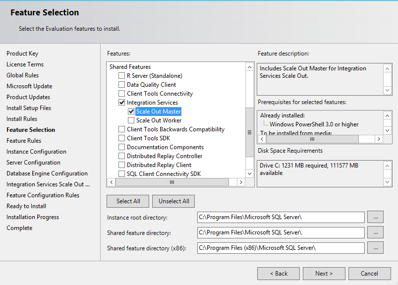
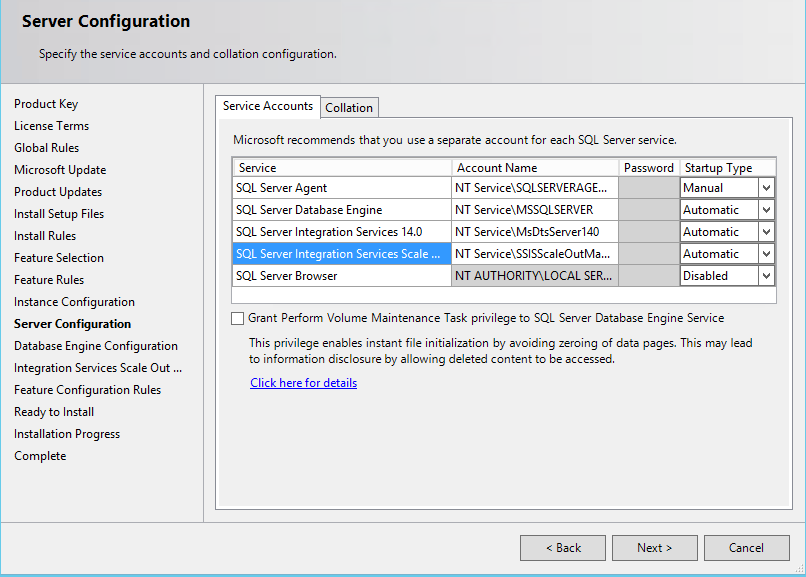
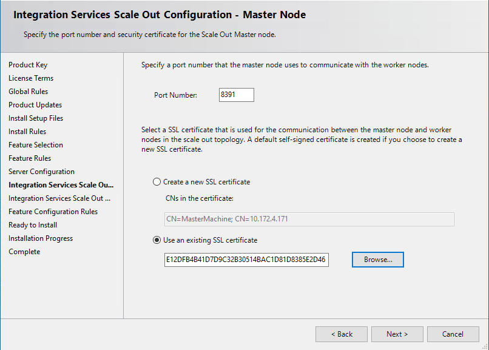
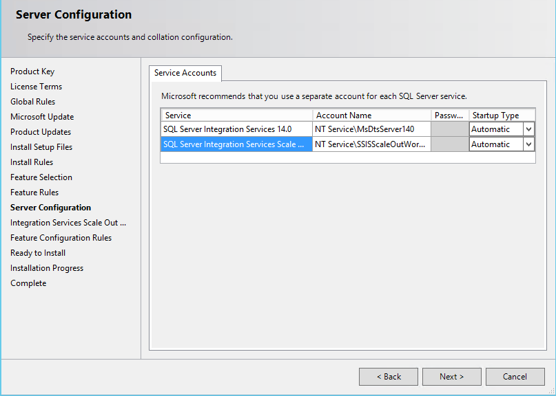
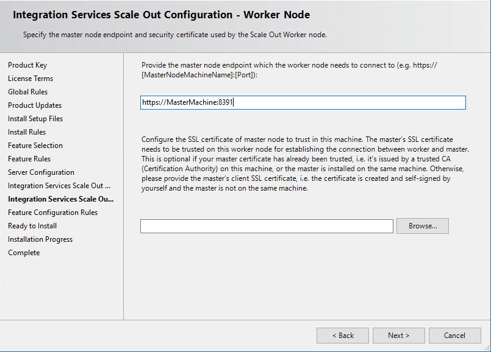
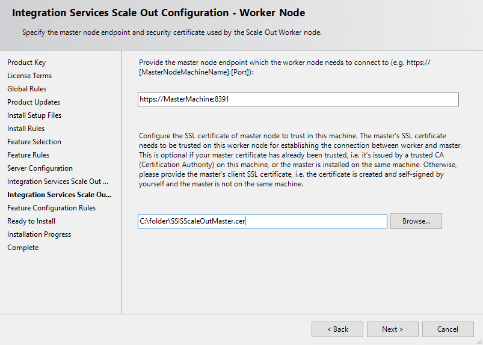

# Walkthrough: Set up Integration Services (SSIS) Scale Out
Set up [!INCLUDE[ssISnoversion_md](../../includes/ssisnoversion-md.md)] (SSIS) Scale Out by completing the following tasks. 

> [!TIP]
> If you are installing Scale Out on a single computer, install the Scale Out Master and Scale Out Worker features at the same time. When you install the features at the same time, the endpoint is automatically generated to connect to Scale Out Master. 

* [Install Scale Out Master](#InstallMaster)

* [Install Scale Out Worker](#InstallWorker)

* [Install Scale Out Worker client certificate](#InstallCert)

* [Open firewall port](#Firewall)

* [Start SQL Server Scale Out Master and Worker service](#Start)

* [Enable Scale Out Master](#EnableMaster)

* [Enable SQL Server Authentication mode](#EnableAuth)

* [Enable Scale Out Worker](#EnableWorker)

## <a name="InstallMaster"></a> Install Scale Out Master

To set up Scale Out Master, you have to install Database Engine Services, [!INCLUDE[ssISnoversion_md](../../includes/ssisnoversion-md.md)], and the Scale Out Master feature of SSIS when you set up [!INCLUDE[ssNoVersion_md](../../includes/ssnoversion-md.md)]. 

For info about how to set up Database Engine and [!INCLUDE[ssISnoversion_md](../../includes/ssisnoversion-md.md)], see [Install SQL Server Database Engine](../../database-engine/install-windows/install-sql-server-database-engine.md), and [Install Integration Services](../install-windows/install-integration-services.md).

> [!NOTE]
> To use the default SQL Server authentication account for Scale Out logging, select Mixed Mode for authentication mode on the **Database Engine Configuration** page during Database Engine installation. See [Change the account for Scale Out logging](change-logdb-account.md) for more information.

To install the Scale Out Master feature, use the [!INCLUDE[ssNoVersion_md](../../includes/ssnoversion-md.md)] installation wizard or the command prompt.

### Install Scale Out Master with the SQL Server installation wizard
1.  On the **Feature Selection** page, select **Scale Out Master**, which is listed under [!INCLUDE[ssISnoversion](../../includes/ssisnoversion-md.md)].   
  
    
  
2.  On the **Server Configuration** page, select the account to run **SQL Server Integration Services Scale Out Master service** and select the **Startup Type**.  
    

3.  On the **Integration Services Scale Out Master Configuration** page, specify the port number that Scale Out Master uses to communicate with Scale Out Worker. The default port number is 8391.  

    

4.  Specify the SSL certificate used to protect the communication between Scale Out Master and Scale Out Worker by doing one of the following.
    * Let the setup process create a default, self-signed SSL certificate by clicking **Create a new SSL certificate**.  The default certificate is installed under Trusted Root Certification Authorities, Local Computer. You can specify the CNs in this certificate. The host name of master endpoint should be included in CNs. By default, the machine name and ip of Master Node are included.
    * Select an existing SSL Certificate on the local computer by clicking **Use an existing SSL certificate** and then clicking **Browse** to select a certificate. The thumbprint of the certificate appears in the text box. Clicking **Browse** displays certificates that are stored in Trusted Root Certification Authorities, Local Computer. The certificate you select must be stored here.       

    
  
5.  Finish the [!INCLUDE[ssNoVersion_md](../../includes/ssnoversion-md.md)] installation wizard.

### Install Scale Out Master from the command prompt

Follow the instructions in [Install SQL Server from the Command Prompt](../../database-engine/install-windows/install-sql-server-2016-from-the-command-prompt.md). Set the parameters for Scale Out Master by doing the following things:
 
1.  Add `IS_Master` to the parameter `/FEATURES`

2.  Configure Scale Out Master by specifying the following parameters and their values:
    -   `/ISMASTERSVCACCOUNT`
    -   `/ISMASTERSVCPASSWORD`
    -   `/ISMASTERSVCSTARTUPTYPE`
    -   `/ISMASTERSVCPORT`
    -   `/ISMasterSVCSSLCertCN` (optional)
    -   `/ISMASTERSVCTHUMBPRINT` (optional)

    > [!NOTE]
    > If Scale Out Master is not installed together with Database Engine, and the Database Engine instance is a named instance, you have to configure `SqlServerName` in the Scale Out Master service configuration file after installation. For more info, see [Scale Out Master](integration-services-ssis-scale-out-master.md).

## <a name="InstallWorker"></a> Install Scale Out Worker
 
To set up Scale Out Worker, you have to install [!INCLUDE[ssISnoversion_md](../../includes/ssisnoversion-md.md)] and its Scale Out Worker feature in [!INCLUDE[ssNoVersion_md](../../includes/ssnoversion-md.md)] setup.

To install the Scale Out Worker feature, use the [!INCLUDE[ssNoVersion_md](../../includes/ssnoversion-md.md)] installation wizard or the command prompt.

### Install Scale Out Worker with the SQL Server installation wizard

1.  On the **Feature Selection** page, select **Scale Out Worker**, which is listed under [!INCLUDE[ssISnoversion](../../includes/ssisnoversion-md.md)].

    

2.  On the **Server Configuration** page, select the account to run **SQL Server Integration Services Scale Out Worker service** and select the **Startup Type**.

    

3.  On the **Integration Services Scale Out Worker Configuration** page, specify the endpoint to connect to Scale Out Master. 

    - For a **single-computer** environment, the endpoint is automatically generated when Scale Out Master and Scale Out Worker are installed at the same time. 

    - For a **multiple-computer** environment, the endpoint consists of the name or IP of the computer with Scale Out Master installed and the port number specified during the Scale Out Master installation.
   
        

    > [!NOTE]
    > You can also skip Worker configuration at this point and associate the Scale Out Worker with the Scale Out Master by using [Scale Out Manager](integration-services-ssis-scale-out-manager.md) after installation.

4. For a **multiple-computer** environment, specify the client SSL certificate that is used to validate Scale Out Master. For a **single-computer** environment, you don't have to specify a client SSL certificate. 
  
    Click **Browse** to find the certificate file (*.cer). To use the default SSL certificate, select the `SSISScaleOutMaster.cer` file located under `\<drive\>:\Program Files\Microsoft SQL Server\140\DTS\Binn` on the computer on which Scale Out Master is installed.   

    

    > [!NOTE]
    > When the SSL certificate used by Scale Out Master is self-signed, a corresponding client SSL certificate has to be installed on the computer with Scale Out Worker. If you provide the file path for the client SSL Certificate on the **Integration Services Scale Out Worker Configuration** page, the certificate will be installed automatically; otherwise, you have to install the certificate manually later. 
     
5. Finish the [!INCLUDE[ssNoVersion_md](../../includes/ssnoversion-md.md)] installation wizard.

### Install Scale Out Worker from the command prompt

Follow the instructions in [Install SQL Server from the Command Prompt](../../database-engine/install-windows/install-sql-server-2016-from-the-command-prompt.md). Set the parameters for Scale Out Worker by doing the following things:

1.  Add IS_Worker to the parameter `/FEATURES`.

2. Configure Scale Out Worker specifying the following parameters and their values:
    -   `/ISWORKERSVCACCOUNT`
    -   `/ISWORKERSVCPASSWORD`
    -   `/ISWORKERSVCSTARTUPTYPE`
    -   `/ISWORKERSVCMASTER` (optional)
    -   `/ISWORKERSVCCERT` (optional)
 
## <a name="InstallCert"></a> Install Scale Out Worker client certificate

During the installation of Scale Out Worker, a worker certificate is automatically created and installed on the computer. Also, a corresponding client certificate, SSISScaleOutWorker.cer, is installed under `\<drive\>:\Program Files\Microsoft SQL Server\140\DTS\Binn`. For Scale Out Master to authenticate the Scale Out Worker, you have to add this client certificate to the Root store of the local computer with Scale Out Master.
  
To add the client certificate to the Root store, double-click the .cer file and then click **Install Certificate** in the Certificate dialog box. The **Certificate Import Wizard** opens.  

## <a name="Firewall"></a> Open firewall port

On the Scale Out Master computer, open the port specified during the Scale Out Master installation and the port for SQL Server (1433, by default) in the Windows Firewall.

> [!Note]
> After you open the firewall port, you also have to restart the Scale Out Worker service.
    
## <a name="Start"></a> Start SQL Server Scale Out Master and Worker services

If you didn't set the startup type of the services to **Automatic** during installation, start the following services:

-   SQL Server Integration Services Scale Out Master 14.0 (SSISScaleOutMaster140S

-   SQL Server Integration Services Scale Out Worker 14.0 (SSISScaleOutWorker140)

## <a name="EnableMaster"></a> Enable Scale Out Master

When you create the SSISDB catalog in [!INCLUDE[ssNoVersion_md](../../includes/ssnoversion-md.md)] [!INCLUDE[ssManStudio_md](../../includes/ssmanstudio-md.md)], select **Enable this server as SSIS scale out master** in the **Create Catalog** dialog box.

After the catalog is created, you can enable Scale Out Master with [Scale Out Manager](integration-services-ssis-scale-out-manager.md).

## <a name="EnableAuth"></a> Enable SQL Server Authentication mode
If you didn't enable [!INCLUDE[ssNoVersion_md](../../includes/ssnoversion-md.md)] authentication during the Database Engine installation, enable SQL Server authentication mode on the [!INCLUDE[ssNoVersion_md](../../includes/ssnoversion-md.md)] instance that hosts the SSISDB catalog. 

Package execution is not blocked when SQL Server authentication is disabled. However, the execution log cannot write to the SSISDB database.

## <a name="EnableWorker"></a> Enable Scale Out Worker

You can enable Scale Out Worker with [Scale Out Manager](integration-services-ssis-scale-out-manager.md), which provides a graphical user interface, or with a stored procedure.

To enable a Scale Out Worker with a stored procedure, execute the `[catalog].[enable_worker_agent]` stored procedure with **WorkerAgentId** as the parameter. 

Get the **WorkerAgentId** value from the `[catalog].[worker_agents]` view in SSISDB, after Scale Out Worker registers with Scale Out Master. Registration takes several minutes after the Scale Out Master and Worker services are started.

#### Example
The following example enables the Scale Out Worker on `computerA`.

```sql
SELECT WorkerAgentId, MachineName FROM [catalog].[worker_agents]
GO
-- Result: --
-- WorkerAgentId                           MachineName  --
-- 6583054A-E915-4C2A-80E4-C765E79EF61D    computerA    --

EXEC [catalog].[enable_worker_agent] '6583054A-E915-4C2A-80E4-C765E79EF61D'
GO 
```

## Next steps
-   [Run Packages in Integration Services (SSIS) Scale Out](run-packages-in-integration-services-ssis-scale-out.md).
