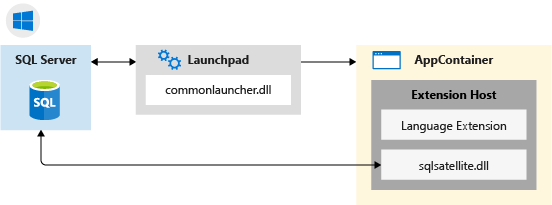
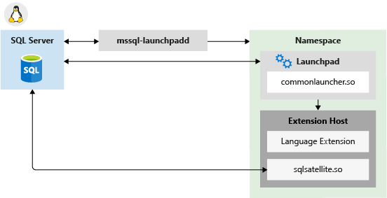

# Extensibility architecture in SQL Server Language Extensions

[!INCLUDE [SQL Server 2019 and later](../../includes/applies-to-version/sqlserver2019.md)]

Learn about the extensibility architecture used for SQL Server Language Extensions, which allows you to run external code in SQL Server. Starting with SQL Server 2019, Java, Python, and R are supported. The code executes in a language runtime environment as an extension to the core database engine.

## Background

The purpose of the extensibility framework is to provide an interface between SQL Server and external languages. By executing a trusted language within a secure framework managed by SQL Server, database administrators can maintain security while allowing data scientists access to enterprise data.

<!-- We need to get a diagram like the one below.
The following diagram visually describes opportunities and benefits of the extensible architecture.

  
-->

Any supported external language can be run by calling a stored procedure and the results are returned as tabular results directly to SQL Server. This makes it easy to use the external language from any application that can send a SQL query and handle the results.

## Architecture diagrams

The architecture is designed such that external code run in a separate process from SQL Server, but with components that internally manage the chain of requests for data and operations on SQL Server. 
  
  ***Component architecture in Windows:***

  
  
  ***Component architecture in Linux:***
  
  
  
Components include a **Launchpad** service used to invoke external runtimes (for example, Java) and library-specific logic for loading interpreters and libraries.

## Launchpad

The [!INCLUDE[rsql_launchpad_md](../../includes/rsql-launchpad-md.md)] is a service that manages the life-time, resources, and security boundaries of the external process that's responsible for script execution. This is similar to the way that the full-text indexing and query service launches a separate host for processing full-text queries. The Launchpad service can start only trusted launchers that are published by Microsoft, or that have been certified by Microsoft as meeting requirements for performance and resource management.

The [!INCLUDE[rsql_launchpad_md](../../includes/rsql-launchpad-md.md)] service runs under **SQLRUserGroup** which uses [AppContainers](/windows/desktop/secauthz/appcontainer-isolation) for execution isolation.

A separate [!INCLUDE[rsql_launchpad_md](../../includes/rsql-launchpad-md.md)] service is created for each database engine instance to which you have added SQL Server Machine Language Extensions. There is one Launchpad service for each database engine instance, so if you have multiple instances with external script support, you will have a Launchpad service for each one. A database engine instance is bound to the Launchpad service created for it. All invocations of external script in a stored procedure or T-SQL result in the SQL Server service calling the Launchpad service created for the same instance.

To execute tasks in a specific supported language, the Launchpad gets a secured worker account from the pool, and starts a satellite process to manage the external runtime. Each satellite process inherits the user account of the Launchpad and uses that worker account for the duration of script execution. If script uses parallel processes, they are created under the same, single worker account.

## Communication channels between components

Communication protocols among components and data platforms are described in this section.

+ **TCP/IP**

  By default, internal communications between SQL Server and the SQL Satellite use TCP/IP.

+ **ODBC**

  Communications between external data science clients and a remote SQL Server instance use ODBC. The account that sends the script jobs to SQL Server must have both permissions to connect to the instance and to run external scripts.

  Additionally, depending on the task, the account might need these permissions:

  + Read data used by the job
  + Write data to tables: for example, when saving results to a table
  + Create database objects: for example, if saving external script as part of a new stored procedure.

  When SQL Server is used as the compute context for script executed from a remote client, and the executable must retrieve data from an external source, ODBC is used for writeback. SQL Server maps the identity of the user issuing the remote command to the identity of the user on the current instance, and runs the ODBC command using that user's credentials. The connection string needed to perform this ODBC call is obtained from the client code.

+ **Other protocols**

  Processes that might need to work in "chunks" or transfer data back to a remote client can also use the [XDF file format](/machine-learning-server/r/concept-what-is-xdf). Actual data transfer is via encoded blobs.

## Next steps

+ [What is Language Extensions?](../language-extensions-overview.md)
