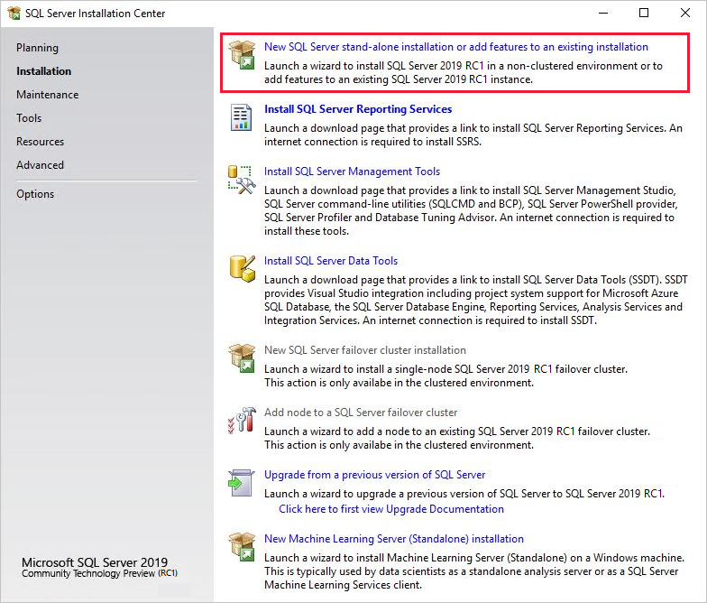
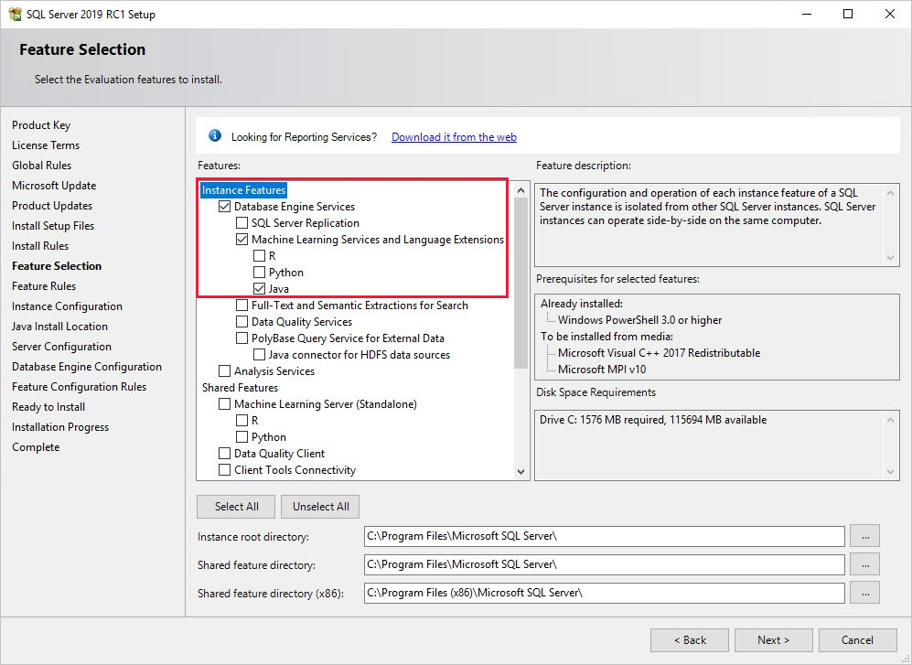

# Install SQL Server Language Extensions on Windows

 [!INCLUDE [SQL Server](../../includes/applies-to-version/sqlserver.md)]

Learn how to install the Language Extensions component on SQL Server by running the [!INCLUDE[ssNoVersion](../../includes/ssnoversion-md.md)] setup wizard.

> [!NOTE]
> This article is for installation of SQL Server Language Extensions on Windows. For Linux, see [Install SQL Server 2019 Language Extensions (Java) on Linux](https://docs.microsoft.com/sql//linux/sql-server-linux-setup-language-extensions)

<a name="prerequisites"></a> 

## Pre-install checklist

+ SQL Server 2019 Setup is required if you want to install support for Language Extensions.

+ A database engine instance is required. You cannot install just the Language Extensions features, although you can add them incrementally to an existing instance.

+ For business continuity, [Always On Availability Groups](https://docs.microsoft.com/sql/database-engine/availability-groups/windows/overview-of-always-on-availability-groups-sql-server) are supported for Language Extensions. You have to install language extensions, and configure packages, on each node.

+ Installing Language Extensions is supported on a failover cluster in SQL Server 2019.

+ Do not install SQL Server Language Extensions on a domain controller. The Language Extensions portion of setup will fail.

+ Language Extensions and [Machine Learning Services](../../machine-learning/index.yml) are installed by default on SQL Server Big Data Clusters. If you use Big Data Clusters, you do not need to follow the steps in this article. For more information, see [Use Machine Learning Services (Python and R) on Big Data Clusters](../../big-data-cluster/machine-learning-services.md).

> [!IMPORTANT]
> After setup is complete, be sure to complete the post-configuration steps described in this article. These steps include enabling SQL Server to use external code, and adding accounts required for SQL Server to run Java code on your behalf. Configuration changes generally require a restart of the instance, or a restart of the Launchpad service.

<a name="java-jre-jdk"></a>

## Java JRE or JDK

In SQL Server 2019 Release Candidate 1, there are two ways to install and use Java with SQL Server:

1. Use the default Java runtime, Zulu Open JRE version 11.0.3. This runtime is supported and included with the SQL Server installation.

1. Use your preferred Java distribution instead of the default Java runtime.

    Java 11 is currently the supported version on Windows. The Java Runtime Environment (JRE) is the minimum requirement, but Java Development Kit (JDK) is useful if you need the Java compiler and development packages. Because the JDK is all inclusive, if you install the JDK, the JRE is not necessary. On Windows, we recommend installing the JDK under the default `/Program Files/` folder if possible. Otherwise, extra configuration is required to grant permissions to executables. For more information, see the [grant permissions (Windows)](#perms-nonwindows) section in this document.

    > [!NOTE]
    > Given that Java is backwards compatible, earlier versions might work, but the supported and tested version for the Release Candidate 1 release is Java 11.
    
## Get the installation media

[!INCLUDE[GetInstallationMedia](../../includes/getssmedia.md)]

## Run Setup

For local installations, you must run Setup as an administrator. If you install [!INCLUDE[ssNoVersion](../../includes/ssnoversion-md.md)] from a remote share, you must use a domain account that has read and execute permissions on the remote share.

1. Start the setup wizard for SQL Server 2019. 
  
2. On the **Installation** tab, select **New SQL Server stand-alone installation or add features to an existing installation**.

     

3. On the **Feature Selection** page, select these options:
  
    - **Database Engine Services**
  
        To use Language Extensions with SQL Server, you must install an instance of the database engine. You can use either a default or a named instance.
  
    - **Machine Learning Services and Language Extensions**
  
        This option installs the Language Extensions component that support Java code execution.

        - If you want to install the default Java runtime, Zulu Open JRE 11.0.3, select **Machine Learning Services and Language Extensions** and **Java**.

        - If you want to use your own Java runtime, select **Machine Learning Services and Language Extensions**. Do not select Java.

        If you want to use R and Python, see [Install SQL Server Machine Learning Services on Windows](https://docs.microsoft.com/sql/machine-learning/install/sql-machine-learning-services-windows-install).

    

4. If you choose **Java** in the previous step to install the default Java runtime, the **Java Install Location** page will show up.

    Select the **Install Open JRE 11.0.3 included with this installation**.

    

    > [!NOTE]
    > The **Provide the location of a different version that has been installed on this computer** is not used for Language Extensions.

5. On the **Ready to Install** page, verify that these selections are included, and select **Install**.
  
    + Database Engine Services
    + Machine Learning Services and Language Extensions

    Note of the location of the folder under the path `..\Setup Bootstrap\Log` where the configuration files are stored. When setup is complete, you can review the installed components in the Summary file.

6. After setup is complete, if you are instructed to restart the computer, do so now. It is important to read the message from the Installation Wizard when you have finished with Setup. For more information, see [View and Read SQL Server Setup Log Files](https://docs.microsoft.com/sql/database-engine/install-windows/view-and-read-sql-server-setup-log-files).

## Add the JRE_HOME variable

`JRE_HOME` is a system environment variable that specifies the location of the Java interpreter. In this step, create a system environment variable for it on Windows.

1. Find and copy the JRE home path.

    For example, the JRE home path for the default Java runtime Zulu JRE 11.0.3 is `C:\Program Files\Microsoft SQL Server\MSSQL15.MSSQLSERVER\MSSQL\Binn\AZUL-OpenJDK-JRE\`.

    Depending on your SQL Server installation path or if you chose another Java runtime, your location of the JDK or JRE might be different than the example path above. Even if you have a JDK installed, you often times will get a JRE sub folder as part of that installation, so point to the JRE folder in that case. The Java extension will attempt to load the `jvm.dll` from the path `%JRE_HOME%\bin\server`.

2. In Control Panel, open **System and Security**, open **System**, and click **Advanced System Properties**.

3. Click **Environment Variables**.

4. Create a new system variable for `JRE_HOME` with the value of the JDK/JRE path (found in step 1).

5. Restart [Launchpad](../concepts/extensibility-framework.md#launchpad).

    1. Open [SQL Server Configuration Manager](../../relational-databases/sql-server-configuration-manager.md).

    2. Under SQL Server Services, right-click SQL Server Launchpad and select **Restart**.

<a name="perms-nonwindows"></a>

## Grant access to non-default JRE folder

If you did not install the default Zulu Open JRE that was included with SQL Server and did not install the JDK or JRE under program files, you need to perform the following steps. Run the **icacls** commands from an *elevated* line to grant access to the **SQLRUsergroup** and SQL Server service accounts (in **ALL_APPLICATION_PACKAGES**) for accessing the JRE. The commands will recursively grant access to all files and folders under the given directory path.

1. Give SQLRUserGroup permissions

    For a named instance,  append the instance name to SQLRUsergroup (for example, `SQLRUsergroupINSTANCENAME`).

    ```cmd
    icacls "<PATH to JRE>" /grant "SQLRUsergroup":(OI)(CI)RX /T
    ```
    
    You can skip this step if you installed the JDK/JRE in the default folder under program files on Windows.

2. Give AppContainer permissions

    ```cmd
    icacls "<PATH to JRE>" /grant "ALL APPLICATION PACKAGES":(OI)(CI)RX /T
    ```
    
## Enable script execution

1. Open [!INCLUDE[ssManStudioFull](../../includes/ssmanstudiofull-md.md)]. 

    > [!TIP]
    > You can download and install the appropriate version from this page: [Download SQL Server Management Studio (SSMS)](https://docs.microsoft.com/sql/ssms/download-sql-server-management-studio-ssms).
    > 
    > You can also use [Azure Data Studio](../../azure-data-studio/what-is.md), which supports administrative tasks and queries against SQL Server.
  
2. Connect to the instance where you installed Language Extensions, click **New Query** to open a query window, and run the following command:

    ```sql
    sp_configure
    ```

    The value for the property, `external scripts enabled`, should be **0** at this point. The feature is turned off by default and must be explicitly enabled by an administrator before you can run Java code.
    
3.  To enable the external scripting feature, run the following statement:
    
    ```sql
    EXEC sp_configure  'external scripts enabled', 1
    RECONFIGURE WITH OVERRIDE
    ```
    
    If you have already enabled the feature for Machine Learning Services, don't run reconfigure a second time for Language Extensions. The underlying extensibility platform supports both.

## Restart the service

When the installation is complete, restart the database engine before continuing to the next, enabling script execution.

Restarting the service also automatically restarts the related SQL Server Launchpad service.

You can restart the service using the right-click **Restart** command for the instance in SSMS, or by using the **Services** panel in Control Panel, or by using [SQL Server Configuration Manager](../../relational-databases/sql-server-configuration-manager.md).

<a name="register_external_language"></a>

## Register external language

For each database you want to use language extensions in, you need to register the external language with [CREATE EXTERNAL LANGUAGE](https://docs.microsoft.com/sql/t-sql/statements/create-external-language-transact-sql).

The following example adds an external language called Java to a database on SQL Server on Windows.

```SQL
CREATE EXTERNAL LANGUAGE Java
FROM (CONTENT = N'<path-to-zip>', FILE_NAME = 'javaextension.dll');
GO
```

For more information, see [CREATE EXTERNAL LANGUAGE](https://docs.microsoft.com/sql/t-sql/statements/create-external-language-transact-sql).

## Verify installation

Check the installation status of the instance in the setup logs.

Use the following steps to verify that all components used to launch external script are running.

1. In SQL Server Management Studio or Azure Data Studio, open a new query window, and run the following statement:
    
    ```sql
    EXEC sp_configure  'external scripts enabled'
    ```

    The **run_value** is now set to 1.
    
2. Open the **Services** panel or SQL Server Configuration Manager, and verify **SQL Server Launchpad service** is running. You should have one service for every database engine instance that has language extensions installed. For more information about the service, see [Extensibility framework](../concepts/extensibility-framework.md). 
   
## Additional configuration

If the verification step was successful, you can run Java Code from SQL Server Management Studio, Azure Data Studio, Visual Studio Code, or any other client that can send T-SQL statements to the server.

If you got an error when running the command, review the additional configuration steps in this section. You might need to make additional appropriate configurations to the service or database.

At the instance level, additional configuration might include:

* [Firewall configuration for SQL Server Machine Learning Services](../../machine-learning/security/firewall-configuration.md)
* [Enable additional network protocols](../../database-engine/configure-windows/enable-or-disable-a-server-network-protocol.md)
* [Enable remote connections](../../database-engine/configure-windows/configure-the-remote-access-server-configuration-option.md)
* [Create a login for SQLRUserGroup](../../machine-learning/security/create-a-login-for-sqlrusergroup.md)

<a name="bkmk_configureAccounts"></a> 
<a name="permissions-external-script"></a> 

On the database, you might need the following configuration updates:

* [Give users permission to SQL Server Machine Learning Services](../../machine-learning/security/user-permission.md)
* [Give users permission to execute a specific language](https://docs.microsoft.com/sql/t-sql/statements/create-external-language-transact-sql#permissions)

> [!NOTE]
> Whether additional configuration is required depends on your security schema, where you installed SQL Server, and how you expect users to connect to the database and run external scripts.

## Suggested optimizations

Now that you have everything working, you might also want to optimize the server to support language extensions.

### Optimize the server for language extensions

The default settings for [!INCLUDE[ssNoVersion](../../includes/ssnoversion-md.md)] setup are intended to optimize the balance of the server for a variety of services that are supported by the database engine, which might include extract, transform, and load (ETL) processes, reporting, auditing, and applications that use [!INCLUDE[ssNoVersion](../../includes/ssnoversion-md.md)] data. Therefore, under the default settings, you might find that resources for language extensions are sometimes restricted or throttled, particularly in memory-intensive operations.

To ensure that language extensions jobs are prioritized and resourced appropriately, we recommend that you use SQL Server Resource Governor to configure an external resource pool. You might also want to change the amount of memory that's allocated to the [!INCLUDE[ssNoVersion](../../includes/ssnoversion-md.md)] database engine, or increase the number of accounts that run under the [!INCLUDE[rsql_launchpad](../../includes/rsql-launchpad-md.md)] service.

- To configure a resource pool for managing external resources, see [Create an external resource pool](../../t-sql/statements/create-external-resource-pool-transact-sql.md).
  
- To change the amount of memory reserved for the database, see [Server memory configuration options](../../database-engine/configure-windows/server-memory-server-configuration-options.md).
  
If you are using Standard Edition and do not have Resource Governor, you can use Dynamic Management Views (DMVs) and Extended Events, as well as Windows event monitoring, to help manage the server resources.

## Next steps

Java developers can get started with some simple examples, and learn the basics of how Java works with SQL Server. For your next step, see the following link:

+ [Tutorial: Regular expressions with Java](../tutorials/search-for-string-using-regular-expressions-in-java.md)
