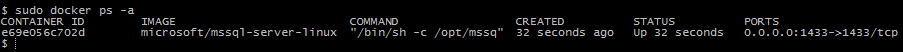

# Get started with SQL Server 2017 on Docker

In this quick start tutorial, you use Docker to pull and run the SQL Server 2017 RC1 containter image, [mssql-server-linux](https://hub.docker.com/r/microsoft/mssql-server-linux/). Then connect with **sqlcmd** to create your first database and run queries.

This image consists of SQL Server running on Linux based on Ubuntu 16.04. It can be used with the Docker Engine 1.8+ on Linux or on Docker for Mac/Windows.

> [!NOTE]
> This quick start specifically focuses on using the mssql-server-linux image. The Windows image is not covered, but you can learn more about it on the [mssql-server-windows Docker Hub page](https://hub.docker.com/r/microsoft/mssql-server-windows/).

## <a id="requirements"></a> Prerequisites

- Docker Engine 1.8+ on any supported Linux distribution or Docker for Mac/Windows.
- Minimum of 4 GB of disk space
- Minimum of 4 GB of RAM
- [System requirements for SQL Server on Linux](sql-server-linux-setup.md#system).

> [!IMPORTANT]
> The default on Docker for Mac and Docker for Windows is 2 GB for the Moby VM, so you must change it to 4 GB. If you are running on Mac or Windows, use the procedures below in increase the memory.

### Mac: Increase Docker memory to 4GB

The following steps increase the memory for Docker for Mac to 4GB.

1. Click the Docker logo on the top status bar.
1. Select **Preferences**.
1. Move the memory indicator to 4 GB or more.
1. Click the **restart** button at the button of the screen.

### Windows: Increase Docker memory to 4GB

The following steps increase the memory for Docker for Windows to 4GB.

1. Right-click on the Docker icon from the task bar.
1. Click **Settings** under that menu.
1. Click the **Advanced** Tab.
1. Move the memory indicator to 4 GB or more.
1. Click the **Apply** button.

## Pull and run the container image

1. Pull the container image from Docker Hub.

    ```bash
    docker pull microsoft/mssql-server-linux
    ```

    > [!TIP]
    > For Linux, depending on your system and user configuration, you might need to preface each `docker` command with `sudo`.

1. To run the container image with Docker, you can use the following command from a bash shell (Linux/macOS):

    ```bash
    docker run -e 'ACCEPT_EULA=Y' -e 'SA_PASSWORD=<YourStrong!Passw0rd>' -p 1401:1433 -d microsoft/mssql-server-linux
    ```

    If you are using Docker for Windows, use the following command from an elevated PowerShell command-prompt:

    ```PowerShell
    docker run -e "ACCEPT_EULA=Y" -e "SA_PASSWORD=<YourStrong!Passw0rd>" -p 1401:1433 -d microsoft/mssql-server-linux
    ```

    > [!NOTE]
    > The only difference between the bash (Linux/macOS) example and the PowerShell (Windows) example is single quotes versus double-quotes around the environment variables. The docker run command fails if you use the wrong one. Throughout the remainder of this topic, bash and PowerShell code blocks are provided for convenience. If there is only one example, it works on all platforms, including Windows.

    The following table provides a description of the parameters in the previous `docker run` example:

    | Parameter | Description |
    |-----|-----|
    | **-e 'ACCEPT_EULA=Y'** |  Set the **ACCEPT_EULA** variable to any value to confirm your acceptance of the [End-User Licensing Agreement](http://go.microsoft.com/fwlink/?LinkId=746388). Required setting for the SQL Server image. |
    | **-e 'SA_PASSWORD=\<YourStrong!Passw0rd\>'** | Specify your own strong password that is at least 8 characters and meets [SQL Server's password requirements](../relational-databases/security/password-policy.md). Required setting for the SQL Server image. |
    | **-p 1401:1433** | Map a TCP port on the host environment (first value) with a TCP port in the container (second value). In this example, SQL Server is listening on TCP 1433 in the container and this is exposed to the port, 1401, on the host. |
    | **microsoft/mssql-server-linux** | The SQL Server Linux container image. Unless otherwise specified, this defaults to the **latest** image. |

1. To view your Docker containers, use the `docker ps` command.

    ```bash
    docker ps -a
    ```

    You should see output similar to the following screenshot:

    

1. If the **STATUS** column shows a status of **Up**, then SQL Server is running in the container and listening on the port specified in the **PORTS** column. If the **STATUS** column for your SQL Server container shows **Exited**, see the [Troubleshooting](#troubleshooting) section.

## Change the SA password

The SA account is an system administrator on the SQL Server instance that gets created during setup. After creating your SQL Server container, the `SA_PASSWORD` environment variable you specified is discoverable by running `echo $SA_PASSWORD` in the container. For security purposes, change your SA password.

1. Choose a strong password to use for the SA user.

1. Use `docker exec` to run **sqlcmd** to change the password using Transact-SQL.

> ```bash
> docker exec -it <Container ID> /opt/mssql-tools/bin/sqlcmd -S localhost -U SA -P '<Old Password>' -Q 'ALTER LOGIN SA WITH PASSWORD="<New Password>";'
> ```

## Connect to SQL Server

The following steps use the SQL Server command-line tool, **sqlcmd**, inside the container to connect to SQL Server.

1. Use the `docker exec -it` command to start an interactive bash shell inside your running container. In the following example `e69e056c702d` is the container ID.

    ```bash
    docker exec -it e69e056c702d "bash"
    ```

    > [!TIP]
    > You don't always have to specify the entire container id. You only have to specify enough characters to uniquely identify it. So in this example, it might be enough to use `e6` or `e69` rather than the full id.

1. Once inside the container, connect locally with sqlcmd. Note that sqlcmd is not in the path by default, so you have to specify the full path.

    ```bash
    /opt/mssql-tools/bin/sqlcmd -S localhost -U SA -P '<YourPassword>'
    ```

   > [!TIP]
   > You can omit the password on the command-line to be prompted to enter it.

1. If successful, you should get to a **sqlcmd** command prompt: `1>`.

## Connect locally

The following steps use **sqlcmd** to locally connect to your new SQL Server instance.

1. Run **sqlcmd** with parameters for your SQL Server name (-S), the user name (-U), and the password (-P). In this tutorial, you are connecting locally, so the server name is `localhost`. The user name is `SA` and the password is the one you provided for the SA account during setup.

   ```bash
   sqlcmd -S localhost -U SA -P '<YourPassword>'
   ```

   > [!TIP]
   > You can omit the password on the command-line to be prompted to enter it.

   > [!TIP]
   > If you later decide to connect remotely, specify the machine name or IP address for the **-S** parameter, and make sure port 1433 is open on your firewall.

1. If successful, you should get to a **sqlcmd** command prompt: `1>`.

1. If you get a connection failure, first attempt to diagnose the problem from the error message. Then review the [connection troubleshooting recommendations](../linux/sql-server-linux-troubleshooting-guide.md#connection).

## Create and query data
The following sections walk you through using **sqlcmd** and Transact-SQL to create a new database, add data, and run a simple query.

### Create a new database

The following steps create a new database named `TestDB`.

1. From the **sqlcmd** command prompt, paste the following Transact-SQL command to create a test database:

   ```sql
   CREATE DATABASE TestDB
   ```

1. On the next line, write a query to return the name of all of the databases on your server:

   ```sql
   SELECT Name from sys.Databases
   ```

1. The previous two commands were not executed immediately. You must type `GO` on a new line to execute the previous commands:

   ```sql
   GO
   ```

### Insert data

Next create a new table, `Inventory`, and insert two new rows.

1. From the **sqlcmd** command prompt, switch context to the new `TestDB` database:

   ```sql
   USE TestDB
   ```

1. Create new table named `Inventory`:

   ```sql
   CREATE TABLE Inventory (id INT, name NVARCHAR(50), quantity INT)
   ```

1. Insert data into the new table:

   ```sql
   INSERT INTO Inventory VALUES (1, 'banana', 150); INSERT INTO Inventory VALUES (2, 'orange', 154);
   ```

1. Type `GO` to execute the previous commands:

   ```sql
   GO
   ```

### Select data

Now, run a query to return data from the `Inventory` table.

1. From the **sqlcmd** commandd prompt, enter a query that returns rows from the `Inventory` table where the quantity is greater than 152:

   ```sql
   SELECT * FROM Inventory WHERE quantity > 152;
   ```

1. Execute the command:

   ```sql
   GO
   ```

### Exit the sqlcmd command prompt

1. To end your **sqlcmd** session, type `QUIT`:

   ```sql
   QUIT
   ```

1. To exit the interactive command-prompt in your container, type `exit`. Your container continues to run after you exit the interactive bash shell.

## Connect from outside the container

You can also connect to the SQL Server instance on your Docker machine from any external Linux, Windows, or macOS tool that supports SQL connections.

The following steps uses **sqlcmd** outside of your container to connect to SQL Server running in the container. These steps assume that you already have the SQL Server command-line tools installed outside of your container. The same principals apply when using other tools, but the process of connecting will be unique to each tool.

1. Find the IP address for the machine that hosts your container. On Linux, use **ifconfig** or **ip addr**. On Windows, use **ipconfig**.

1. Run sqlcmd specifying the IP address and the port mapped to port 1433 in your container. In this example, that is port 1401 on the host machine.

   ```bash
   sqlcmd -S 10.3.2.4,1401 -U SA -P '<YourPassword>'
   ```

   ```PowerShell
   sqlcmd -S 10.3.2.4,1401 -U SA -P "<YourPassword>"
   ```

1. Run Transact-SQL commands. When finished, type `QUIT`.

Other common tools to connect to SQL Server include:

- [Visual Studio Code](sql-server-linux-develop-use-vscode.md)
- [SQL Server Management Studio (SSMS) on Windows](sql-server-linux-develop-use-ssms.md)

## Next steps

After installing SQL Server on Linux, next see [how to connect to the server and run basic Transact-SQL queries](sql-server-linux-connect-and-query-sqlcmd.md). Also, check out the [mssql-docker GitHub repository](https://github.com/Microsoft/mssql-docker) for resources, feedback, and known issues.
