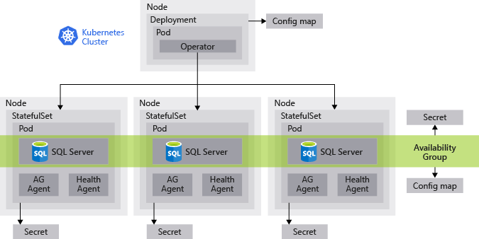

# Always On availability groups for SQL Server containers

SQL Server 2019 supports availability groups on containers in a Kubernetes cluster. For availability groups, deploy the SQL Server [Kubernetes operator](https://coreos.com/blog/introducing-operators.html) to your Kubernetes cluster. The operator helps package, deploy, and manage the availability group in a cluster.

In the image above, a four-node kubernetes clusters host an availability group with three replicas. The solution includes the following components:

* A Kubernetes [*deployment*](https://kubernetes.io/docs/concepts/workloads/controllers/deployment/). The deployment includes the operator and a configuration map. These provide the container image, software, and instructions required to deploy SQL Server instances for the availability group.

* Three nodes, each hosting a [*StatefulSet*](https://kubernetes.io/docs/concepts/workloads/controllers/statefulset/). The StatefulSet contains a [*pod*](https://kubernetes.io/docs/concepts/workloads/pods/pod-overview/). Each pod contains:
  * A SQL Server container running one instance of SQL Server.
  * An availability group agent. 

* Two [*ConfigMaps*](https://kubernetes.io/docs/tasks/configure-pod-container/configure-pod-configmap/) related to the availability group. The ConfigMaps provide information about:
  * The deployment for the operator.
  * The availability group.

 * [*Persistent volumes*](https://kubernetes.io/docs/concepts/storage/persistent-volumes/) are pieces of storage. A *persistent volume claim* (PVC) is a request for storage by a user. Each container is affiliated with a PVC for the data and log storage. In Azure Kubernetes Service (AKS), you [create a persistent volume claim](https://docs.microsoft.com/azure/aks/azure-disks-dynamic-pv) to automatically provision storage based on a storage class.

In addition, the cluster stores [*secrets*](https://kubernetes.io/docs/concepts/configuration/secret/) for the passwords, certificates, keys, and other sensitive information.

## Deploy the availability group in Kubernetes

To deploy an availability group in Kubernetes:

1. Create the Kubernetes cluster

   For an availability group, create at least three nodes for SQL Server plus a node for the master.

1. Deploy the operator

1. Configure the storage

1. Deploy the StatefulSet

   The operator listens for instructions to deploy the StatefulSet. It automatically creates the instances of SQL Server on three separate nodes and configures the availability group with an external cluster manager.

1. Create the databases and attach them to the availability group

For detailed steps, see [Always On availability groups for SQL Server containers](sql-server-ag-kubernetes.md).

## SQL Server Kubernetes operator

After you deploy the operator, it registers a custom SQL Server resource. Use the operator to deploy this resource.  Each resource corresponds to an instance of SQL Server and includes specific properties like `sapassword` and `monitoring policy`. The operator parses the resource and deploys a Kubernetes StatefulSet.

The StatfulSet contains:

* mssql-server container

* mssql-ha-supervisor container

The code for the operator, HA supervisor, and SQL Server is packaged in a Docker image called `mcr.microsoft.com/mssql/ha`. This image contains the following binaries:

* `mssql-operator`

    This process is deployed as a separate Kubernetes deployment. It registers the [Kubernetes custom resource](https://kubernetes.io/docs/concepts/extend-kubernetes/api-extension/custom-resources/) called `SqlServer` (sqlservers.mssql.microsoft.com). Then it listens for such resources being created or updated in the Kubernetes cluster. For every such event, it creates or updates the Kubernetes resources for the corresponding instance (for example the StatefulSet, or `mssql-server-k8s-init-sql` job).

* `mssql-server-k8s-health-agent`

    This web server serves Kubernetes [liveness probes](https://kubernetes.io/docs/tasks/configure-pod-container/configure-liveness-readiness-probes/) to determine the health of a SQL Server instance. Monitors the health of the local SQL Server instance by calling `sp_server_diagnostics` and comparing the results with your monitor policy.

* `mssql-ha-supervisor`

   Maintains the ag certificate and endpoint. 

* `mssql-server-k8s-ag-agent`
  
    This process monitors the health of an AG replica on a single SQL Server instance and performs failovers.

    It also maintains the leader election.

* `mssql-server-k8s-init-sql`
  
    This Kubernetes [job](https://kubernetes.io/docs/concepts/workloads/controllers/jobs-run-to-completion/) applies a desired state configuration to a SQL Server instance. The job is created by the operator every time a SqlServer resource is created or updated. It ensures that the target SQL Server instance corresponding to the custom resource has the desired configuration described in the resource.

    For example, if any of the following settings are required, it completes them:
  * Update the SA password
  * Creates the SQL login for the agents
  * Creates the DBM endpoint

* `mssql-server-k8s-rotate-creds`
  
    This Kubernetes job implements the rotate credentials task. Create this job to request updates to the SA password, agent SQL login password, DBM cert, etc. The SA password is specified as the job parameters. The others are auto-generated.

* `mssql-server-k8s-failover`

   A Kubernetes job that implements the manual failover workflow.

### Notes

Regardless of the AG configuration, The operator will always deploy the HA supervisor. If the SqlServer resource does not list any AG, the operator will still deploy this container.

The version for the operator image is identical to the version for the SQL Server image.

## Next steps

> [SQL Server container in Kubernetes](tutorial-sql-server-containers-kubernetes.md)
