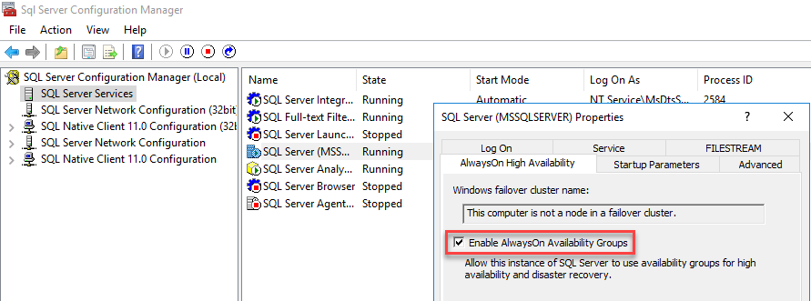
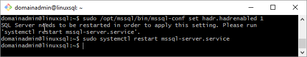
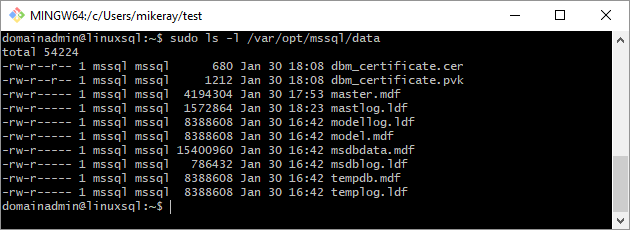

# Configure SQL Server Always On Availability Group on Windows and Linux (cross-platform)

[!INCLUDE[tsql-appliesto-sslinux-only](../includes/tsql-appliesto-ss2017-xxxx-xxxx-xxx-md.md)]

This article explains the steps to create an Always On Availability Group (AG) with one replica on a Windows server and the other replica on a Linux server. This configuration is cross-platform because the replicas are on different operating systems. Use this configuration for migration from one platform to the other or disaster recovery (DR). This configuration does not support high-availability because there is no cluster solution to manage a cross-platform configuration. 


Before proceeding, you should be familiar with installation and configuration for SQL Server instances on Windows and Linux. 

## Scenario

In this scenario, two servers are on different operating systems. A Windows Server 2016 named `WinSQLInstance` hosts the primary replica. A Linux server named `LinuxSQLInstance` host the secondary replica.

## Configure the AG 

The steps to create the AG are the same as the steps to create an AG for read-scale workloads. The AG cluster type is NONE, because there is no cluster manager. 

   >[!NOTE]
   >For the scripts in this article, angle brackets `<` and `>` identify values that you need to replace for your environment. The angle brackets themselves are not required for the scripts. 

1. Install SQL Server 2017 on Windows Server 2016, enable Always On Availability Groups from SQL Server Configuration Manager, and set mixed mode authentication. 

   >[!TIP]
   >If you are validating this solution in Azure, place both servers in the same availability set to ensure they are separated in the data center. 

   **Enable Availability Groups**

   For instructions, see [Enable and disable Always On Availability Groups (SQL Server)](../database-engine/availability-groups/windows/enable-and-disable-always-on-availability-groups-sql-server.md).

   

   SQL Server Configuration Manager notes that the computer is not a node in a failover cluster. 

   After you enable Availability Groups, restart SQL Server.

   **Set mixed mode authentication**

   For instructions, see [Change server authentication mode](../database-engine/configure-windows/change-server-authentication-mode.md#SSMSProcedure).

1. Install SQL Server 2017 on Linux. For instructions, see [Install SQL Server](sql-server-linux-setup.md). Enable `hadr` via mssql-conf.

   To enable `hadr` via mssql-conf from a shell prompt, issue the following command:

   ```bash
   sudo /opt/mssql/bin/mssql-conf set hadr.hadrenabled 1
   ```

   After you enable `hadr`, restart the SQL Server instance.  

   The following image shows this complete step.

   

1. Configure hosts file on both servers or register the server names with DNS.

1. Open up firewall ports for TPC 1433 and 5022 on both Windows and Linux.

1. On the primary replica, create a database login and password.

   ```sql
   CREATE LOGIN dbm_login WITH PASSWORD = '<C0m9L3xP@55w0rd!>';
   CREATE USER dbm_user FOR LOGIN dbm_login;
   GO
   ```

1. On the primary replica, create a master key and certificate, then back up the certificate with a private key.

   ```sql
   CREATE MASTER KEY ENCRYPTION BY PASSWORD = '<C0m9L3xP@55w0rd!>';
   CREATE CERTIFICATE dbm_certificate WITH SUBJECT = 'dbm';
   BACKUP CERTIFICATE dbm_certificate
   TO FILE = 'C:\Program Files\Microsoft SQL Server\MSSQL14.MSSQLSERVER\MSSQL\DATA\dbm_certificate.cer'
   WITH PRIVATE KEY (
           FILE = 'C:\Program Files\Microsoft SQL Server\MSSQL14.MSSQLSERVER\MSSQL\DATA\dbm_certificate.pvk',
           ENCRYPTION BY PASSWORD = '<C0m9L3xP@55w0rd!>'
       );
   GO
   ```

1. Copy the certificate and private key to the Linux server (secondary replica) at `/var/opt/mssql/data`. You can use `pscp` to copy the files to the Linux server. 

1. Set the group and ownership of the private key and the certificate to `mssql:mssql`.

   The following script sets the group and ownership of the files. 

   ```bash
   sudo chown mssql:mssql /var/opt/mssql/data/dbm_certificate.pvk
   sudo chown mssql:mssql /var/opt/mssql/data/dbm_certificate.cer
   ```

   In the following diagram, ownership and group are set correctly for the certificate and key.

   


1. On the secondary replica, create a database login and password and create a master key.

   ```sql
   CREATE LOGIN dbm_login WITH PASSWORD = '<C0m9L3xP@55w0rd!>';
   CREATE USER dbm_user FOR LOGIN dbm_login;
   GO
   CREATE MASTER KEY ENCRYPTION BY PASSWORD = '<M@st3rKeyP@55w0rD!>'
   GO
   ```

1. On the secondary replica, restore the certificate you copied to `/var/opt/mssql/data`. 

   ```sql
   CREATE CERTIFICATE dbm_certificate   
       AUTHORIZATION dbm_user
       FROM FILE = '/var/opt/mssql/data/dbm_certificate.cer'
       WITH PRIVATE KEY (
       FILE = '/var/opt/mssql/data/dbm_certificate.pvk',
       DECRYPTION BY PASSWORD = '<C0m9L3xP@55w0rd!>'
   )
   GO
   ```

1. On the primary replica, create an endpoint.

   ```sql
   CREATE ENDPOINT [Hadr_endpoint]
       AS TCP (LISTENER_IP = (0.0.0.0), LISTENER_PORT = 5022)
       FOR DATA_MIRRORING (
           ROLE = ALL,
           AUTHENTICATION = CERTIFICATE dbm_certificate,
           ENCRYPTION = REQUIRED ALGORITHM AES
           );
   ALTER ENDPOINT [Hadr_endpoint] STATE = STARTED;
   GRANT CONNECT ON ENDPOINT::[Hadr_endpoint] TO [dbm_login]
   GO
   ```

   >[!IMPORTANT]
   >The firewall must be open for the listener TCP port. In the preceding script, the port is 5022. Use any available TCP port. 

1. On the secondary replica, create the endpoint. Repeat the preceding script on the secondary replica to create the endpoint. 

1. On the primary replica, create the AG with `CLUSTER_TYPE = NONE`. The example script uses `SEEDING_MODE = AUTOMATIC` to create the AG. 

   >[!NOTE]
   >When the Windows instance of SQL Server uses different paths for data and log files, automatic seeding fails to the Linux instance of SQL Server because these paths do not exist on the secondary replica. To use the following script for a cross-platform AG, the database requires the same path for the data and log files on the Windows server. Alternatively you can update the script to set `SEEDING_MODE = MANUAL` and then back up and restore the database with `NORECOVERY` to seed the database. 
   >
   >This behavior applies to Azure Marketplace images. 
   >
   >For more information about automatic seeding, see [Automatic Seeding - Disk Layout](../database-engine/availability-groups/windows/automatic-seeding-secondary-replicas.md#disklayout). 

   Before you run the script, update the values for your AGs.

      * Replace `<WinSQLInstance>` with the server name of the primary replica SQL Server instance.

      * Replace `<LinuxSQLInstance>` with the server name of the secondary replica SQL Server instance. 

   To create the AG, update the values and run the script on the primary replica.  

   ```sql
   CREATE AVAILABILITY GROUP [ag1]
       WITH (CLUSTER_TYPE = NONE)
       FOR REPLICA ON
           N'<WinSQLInstance>' 
      	WITH (
	       ENDPOINT_URL = N'tcp://<WinSQLInstance>:5022',
	       AVAILABILITY_MODE = ASYNCHRONOUS_COMMIT,
      	    SEEDING_MODE = AUTOMATIC,
	      	FAILOVER_MODE = MANUAL,
		   SECONDARY_ROLE (ALLOW_CONNECTIONS = ALL)
      		),
           N'<LinuxSQLInstance>' 
	   WITH (
      	    ENDPOINT_URL = N'tcp://<LinuxSQLInstance>:5022',
	       AVAILABILITY_MODE = ASYNCHRONOUS_COMMIT,
	       SEEDING_MODE = AUTOMATIC,
		   FAILOVER_MODE = MANUAL,
		   SECONDARY_ROLE (ALLOW_CONNECTIONS = ALL)
           )
   GO
   ```
   
   For more information, see [CREATE AVAILABILITY GROUP (Transact-SQL)](../t-sql/statements/create-availability-group-transact-sql.md).

1. On the secondary replica, join the AG.

   ```sql
   ALTER AVAILABILITY GROUP [ag1] JOIN WITH (CLUSTER_TYPE = NONE)
   ALTER AVAILABILITY GROUP [ag1] GRANT CREATE ANY DATABASE
   GO
   ```

1. Create a database for the AG. The example steps use a database named `<TestDB>`. If you are using automatic seeding, set the same path for both the data and the log files. 

   Before you run the script, update the values for your database.

      * Replace `<TestDB>` with the name of your database.

      * Replace `<F:\Path>` with the path for your database and log files. Use the same path for the database and log files. 

      You can also use the default paths. 

    To create your database, run the script. 

   ```sql
   CREATE DATABASE [<TestDB>]
      CONTAINMENT = NONE
     ON  PRIMARY ( NAME = N'<TestDB>', FILENAME = N'<F:\Path>\<TestDB>.mdf')
     LOG ON ( NAME = N'<TestDB>_log', FILENAME = N'<F:\Path>\<TestDB>_log.ldf')
   GO
   ```

1. Take a full backup of the database. 

1. If you are not using automatic seeding, restore the database on the secondary replica (Linux) server. [Migrate a SQL Server database from Windows to Linux using backup and restore](sql-server-linux-migrate-restore-database.md). Restore the database `WITH NORECOVERY` on the secondary replica. 

1. Add the database to the AG. Update the example script. Replace `<TestDB>` with the name of your database. On the primary replica, run the SQL query to add the database to the AG.

   ```sql
   ALTER AG [ag1] ADD DATABASE <TestDB>
   GO
   ```

1. Verify that the database is getting populated on the secondary replica. 

## Fail over the primary replica

[!INCLUDE[Force failover](../includes/ss-force-failover-read-scale-out.md)]

This article reviewed the steps to create a cross-platform AG to support migration or read-scale workloads. It can be used for manual disaster recovery. It also explained how to fail over the AG. A cross-platform AG uses cluster type `NONE` and does not support high availability because there is no cluster tool across-platforms. 

## Next steps

[Overview of Always On Availability Groups](../database-engine/availability-groups/windows/overview-of-always-on-availability-groups-sql-server.md)

[SQL Server availability basics for Linux deployments](sql-server-linux-ha-basics.md)
