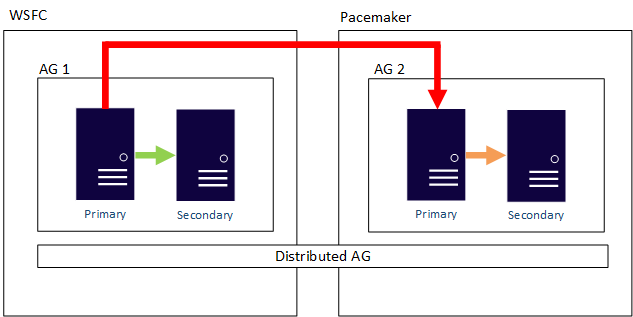

# Always On Availability Groups on Linux

[!INCLUDE[appliesto-ss-xxxx-xxxx-xxx-md-linuxonly](../includes/appliesto-ss-xxxx-xxxx-xxx-md-linuxonly.md)]

This article describes the characteristics of Always On Availability Groups (AGs) under Linux-based [!INCLUDE[ssnoversion-md](../includes/ssnoversion-md.md)] installations. It also covers differences between Linux- and Windows Server failover cluster (WSFC)-based AGs. See the [Windows-based documentation](../database-engine/availability-groups/windows/overview-of-always-on-availability-groups-sql-server.md) for the basics of AGs, as they work the same on Windows and Linux except for the WSFC.

From a high-level standpoint, availability groups under [!INCLUDE[ssnoversion-md](../includes/ssnoversion-md.md)] on Linux are the same as they are on WSFC-based implementations. That means that all the limitations and features are the same, with some exceptions. The main differences include:

-   Microsoft Distributed Transaction Coordinator (DTC) is not supported under Linux in [!INCLUDE[sssql17-md](../includes/sssql17-md.md)]. If your applications require the use of distributed transactions and need an AG, deploy [!INCLUDE[ssnoversion-md](../includes/ssnoversion-md.md)] on Windows.
-   Linux-based deployments use Pacemaker instead of a WSFC.
-   Unlike most configurations for AGs on Windows except for the Workgroup Cluster scenario, Pacemaker never requires Active Directory Domain Services (AD DS).
-   How to fail an AG from one node to another is different between Linux and Windows.
-   Certain settings such as `required_synchronized_secondaries_to_commit` can only be changed via Pacemaker on Linux, whereas a WSFC-based install uses Transact-SQL.

## Number of replicas and cluster nodes

An AG in [!INCLUDE[ssstandard-md](../includes/ssstandard-md.md)] can have two total replicas: one primary, and one secondary that can only be used for availability purposes. It cannot be used for anything else, such as readable queries. An AG in [!INCLUDE[ssenterprise-md](../includes/ssenterprise-md.md)] can have up to nine total replicas: one primary and up to eight secondaries, of which up to three (including the primary) can be synchronous. If using an underlying cluster, there can be a maximum of 16 nodes total when Corosync is involved. An availability group can span at most nine of the 16 nodes with [!INCLUDE[ssenterprise-md](../includes/ssenterprise-md.md)], and two with [!INCLUDE[ssstandard-md](../includes/ssstandard-md.md)].

A two-replica configuration that requires the ability to automatically fail over to another replica requires the use of a configuration-only replica, as described in [Configuration-only replica and quorum](#configuration-only-replica-and-quorum). Configuration-only replicas were introduced in [!INCLUDE[sssql17-md](../includes/sssql17-md.md)] Cumulative Update 1 (CU1), so that should be the minimum version deployed for this configuration.

If Pacemaker is used, it must be properly configured so it remains up and running. That means that quorum and STONITH must be implemented properly from a Pacemaker perspective, in addition to any [!INCLUDE[ssnoversion-md](../includes/ssnoversion-md.md)] requirements such as a configuration-only replica.

Readable secondary replicas are only supported with [!INCLUDE[ssenterprise-md](../includes/ssenterprise-md.md)].

## Cluster type and failover mode

New to [!INCLUDE[sssql17-md](../includes/sssql17-md.md)] is the introduction of a cluster type for AGs. For Linux, there are two valid values: External and None. A cluster type of External means that Pacemaker will be used underneath the AG. Using External for cluster type requires that the failover mode be set to External as well (also new in [!INCLUDE[sssql17-md](../includes/sssql17-md.md)]). Automatic failover is supported, but unlike a WSFC, failover mode is set to External, not automatic, when Pacemaker is used. Unlike a WSFC, the Pacemaker portion of the AG is created after the AG is configured.

A cluster type of None means that there is no requirement for, nor will the AG use, Pacemaker. Even on servers that have Pacemaker configured, if an AG is configured with a cluster type of None, Pacemaker will not see or manage that AG. A cluster type of None only supports manual failover from a primary to a secondary replica. An AG created with None is primarily targeted for the read-scale out scenario as well as upgrades. While it can work in scenarios like disaster recovery or local availability where no automatic failover is necessary, it is not recommended. The listener story is also more complex without Pacemaker.

Cluster type is stored in the [!INCLUDE[ssnoversion-md](../includes/ssnoversion-md.md)] dynamic management view (DMV) `sys.availability_groups`, in the columns `cluster_type` and `cluster_type_desc`.

## required\_synchronized\_secondaries\_to\_commit

New to [!INCLUDE[sssql17-md](../includes/sssql17-md.md)] is a setting that is used by AGs called `required_synchronized_secondaries_to_commit`. This tells the AG the number of secondary replicas that must be in lockstep with the primary. This enables things like automatic failover (only when integrated with Pacemaker with a cluster type of External), and controls the behavior of things like the availability of the primary if the right number of secondary replicas is either online or offline. To understand more about how this works, see [High availability and data protection for availability group configurations](sql-server-linux-availability-group-ha.md). The `required_synchronized_secondaries_to_commit` value is set by default and maintained by Pacemaker/ [!INCLUDE[ssnoversion-md](../includes/ssnoversion-md.md)]. You can manually override this value.

The combination of `required_synchronized_secondaries_to_commit` and the new sequence number (which is stored in `sys.availability_groups`) informs Pacemaker and [!INCLUDE[ssnoversion-md](../includes/ssnoversion-md.md)] that, for example, automatic failover can happen. In that case, a secondary replica would have the same sequence number as the primary, meaning it is up to date with all the latest configuration information.

There are three values that can be set for `required_synchronized_secondaries_to_commit`: 0, 1, or 2. They control the behavior of what happens when a replica becomes unavailable. The numbers correspond to the number of secondary replicas that must be synchronized with the primary. The behavior is as follows under Linux:

-   0 - No automatic failover is possible since no secondary replica is required to be synchronized. The primary database is available at all times.
-   1 - One secondary replica must be in a synchronized state with the primary; automatic failover is possible. The primary database is unavailable until a secondary synchronous replica is available.
-   2 - Both secondary replicas in a three or more node AG configuration must be synchronized with the primary; automatic failover is possible.

`required_synchronized_secondaries_to_commit` controls not only the behavior of failovers with synchronous replicas, but data loss. With a value of 1 or 2, a secondary replica is always required to be synchronized, so there will always be data redundancy. That means no data loss.

To change the value of `required_synchronized_secondaries_to_commit`, use the following syntax:

>[!NOTE]
>Changing the value causes the resource to restart, meaning a brief outage. The only way to avoid this is to set the resource to not be managed by the cluster temporarily.

**Red Hat Enterprise Linux (RHEL) and Ubuntu**

```bash
sudo pcs resource update <AGResourceName> required_synchronized_secondaries_to_commit=<Value>
```

**SUSE Linux Enterprise Server (SLES)**

```bash
sudo crm resource param ms-<AGResourceName> set required_synchronized_secondaries_to_commit <value>
```

where *AGResourceName* is the name of the resource configured for the AG, and *Value* is 0, 1, or 2. To set it back to the default of Pacemaker managing the parameter, execute the same statement with no value.

Automatic failover of an AG is possible when the following conditions are met:

-   The primary and the secondary replica are set to synchronous data movement.
-   The secondary has a state of synchronized (not synchronizing), meaning the two are at the same data point.
-   The cluster type is set to External. Automatic failover is not possible with a cluster type of None.
-   The `sequence_number` of the secondary replica to become the primary has the highest sequence number - in other words, the secondary replica's `sequence_number` matches the one from the original primary replica.

If these conditions are met and the server hosting the primary replica fails, the AG will change ownership to a synchronous replica. The behavior for synchronous replicas (of which there can be three total: one primary and two secondary replicas) can further be controlled by `required_synchronized_secondaries_to_commit`. This works with AGs on both Windows and Linux, but is configured completely differently. On Linux, the value is configured automatically by the cluster on the AG resource itself.

## Configuration-only replica and quorum

Also new in [!INCLUDE[sssql17-md](../includes/sssql17-md.md)] as of CU1 is a configuration-only replica. Because Pacemaker is different than a WSFC, especially when it comes to quorum and requiring STONITH, having just a two-node configuration will not work when it comes to an AG. For an FCI, the quorum mechanisms provided by Pacemaker can be fine, because all FCI failover arbitration happens at the cluster layer. For an AG, arbitration under Linux happens in [!INCLUDE[ssnoversion-md](../includes/ssnoversion-md.md)], where all the metadata is stored. This is where the configuration-only replica comes into play.

Without anything else, a third node and at least one synchronized replica would be required. This would not work for [!INCLUDE[ssstandard-md](../includes/ssstandard-md.md)], since it can only have two replicas participating in an AG. The configuration-only replica stores the AG configuration in the master database, same as the other replicas in the AG configuration. The configuration-only replica does not have the user databases participating in the AG. The configuration data is sent synchronously from the primary. This configuration data is then used during failovers, whether they are automatic or manual.

For an AG to maintain quorum and enable automatic failovers with a cluster type of External, it either must:

-   Have three synchronous replicas ([!INCLUDE[ssenterprise-md](../includes/ssenterprise-md.md)] only); or
-   Have two replicas (primary and secondary) as well as a configuration only replica.

Manual failovers can happen whether using External or None cluster types for AG configurations. While a configuration-only replica can be configured with an AG that has a cluster type of None, it is not recommended, since it complicates the deployment. For those configurations, manually modify `required_synchronized_secondaries_to_commit` to have a value of at least 1, so that there is at least one synchronized replica.

A configuration-only replica can be hosted on any edition of [!INCLUDE[ssnoversion-md](../includes/ssnoversion-md.md)], including [!INCLUDE[ssexpress-md](../includes/ssexpress-md.md)]. This will minimize licensing costs and ensures it works with AGs in [!INCLUDE[ssstandard-md](../includes/ssstandard-md.md)]. This means that the third required server just needs to meet the minimum specification for [!INCLUDE[ssnoversion-md](../includes/ssnoversion-md.md)], since it is not receiving user transaction traffic for the AG.

When a configuration-only replica is used, it has the following behavior:

-   By default, `required_synchronized_secondaries_to_commit` is set to 0. This can be manually modified to 1 if desired.
-   If the primary fails and `required_synchronized_secondaries_to_commit` is 0, the secondary replica will become the new primary and be available for both reading and writing. If the value is 1, automatic failover will occur, but will not accept new transactions until the other replica is online.
-   If a secondary replica fails and `required_synchronized_secondaries_to_commit` is 0, the primary replica still accepts transactions, but if the primary fails at this point, there is no protection for the data nor failover possible (manual or automatic), since a secondary replica is not available.
-   If the configuration-only replicas fails, the AG will function normally, but no automatic failover is possible.
-   If both a synchronous secondary replica and the configuration-only replica fail, the primary cannot accept transactions, and there is nowhere for the primary to fail to.

In CU1 there is a known bug in the logging in the corosync.log file that is generated via `mssql-server-ha`. If a secondary replica is not able to become the primary due to the number of required replicas available, the current message says "Expected to receive 1 sequence numbers but only received 2. Not enough replicas are online to safely promote the local replica." The numbers should be reversed, and it should say "Expected to receive 2 sequence numbers but only received 1. Not enough replicas are online to safely promote the local replica." 

## Multiple availability groups 

More than one AG can be created per Pacemaker cluster or set of servers. The only limitation is system resources. AG ownership is shown by the master. Different AGs can be owned by different nodes; they do not all need to be running on the same node.

## Drive and folder location for databases

As on Windows-based AGs, the drive and folder structure for the user databases participating in an AG should be identical. For example, if the user databases are in `/var/opt/mssql/userdata` on Server A, that same folder should exist on Server B. The only exception to this is noted in the section [Interoperability with Windows-based availability groups and replicas](#interoperability-with-windows-based-availability-groups-and-replicas).

## The listener under Linux

The listener is optional functionality for an AG. It provides a single point of entry for all connections (read/write to the primary replica and/or read-only to secondary replicas) so that applications and end users do not need to know which server is hosting the data. In a WSFC, this is the combination of a network name resource and an IP resource, which is then registered in AD DS (if needed) as well as DNS. In combination with the AG resource itself, it provides that abstraction. For more information on a listener, see [Listeners, Client Connectivity, and Application Failover](../database-engine/availability-groups/windows/listeners-client-connectivity-application-failover.md).

The listener under Linux is configured differently, but its functionality is the same. There is no concept of a network name resource in Pacemaker, nor is an object created in AD DS; there is just an IP address resource created in Pacemaker that can run on any of the nodes. An entry associated with the IP resource for the listener in DNS with a "friendly name" needs to be created. The IP resource for the listener will only be active on the server hosting the primary replica for that availability group.

If Pacemaker is used and an IP address resource is created that is associated with the listener, there will be a brief outage as the IP address stops on the one server and starts on the other, whether it is automatic or manual failover. While this provides abstraction through the combination of a single name and IP address, it does not mask the outage. An application must be able to handle the disconnect by having some sort of functionality to detect this and reconnect.

However, the combination of the DNS name and IP address is still not enough to provide all the functionality that a listener on a WSFC provides, such as read-only routing for secondary replicas. When configuring an AG, a "listener" still needs to be configured in [!INCLUDE[ssnoversion-md](../includes/ssnoversion-md.md)]. This can be seen in the wizard as well as the Transact-SQL syntax. There are two ways that this can be configured to function the same as on Windows:

-   For an AG with a cluster type of External, the IP address associated with the "listener" created in [!INCLUDE[ssnoversion-md](../includes/ssnoversion-md.md)] should be the IP address of the resource created in Pacemaker.
-   For an AG created with a cluster type of None, use the IP address associated with the primary replica.

The instance associated with the provided IP address then becomes the coordinator for things like the read-only routing requests from applications.

## Interoperability with Windows-based availability groups and replicas 

An AG that has a cluster type of External or one that is WSFC cannot have its replicas cross platforms. This is true whether the AG is [!INCLUDE[ssstandard-md](../includes/ssstandard-md.md)] or [!INCLUDE[ssenterprise-md](../includes/ssenterprise-md.md)]. That means in a traditional AG configuration with an underlying cluster, one replica cannot be on a WSFC and the other on Linux with Pacemaker.

An AG with a cluster type of NONE can have its replicas cross OS boundaries, so there could be both Linux- and Windows-based replicas in the same AG. An example is shown here where the primary replica is Windows-based, while the secondary is on one of the Linux distributions.


A distributed AG can also cross OS boundaries. The underlying AGs are bound by the rules for how they are configured, such as one configured with External being Linux-only, but the AG that it is joined to could be configured using a WSFC. Consider the following example:



<!-- Distributed AGs are also supported for upgrades from [!INCLUDE[sssql15-md](../includes/sssql15-md.md)] to [!INCLUDE[sssql17-md](../includes/sssql17-md.md)]. For more information on how to achieve this, see [the article "x"].

If using automatic seeding with a distributed availability group that crosses OSes, it can handle the differences in folder structure. How this works is described in [the documentation for automatic seeding].
-->
 
## Next steps
[Configure availability group for SQL Server on Linux](sql-server-linux-availability-group-configure-ha.md)

[Configure read-scale availability group for SQL Server on Linux](sql-server-linux-availability-group-configure-rs.md)

[Add availability group Cluster Resource on RHEL](sql-server-linux-availability-group-cluster-rhel.md)

[Add availability group Cluster Resource on SLES](sql-server-linux-availability-group-cluster-sles.md)

[Add availability group Cluster Resource on Ubuntu](sql-server-linux-availability-group-cluster-ubuntu.md)

[Configure a cross-platform availability group](sql-server-linux-availability-group-cross-platform.md)

