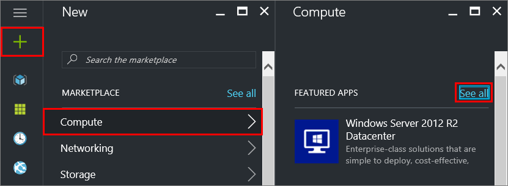

---
# required metadata

title: Provision a Linux VM in Azure for SQL Server - SQL Server vNext CTP1 | Microsoft Docs
description: 
author: rothja 
ms.author: jroth 
manager: jhubbard
ms.date: 11/16/2016
ms.topic: article
ms.prod: sql-linux
ms.technology: database-engine
ms.assetid: 222e23b2-51e7-429b-b8e5-61e0ebe7df9b

# optional metadata

# keywords: ""
# ROBOTS: ""
# audience: ""
# ms.devlang: ""
# ms.reviewer: ""
# ms.suite: ""
# ms.tgt_pltfrm: ""
# ms.custom: ""
---
# Provision a Linux VM in Azure for SQL Server
Azure provides Linux virtual machine images that have SQL Server vNext CTP1 installed. This topic provides a short walkthrough on how to use the SQL Server virtual machine image for Red Hat Enterprise Linux. 

## Create a Red Hat Enterprise Linux VM with SQL Server installed

Open the [Azure portal](https://portal.azure.com/).

1. Click **New** on the left.

2. In the **New** blade, click **Compute**

3. Click **See All** next to the **Featured Apps** heading.

   

4. In the search box, type **SQL Server vNext on Red Hat Enterprise Linux 7.2**, and press **Enter** to start the search.

5. Select the **SQL Server vNext on Red Hat Enterprise Linux 7.2** image.

5. Click **Create**.

6. On the **Basics** blade, fill in the details for your Linux VM. 

    

    > [!Note] You have the choice of using an SSH public key or a Password for authentication. SSH is more secure. For instructions on how to generate an SSH key, see [Create SSH keys on Linux and Mac for Linux VMs in Azure](https://docs.microsoft.com/azure/virtual-machines/virtual-machines-linux-mac-create-ssh-keys). 

7. Click **OK**.

8. On the **Size** blade, choose a machine size. To see more sizes, select **View all**.

9. Click **Select**.

10. On the **Settings** blade, you can make changes to the settings or keep the default settings.

11. Click **OK**.

12. On the **Summary** page, click **OK** to create the VM.

## <a id="connect"></a> Connect to the Linux VM

If you already use a BASH shell, connect to the Azure VM using the **ssh** command. In the following command, replace the VM user name and IP address to connect to your Linux VM.  

```bash
ssh -l AzureAdmin 100.55.555.555
```
You can find the IP address of your VM in the Azure portal. 


If you are running on Windows and do not have a BASH shell, you can install an SSH client, such as PuTTY.

1. [Download and install PuTTY](http://www.chiark.greenend.org.uk/~sgtatham/putty/download.html).

2. Run PuTTY.

3. On the PuTTY configuration screen enter your VM's public IP address.

4. Click Open and enter your username and password at the prompts.

For more information about connecting to Linux VMs, see [Create a Linux VM on Azure using the Portal](https://docs.microsoft.com/azure/virtual-machines/virtual-machines-linux-quick-create-portal#ssh-to-the-vm).

## Configure SQL Server

1. After connecting to your Linux VM, open a new command terminal.

2. Navigate to the SQL Server directory

   ```bash
   cd /opt/mssql/bin
   ```
   
3. Setup SQL Server

   ```bash
   sudo ./sqlservr-setup 
   ```
   
   Accept the License and enter a password for the system administrator account. You can start the server when prompted.

4. Optionally, [install the SQL Server Tools](sql-server-linux-setup-tools.md#RHEL).

## Configure for remote connections
If you want to be able to connect to this SQL Server remotely, you have to configure an inbound rule on the Network Security Group for the port that your SQL Server instance is listening. By default, this is TCP port 1433.

1. In the portal, select **Virtual machines**, and then select your SQL Server VM.

2. In the list of properties, select **Network interfaces**.

3. Then select the Network Interface for your VM.

    

4. Click the Network security group link.

    

5. In the properties of the Network Security Group, selct **Inbound security rules**.

6. Click the **+Add** button.

7. Provide a Name of "SQLServerRemoteConnections".

8. In the **Service** list, select **MS SQL**.

    

11. Click **OK** to save the rule for your VM.

## Next steps
Now that you have a SQL Server vNext virtual machine in Azure, you can [connect locally and run a test query](sql-server-linux-connect-and-query-sqlcmd.md).

If you configured the Azure VM for remote SQL Server connections, you should also be able to connect remotely. For an example of connecting to SQL Server on Linux from a remote Windows machine, see [Use SSMS on Windows to connect to SQL Server on Linux](sql-server-linux-develop-use-ssms.md).

For more general information about Linux virtual machines in Azure, see the [Linux Virtual Machine Documentation](https://docs.microsoft.com/en-us/azure/virtual-machines/linux/).
