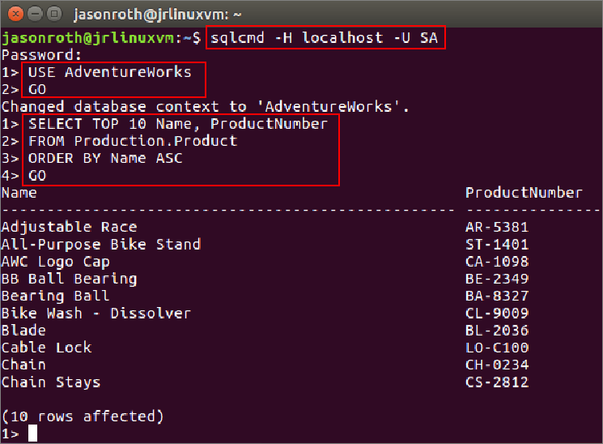

---
# required metadata

title: Use the sqlcmd command-line utility on Linux - SQL Server vNext CTP1 | Microsoft Docs
description: This tutorial shows how to run sqlcmd on Linux to run Transact-SQL queries.
author: rothja 
ms.author: jroth 
manager: jhubbard
ms.date: 11/15/2016
ms.topic: article
ms.prod: sql-linux
ms.technology: database-engine
ms.assetid: 9e6c1ae1-59a4-4589-b839-18d6a52f2676

# optional metadata

# keywords: ""
# ROBOTS: ""
# audience: ""
# ms.devlang: ""
# ms.reviewer: ""
# ms.suite: ""
# ms.tgt_pltfrm: ""
# ms.custom: ""

---
# Connect and query SQL Server on Linux with sqlcmd

This topic shows how to use [sqlcmd](https://msdn.microsoft.com/library/ms162773.aspx) to connect to SQL Server vNext CTP1 on Linux. 

After successfully connecting, you run a simple Transact-SQL (T-SQL) query to verify communication with the database.

> [!TIP]
> **Sqlcmd** is just one tool for connecting to SQL Server to run queries and perform management and development tasks. For other tools such as SQL Server Management Studio and Visual Studio Code, see the [Develop](sql-server-linux-develop-overview.md) and [Manage](sql-server-linux-management-overview.md) areas. 

## Install the SQL Server command-line tools

**Sqlcmd** is part of the SQL Server command-line tools, which are not installed automatically with SQL Server on Linux. If you have not already installed the SQL Server command-line tools on your Linux machine, you must install them. For more information on how to install the tools, select your Linux distribution from the following list:

- [Red Hat Enterprise Linux](sql-server-linux-setup-red-hat.md#tools)
- [Ubuntu](sql-server-linux-setup-ubuntu.md#tools)

## Connect to SQL Server on Linux

The following steps show how to connect to SQL Server vNext on Linux with sqlcmd.

1. On your Linux box, open a command terminal.

2. Run **sqlcmd** with parameters for your SQL Server instance name (-H), the user name (-U), and the password (-P). 

   The following command connects to the local SQL Server instance (**localhost**) on Linux.

    ```bash
    sqlcmd -H localhost -U SA -P password
    ```

    > [!TIP]
    > You can omit the password on the command-line to be prompted to enter it manually.

    If you were connecting to a remote instance, specify the machine name or IP address for the **-H** parameter. 

    ```bash
    sqlcmd -H 192.555.5.555 -U SA -P password
    ```

    > [!TIP]
    > If you get a connection failure, first attempt to diagnose the problem from the error message. Then review the [connection troubleshooting recommendations](sql-server-linux-connect-and-query.md#troubleshoot).

## Run sample queries

After you connect to your server, you can connect to a database and run a sample query. If you are new to writing queries, see [Writing Transact-SQL Statements](https://msdn.microsoft.com/library/ms365303.aspx).

1. Identify a database to use to run a query against. This could be a new database you created in the [Transact-SQL tutorial](https://msdn.microsoft.com/library/ms365303.aspx). Or it could be the **AdventureWorks** sample database that you [downloaded and restored](sql-server-linux-migrate-restore-database.md).

2. At the sqlcmd prompt, change the context to your target database. The following Transact-SQL statement changes the context to the **AdventureWorks** database.

    ```sql
    USE AdventureWorks
    ```

3. On a new line type `GO`, and press enter.

    ```sql
    GO
    ```

2. Next, write a Transact-SQL query to select data from one of the tables. You can press enter between lines of your query. The following example selects data from the **Production.Product** table of the **AdventureWorks** database.
    
    ```sql
    SELECT TOP 10 Name, ProductNumber
    FROM Production.Product
    ORDER BY Name ASC
    ```

3. Then type `GO` and press enter.


4. The results output to the command window.

    

5. Type `exit` and press enter to quit sqlcmd. 

## Run a Transact-SQL Script

You can also use sqlcmd to run Transact-SQL script files. Use the following steps to run a script.

1. In a Linux command terminal, use `vi` to create a new script file named sqlscript.sql.

    ```bash
    vi sqlscript.sql
    ```

2. In the `vi` editor, press `i` to enter INSERT mode.

    ```bash
    i
    ```

3. Enter the same Transact-SQL commands from the previous example.

    ```sql 
    USE AdventureWorks
    GO
    
    SELECT TOP 10 Name, ProductNumber
    FROM Production.Product
    ORDER BY Name ASC
    ```sql

4. Press the **Escape** key to exit INSERT mode.

5. Press **:x** to save and exit **vi**.

    ```bash
    :x
    ```

6. At the prompt, run sqlcmd with the sqlscript.sql file as an input file.

    ```bash
    sqlcmd -H localhost -U SA -P password -i sqlscript.sql
    ```
    
7. You should see 10 rows returned in the output window. Instead of staying at the sqlcmd prompt, you return immediately to the terminal prompt.

> [!NOTE]
> You can also send the output to a file with the **-o** parameter.
>
> ```bash
> sqlcmd -H localhost -U SA -P password -i sqlscript.sql -o output.txt
> ```

# Next Steps

In addition to queries, you can use T-SQL statements to create and manage databases. For more information on how to use sqlcmd.exe, see [sqlcmd Utility](https://msdn.microsoft.com/library/ms162773.aspx).

If you're new to T-SQL, see [Tutorial: Writing Transact-SQL Statements](https://msdn.microsoft.com/library/ms365303.aspx) and the [Transact-SQL Reference (Database Engine)](https://msdn.microsoft.com/library/bb510741.aspx).

For other ways to connect to SQL Server on Linux, see the [Develop](sql-server-linux-develop-overview.md) and [Manage](sql-server-linux-management-overview.md) areas. 


