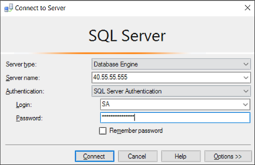

---
# required metadata

title: Connect and query SQL Server on Linux (SSMS) | SQL Server vNext CTP1
description: 
author: rothja 
ms.author: jroth 
manager: jhubbard
ms.date: 10-28-2016
ms.topic: article
ms.prod: sql-non-specified
ms.service: 
ms.technology: 
ms.assetid: 

# optional metadata

# keywords: ""
# ROBOTS: ""
# audience: ""
# ms.devlang: ""
# ms.reviewer: ""
# ms.suite: ""
# ms.tgt_pltfrm: ""
# ms.custom: ""

---
# Connect and query SQL Server on Linux (SSMS)
This topic is a walkthrough for using SQL Server Management Studio (SSMS) to connect and query SQL Server vNext CTP1 on Linux.

This article shows how to connect to an Azure SQL database using SQL Server Management Studio (SSMS). After successfully connecting, we run a simple Transact-SQL (T-SQL) query to verify communication with the database.

## Install the newest version of SQL Server Management Studio

When working with SQL Database, you should always use the most recent version of SQL Server Management Studio (SSMS). The latest version of SSMS is continually updated and optimized to work with Azure and SQL Database. The latest version of SSMS works for all supported versions of SQL Server. To download and install the latest version, see [Download SQL Server Management Studio](https://msdn.microsoft.com/library/mt238290.aspx). To stay up-to-date, the latest version of SSMS prompts you when there is a new version available to download. 

After installing, type **Microsoft SQL Server Management Studio** in the Windows search box and run the app:

## Connect to SQL Server on Linux

The following steps show how to connect to an Azure SQL server and database with SSMS.

1. Start SSMS by typing **Microsoft SQL Server Management Studio** in the Windows search box, and then click the desktop app.

2. In the **Connect to Server** window, enter the following information (if SSMS is already running, click **Connect > Database Engine** to open the **Connect to Server** window):

    - **Server type**: The default is database engine; do not change this value.
    - **Server name**: Enter the name of your SQL Server machine, the IP address, or **localhost** if you are connecting locally.
    - **Authentication type**: For SQL Server vNext CTP1 on Linux, use **SQL Server Authentication**.
    - **User name**: Enter the name of a user with access to a database on the server (for example, the default **SA** account created during setup). 
    - **Password**: Enter the password for the specified user (for the **SA** account, you created this during setup).
   
        

3. Click **Connect**.

    > [!TIP]
    > If you get a connection failure, note the error message and review the [connection troubleshooting recommendations](sql-server-linux-connect-and-query.md#troubleshoot).
 
5. After successfully connecting to your Azure SQL database, **Object Explorer** opens and you can now access your database to perform administrative tasks or query data.
 
     
     
## Run sample queries

After you connect to your server, you can connect to a database and run a sample query. If you are new to writing queries, see [Writing Transact-SQL Statements](https://msdn.microsoft.com/library/ms365303.aspx).

1. In **Object Explorer**, navigate to a database on the server, such as the **AdventureWorks** sample database.
2. Right-click the database and then select **New Query**:

	

3. In the query window, copy and paste the following:

		SELECT
		CustomerId
		,Title
		,FirstName
		,LastName
		,CompanyName
		FROM SalesLT.Customer;

4. Click the **Execute** button:

	

## Next steps

You can use T-SQL statements to create and manage databases in Azure in much the same way you can with SQL Server.

If you're new to T-SQL, see [Tutorial: Writing Transact-SQL Statements](https://msdn.microsoft.com/library/ms365303.aspx) and the [Transact-SQL Reference (Database Engine)](https://msdn.microsoft.com/library/bb510741.aspx).

For more information on how to use SSMS, see [Use SQL Server Management Studio](https://msdn.microsoft.com/library/ms174173.aspx).
