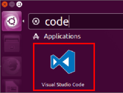
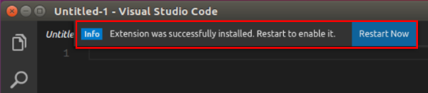
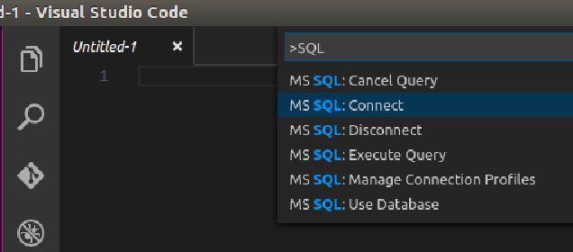
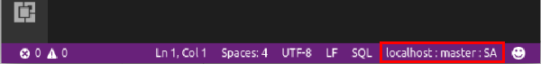
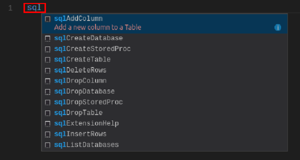
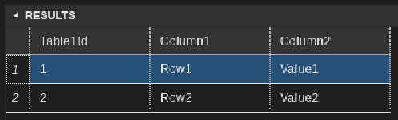

---
# required metadata

title: Use the multi-platform VS Code tool for SQL Server on Linux | SQL Server vNext CTP1
description: 
author: erickangMSFT
ms.author: jroth 
manager: jhubbard
ms.date: 11-09-2016
ms.topic: article
ms.prod: sql-linux
ms.service: 
ms.technology: 
ms.assetid: 

# optional metadata

# keywords: ""
# ROBOTS: ""
# audience: ""
# ms.devlang: ""
# ms.reviewer: ""
# ms.suite: ""
# ms.tgt_pltfrm: ""
# ms.custom: ""

---
# Use the multi-platform VS Code tool for SQL Server on Linux

This topic shows how to use Visual Studio Code (VS Code) tool to connect and query SQL Server vNext CTP1 on Linux.

VS Code is a cross-platform graphical code editor that supports extensions. The SQL Tools extension (vscode-mssql) for VS Code enables you to connect and query SQL Server using Transact-SQL.

## Install Visual Studio Code
If you have not already installed Visual Studio Code, [Download and install VS Code](https://code.visualstudio.com/Download) on your Linux machine.

## Install the SQL Tools extension
The following steps explain how to install the SQL Tools extension (vscode-mssql). 

> [!IMPORTANT] 
> This section contains internal dogfood instructions for now and will be modified for customers later. It will either be a link to other installation instructions or a brief summary of the steps required.

1. Download and save the VSIX file for the SQL Tools extension from [\\\\dtnuget\\download\\vscode-mssql\\latest](file://dtnuget/download/vscode-mssql/latest). Choose the file that matches your target platform.

2. Start VS Code.

   

3. On the **File** menu, click **Open**.

4. Open the previously saved VSIX file.

5. The **vscode-mssql** extension takes up to one minute to install. Wait for the prompt that tells you it installed successfully.

    

6. Restart VS Code to use the **vscode-mssql** extension.

## Change your language to SQL
Before you can connect to your SQL Server instance, you must change the Language Mode to **SQL**. This happens automatically if you open a file with a **.sql** extension. The following steps show you how to change to the **SQL** editor for any file.

1. In VS Code, select the **File** menu, and then select **New File**.

2. Click the Language Mode selector at the bottom of the editor window. It should say **Plain Text** for a new file.

3. Type **SQL** in the Language Mode selector, and then select **SQL**.

    

## Connect to SQL Server

The following steps show how to connect to SQL Server vNext on Linux with VS Code.

1. In VS Code, press **CTRL+Shift+P** (or F1) to open the Command Palette.

2. Type 'SQL' to display the vscode-mssql commands.

    

3. Select the **MS SQL:Connect** command.

4. Select **Create Connection Profile**. This creates a connection profile for your SQL Server instance that you can select in the future from the **MS SQL:Connect** command.

5. Follow the prompts to enter a sequence of values for the new connection profile. After specifying each value, press **Enter** to continue. 

    The following table describes the Connection Profile properties.

   | Setting | Description |
   |-----|-----|
   | **hostname\instance** | The SQL Server instance name. For this tutorial, use **localhost** to connect to the local SQL Server instance on your Linux machine. If connecting to a remote SQL Server, enter the name of the target SQL Server machine or its IP address. |
   | **[Optional] Database to connect** | The database that you want to use. For purposes of this tutorial, don't specify a database and press **Enter** to continue. |
   | **User name** | Enter the name of a user with access to a database on the server. For this tutorial, use the default **SA** account created during setup. |
   | **Password (SQL Login)** | Enter the password for the specified user. | 
   | **Save Password?** | Type **Yes** to save the password. Otherwise, type **No** to be prompted for the password each time the Connection Profile is used. |
   | **[Optional] Enter a name for this profile** | The Connection Profile name. For example, you could name the profile **localhost profile**.  

6. Close the info message that informs you that the profile is created and connected.

    > [!TIP]
    > If you get a connection failure, first attempt to diagnose the problem from the error message. Then review the [connection troubleshooting recommendations](sql-server-linux-connect-and-query.md#troubleshoot).

7. Verify your connection in the status bar. 

    

## Create a database

1. In the editor, type **sql** to bring up a list of editable code snippets. 

   .

2. Select **sqlCreateDatabase**.

3. In the snippet, type **TutorialDB** for the database name.

4. Press CTRL+Shift+E to execute the Transact-SQL commands. View the results in the query window.

    > [!TIP]
    > You can also highlight specific lines in the editor and execute them with CTRL+Shift+E. 

## Create a table

1. Remove the contents of the editor window.

2. Press CTRL+Shift+P to display the Command Palette.

3. Type **SQL** in the Command Palette to display the SQL commands. 

4. Click **MS SQL:Use Database**, and select the **TutorialDB** database. This changes the context to the new database created in the previous section.

3. In the editor, type **sql** to display the snippets, and then select **sqlCreateTable**.

4. Type **Table1** for the table name.

5. Press **Tab**, and then type **dbo** for the schema name.

    > [!NOTE]
    > After adding the snippet, you must type the table and schema names without changing focus away from the VS Code editor.

6. Keep the sample table schema, and press CTRL+Shift+E to create the table. 

## Insert and query

1. Add the following commands to insert two rows and then select all the rows from the **Table1** table.

        INSERT INTO dbo.Table1
        ( [Table1Id], [Column1], [Column2] )
        VALUES
        ( 1, N'Row1', N'Value1' ),
        ( 2, N'Row2', N'Value2' )
        GO
        SELECT * FROM Table1
        GO

2. Press CTRL+Shift+E to execute the commands. The two inserted rows display in the Results window. 

    

## Next steps

In a real-world scenario, you might create a script that you need to save and run later (either for administration or as part of a larger development project). In this case, you can save the script with a **.sql** extension.

If you're new to T-SQL, see [Tutorial: Writing Transact-SQL Statements](https://msdn.microsoft.com/library/ms365303.aspx) and the [Transact-SQL Reference (Database Engine)](https://msdn.microsoft.com/library/bb510741.aspx).

For more information on using VS Code, see the [Visual Studio Code documentation](https://code.visualstudio.com/docs).
