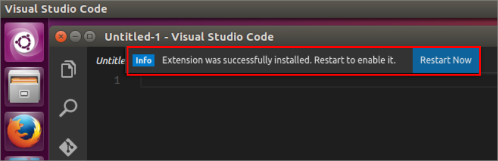

---
# required metadata

title: Connect and query SQL Server on Linux (VS Code) | SQL Server vNext CTP1
description: 
author: rothja 
ms.author: jroth 
manager: jhubbard
ms.date: 10-18-2016
ms.topic: article
ms.prod: sql-non-specified
ms.service: 
ms.technology: 
ms.assetid: 

# optional metadata

# keywords: ""
# ROBOTS: ""
# audience: ""
# ms.devlang: ""
# ms.reviewer: ""
# ms.suite: ""
# ms.tgt_pltfrm: ""
# ms.custom: ""

---
# Connect and query SQL Server on Linux (VS Code)

This topic shows how to use Visual Studio Code (VS Code) tool to connect and query SQL server running on Linux.

VS Code is a cross-platform graphical code editor that supports extensions. This tutorial uses the SQL Tools extension for VS Code.

## Install VS Code

> [!NOTE] 
> This section contains internal dogfood instructions for now and will be modified for customers later. It will either be a link to other installation instructions or a brief summary of the steps required.

1. [Download and install Visual Studio Code](https://code.visualstudio.com/Download) on your target platform.
2. Download and save the VSIX file for the SQL Tools extension. The following platforms are supported at this time.

| Platform | VSIX file |
|-----|-----|
| Windows 7+ | [\\\\dtnuget\\download\\vscode-mssql\\0.0.3\\vscode-mssql-windows-0.0.3.vsix](file://dtnuget/download/vscode-mssql/0.0.3/vscode-mssql-windows-0.0.3.vsix) |
| Mac OS X | [\\\\dtnuget\\download\\vscode-mssql\\0.0.3\\vscode-mssql-mac-0.0.3.vsix](file://dtnuget/download/vscode-mssql/0.0.3/vscode-mssql-mac-0.0.3.vsix) |
| Ubuntu 16 | [\\\\dtnuget\\download\\vscode-mssql\\0.0.3\\vscode-mssql-ubuntu16-0.0.3.vsix](file://dtnuget/download/vscode-mssql/0.0.3/vscode-mssql-ubuntu16-0.0.3.vsix) |

3.	Start VS Code.

   

4. On the File menu, click Open.
5. Open the previously saved VSIX file.
6. The **vscode-mssql** extension takes up to one minute to install. Wait for the prompt that tells you it installed successfully.

    

7. Restart VS Code to use the **vscode-mssql** extension.

## Open a Transact-SQL editor

1. TBD

## Connect to a database

1. TBD

## Create a connection profile

1. TBD

## Execute a query

1. TBD

## Next steps

TBD
