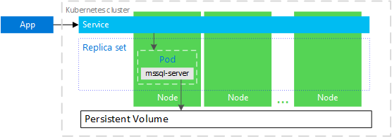

# High availability for SQL Server containers

Create and manage your SQL Server instances natively in Kubernetes.

Deploy SQL Server to docker containers managed by [Kubernetes](https://kubernetes.io/). In Kubernetes, a container with a SQL Server instance can automatically recover in case a cluster node fails. For more robust availability, configure SQL Server Always On availability group with SQL Server instances in containers on a Kubernetes cluster. This article compares the two solutions.

## Compare SQL Server versions on Kubernetes

SQL Server 2017 provides a Docker image that can deploy on Kubernetes. You can configure the image with a Kubernetes persistent volume claim (PVC). Kubernetes monitors the SQL Server process in the container. If the process, pod, container, or node fail, Kubernetes automatically bootstraps another instance and reconnects to the storage.

SQL Server 2019 (preview) introduces a more robust architecture with a Kubernetes StatefulSet. Kubernetes orchestrates instances of SQL Server in container images that participate in a SQL Server Always On Availability Group. This pattern provides improved health monitoring, faster recovery, offload backup, and read scale out.  

## Container with SQL Server instance on Kubernetes

Kubernetes 1.6 and later has support for [*storage classes*](https://kubernetes.io/docs/concepts/storage/storage-classes/), [*persistent volume claims*](https://kubernetes.io/docs/concepts/storage/storage-classes/#persistentvolumeclaims), and the [*Azure disk volume type*](https://github.com/kubernetes/examples/tree/master/staging/volumes/azure_disk). 

In this configuration, Kubernetes plays the role of the container orchestrator. 

In the preceding diagram, `mssql-server` is a SQL Server instance (container) in a [*pod*](https://kubernetes.io/docs/concepts/workloads/pods/pod/). A [replica set](https://kubernetes.io/docs/concepts/workloads/controllers/replicaset/) ensures that the pod is automatically recovered after a node failure. Applications connect to the service. In this case, the service represents a load balancer that hosts an IP address that stays the same after failure of the `mssql-server`.

Kubernetes orchestrates the resources in the cluster. When a node hosting a SQL Server instance container fails, it bootstraps a new container with a SQL Server instance and attaches it to the same persistent storage.

SQL Server 2017 and later support containers on Kubernetes.

To create a container in Kubernetes, see [Deploy a SQL Server container in Kubernetes](tutorial-sql-server-containers-kubernetes.md)

## A SQL Server Always On availability group on SQL Server containers in Kubernetes

SQL Server 2019 supports availability groups on containers in a Kubernetes. For availability groups, deploy the SQL Server [Kubernetes operator](https://coreos.com/blog/introducing-operators.html) to your Kubernetes cluster. The operator helps package, deploy, and manage SQL Server instances and the availability group in a cluster.

In the image above, a four-node kubernetes cluster hosts an availability group with three replicas. The solution includes the following components:

* A Kubernetes [*deployment*](https://kubernetes.io/docs/concepts/workloads/controllers/deployment/). The deployment includes the operator and a configuration map. The deployment describes the container image, software, and instructions required to deploy SQL Server instances for the availability group.

* Three nodes, each hosting a [*StatefulSet*](https://kubernetes.io/docs/concepts/workloads/controllers/statefulset/). The StatefulSet contains a pod. Each pod contains:
  * A SQL Server container running one instance of SQL Server.
  * A supervisor `mcr.microsoft.com/mssql/ha` to manage the availability group.

* Two [*ConfigMaps*](https://kubernetes.io/docs/tasks/configure-pod-container/configure-pod-configmap/) related to the availability group. The ConfigMaps provide information about:
  * The deployment for the operator.
  * The availability group.

 * Persistent volumes for each instance of SQL Server provide the storage for the data and log files.

In addition, the cluster stores [*secrets*](https://kubernetes.io/docs/concepts/configuration/secret/) for the passwords, certificates, keys, and other sensitive information.

## Compare SQL Server high availability on containers with and without the availability group

The following table compares the SQL Server high availability capability in containers on Kubernetes with, and without an availability group:

| |With an availability group | Standalone container instance  No availability group
|:------|:------|:------
|Automatically recover from node failure | Yes | Yes
|Automatically recover from pod failure | Yes | Yes
|Faster failover |Yes |
|Automatically recover from SQL Server instance failure | Yes | 
|Automatically recover from database health check failure | Yes | 
|Provide read-only replicas | Yes |
|Secondary replica backup | Yes | 
|Runs as a StatefulSet | Yes | 

One key difference is that the recovery (or failover) time is faster with an availability group than with a single instance of SQL Server in a container. This improvement is because the SQL Server availability group keeps secondary replicas on other nodes in the cluster. On failover, a secondary replica is selected and promoted to primary. Applications connected to the service are redirected to the new primary replica.

Without the availability group, when Kubernetes detects a failover, it needs to create the container, connect it to the storage, and then applications connected to the service are reconnected. The exact failover time depends on where the failover was, and how it was detected. 

Generally, the failover time for an availability group is measured in seconds, while the failover time for single instance to recover a container may be up to 10 minutes.

## Next steps

To deploy SQL Server containers in Azure Kubernetes Service (AKS), see these examples:

* [Deploy SQL Server in Docker container](sql-server-linux-configure-docker.md)
* [Deploy a SQL Server container in Kubernetes](tutorial-sql-server-containers-kubernetes.md)
* [Always On availability groups for SQL Server containers](sql-server-ag-kubernetes.md)

