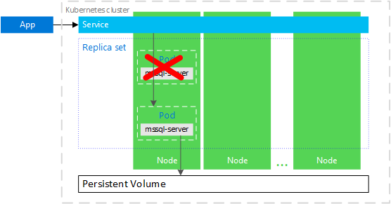
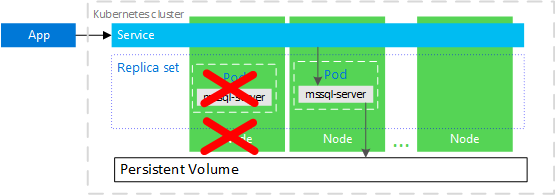

# SQL Server container high availabilty 

SQL Server workoads on containers can provide high availability with container orchestration through [Kubernetes](http://kubernetes.io/).

Two deployment patterns on Kubernetes can provide high availability for SQL Server.

* [A SQL Server container with peristent storage](tutorial-sql-server-containers-kubernetes.md).

* [A SQL Server Always On availability group hosted on SQL Server containers in Kubernetes](tutorial-sql-server-ag-kubernetes.md).

## SQL Server contianer with persistent storage

Kubernetes 1.6 and later has support for [storage classes](http://kubernetes.io/docs/concepts/storage/storage-classes/), [persistent volume claims](http://kubernetes.io/docs/concepts/storage/storage-classes/#persistentvolumeclaims), and the [Azure disk volume type](https://github.com/kubernetes/examples/tree/master/staging/volumes/azure_disk). You can create and manage your SQL Server instances natively in Kubernetes. The example in this article shows how to create a [deployment](https://kubernetes.io/docs/concepts/workloads/controllers/deployment/) to achieve a high availability configuration similar to a shared disk failover cluster instance. In this configuration, Kubernetes plays the role of the cluster orchestrator. When a SQL Server instance in a container fails, the orchestrator bootstraps another instance of the container that attaches to the same persistent storage.

In the preceding diagram, `mssql-server` is a container in a [pod](http://kubernetes.io/docs/concepts/workloads/pods/pod/). Kubernetes orchestrates the resources in the cluster. A [replica set](http://kubernetes.io/docs/concepts/workloads/controllers/replicaset/) ensures that the pod is automatically recovered after a node failure. Applications connect to the service. In this case, the service represents a load balancer that hosts an IP address that stays the same after failure of the `mssql-server`.

In the following diagram, the `mssql-server` container has failed. As the orchestrator, Kubernetes guarantees the correct count of healthy instances in the replica set, and starts a new container according to the configuration. The orchestrator starts a new pod on the same node, and `mssql-server` reconnects to the same persistent storage. The service connects to the re-created `mssql-server`.

In the following diagram, the node hosting the `mssql-server` container has failed. The orchestrator starts the new pod on a different node, and `mssql-server` reconnects to the same persistent storage. The service connects to the re-created `mssql-server`.

## Containerized SQL Server availability group

SQL Server vNext supports availability groups on containers in a Kubernetes. For availability groups, deploy the SQL Server [Kubernetes operator](http://coreos.com/blog/introducing-operators.html) to your Kubernetes cluster. The operator helps package, deploy, and manage the availability group in a cluster.

>[AG in Kubernetes Container](media/tutorial-sql-server-ag-containers-kubernetes/KubernetesCluster.png)

In the image above, a four-node kubernetes cluster host an availability group with three replicas. One node contains a Kubernetes [deployment](http://kubernetes.io/docs/concepts/workloads/controllers/deployment/). The deployment describes the desired state for the SQL Server container on each cluster node. The description includes settings for the SQL Server container, the availability group agent, and the the health agent. These three items exist in a Kubernetes [pod](http://kubernetes.io/docs/concepts/workloads/pods/pod-overview/). The pod belongs to a Kubernetes [StatefulSet](http://kubernetes.io/docs/concepts/workloads/controllers/statefulset/). Each StatefulSet is configured on one node.

### SQL Server Kubernetes operator

After you deploy the operator it registers a custom SQL Server resource. Use the operator to deploy this resource.  Each resource corresponds to an instance of SQL Server and includes specific properties like `sapassword` and `monitoring policy`. The operator parses the resource and deploys a Kubernetes StatefulSet.

The StatfulSet contains:

* mssql-server container

* health monitor agent conainer

* AG Agent container to each pod

The StatefulSet includes the following Kubernetes components:

* `mssql-server-k8s-agents` image contains following binaries:

  * `mssql-server-k8s-operator`

    This process is deployed as a separate Kubernetes deployment. It registers the custom Kubernetes [custom resource](http://kubernetes.io/docs/concepts/extend-kubernetes/api-extension/custom-resources/) called `SqlServer` (sqlservers.mssql.microsoft.com). Then it listens for such resources being created or updated in the Kubernetes cluster. For every such event, it creates or updates the Kubernetes resources for the corresponding instance (i.e. StatefulSet, mssql-server-k8s-init-sql job).

  * `mssql-server-k8s-sqlhealth-agent`

    This web server serves Kubernetes [liveness probes](http://kubernetes.io/docs/tasks/configure-pod-container/configure-liveness-readiness-probes/) to determine the health of a SQL Server instance. Monitors the health of the local SQL Server instance by calling `sp_server_diagnostics` and comparing the results with your monitor policy.

  * `mssql-server-k8s-ag-agent-supervisor`
  
    This process spawns `mssql-server-k8s-ag-agent` processes as child processes and terminates them as necessary, based on which AGs the local SQL Server instance is meant to be part of.

  * `mssql-server-k8s-ag-agent`
  
    This process monitors the health of an AG replica on a single SQL Server instance and performs failovers.

  * `mssql-server-k8s-init-sql`
  
    This Kubernetes [job](http://kubernetes.io/docs/concepts/workloads/controllers/jobs-run-to-completion/) applies a desired state configuration to a SQL Server instance. The job is created by the operator every time a SqlServer resource is created or updated. It ensures that the target SQL Server instance corresponding to the custom resource has the desired configuration described in the resource. 

    For example if any of the following settings are required, it completes them:
      * Update the SA password
      * Creates the SQL login for the agents
      * Creates the DBM endpoint 
       
  * `mssql-server-k8s-rotate-creds`
  
    This Kubernetes job implements the rotate credentials task. Create this job to request updates to the SA password, agent SQL login password, DBM cert, etc. The SA password is specified as the job parameters. The others are auto-generated.

   *`mssql-server-k8s-failover`
   
   A Kubernetes job that implements the manual failover workflow

### Notes

To deploy an AG in Kubernetes, define a SqlServer resource with the names of one or more AGs that the instance should be a part of.

Regardless of the AG configuration, The operator will always deploy the health monitoring container as well as the AG health container. If the SqlServer resource does not list any AG, the operator will still deploy these containers.

The version for the operator image is identical to the version for the SQL Server image `https://coreos.com/blog/introducing-operators.html 