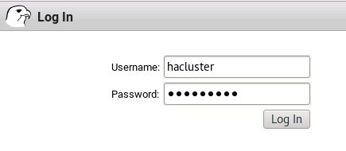

# Deploy a Pacemaker cluster for SQL Server on Linux

[!INCLUDE[appliesto-ss-xxxx-xxxx-xxx-md-linuxonly](../includes/appliesto-ss-xxxx-xxxx-xxx-md-linuxonly.md)]

This tutorial documents the tasks required to deploy a Linux Pacemaker cluster for a [!INCLUDE[ssnoversion-md](../includes/ssnoversion-md.md)] Always On availability group (AG) or failover cluster instance (FCI). Unlike the tightly coupled Windows Server/ [!INCLUDE[ssnoversion-md](../includes/ssnoversion-md.md)] stack, Pacemaker cluster creation as well as availability group (AG) configuration on Linux can be done before or after installation of [!INCLUDE[ssnoversion-md](../includes/ssnoversion-md.md)]. The integration and configuration of resources for the Pacemaker portion of an AG or FCI deployment is done after the cluster is configured.
> [!IMPORTANT]
> An AG with a cluster type of None does *not* require a Pacemaker cluster, nor can it be managed by Pacemaker. 

> [!div class="checklist"]
> * Install the high availability add-on and install Pacemaker.
> * Prepare the nodes for Pacemaker (RHEL and Ubuntu only).
> * Create the Pacemaker cluster.
> * Install the SQL Server HA and SQL Server Agent packages.
 
## Prerequisite
[Install SQL Server 2017](sql-server-linux-setup.md).

## Install the high availability add-on
Use the following syntax to install the packages that make up the high availability (HA) add-on for each distribution of Linux. 

**Red Hat Enterprise Linux (RHEL)**
1.  Register the server using the following syntax. You are prompted for a valid username and password.
    
    ```bash
    sudo subscription-manager register
    ```
    
2.  List the available pools for registration.
    
    ```bash
    sudo subscription-manager list --available
    ```

3.  Run the following command to associate RHEL high availability with the subscription
    
    ```bash
    sudo subscription-manager attach --pool=<PoolID>
    ```
    
    where *PoolId* is the pool ID for the high availability subscription from the previous step.
    
4.  Enable the repository to be able to use the high availability add-on.
    
    ```bash
    sudo subscription-manager repos --enable=rhel-ha-for-rhel-7-server-rpms
    ```
    
5.  Install Pacemaker.
    
    ```bash
    sudo yum install pacemaker pcs fence-agents-all resource-agents
    ```

**Ubuntu**

```bash
sudo apt-get install pacemaker pcs fence-agents resource-agents
```

**SUSE Linux Enterprise Server (SLES)**

Install the High Availability pattern in YaST or do it as part of the main installation of the server. The installation can be done with an ISO/DVD as a source or by getting it online.
> [!NOTE]
> On SLES, the HA add-on gets initialized when the cluster is created.

## Prepare the nodes for Pacemaker (RHEL and Ubuntu only)
Pacemaker itself uses a user created on the distribution named *hacluster*. The user gets created when the HA add-on is installed on RHEL and Ubuntu.
1. On each server that will serve as a node of the Pacemaker cluster, create the password for a user to be used by the cluster. The name used in the examples is *hacluster*, but any name can be used. The name and password must be the same on all nodes participating in the Pacemaker cluster.
   
    ```bash
    sudo passwd hacluster
    ```
    
2. On each node that will be part of the Pacemaker cluster, enable and start the `pcsd` service with the following commands (RHEL and Ubuntu):

   ```bash
   sudo systemctl enable pcsd
   sudo systemctl start pcsd
   ```
   
   Then execute
   
   ```bash
   sudo systemctl status pcsd
   ```
   
   to ensure that `pcsd` is started.
3. Enable the Pacemaker service on each possible node of the Pacemaker cluster.
   
   ```bash
   sudo systemctl start pacemaker
   ```

   On Ubuntu, you see an error:
   
   *pacemaker Default-Start contains no runlevels, aborting.*
   
   This error is a known issue. Despite the error, enabling the Pacemaker service is successful, and this bug will be fixed at some point in the future.
   
4. Next, create and start the Pacemaker cluster. There is one difference between RHEL and Ubuntu at this step. While on both distributions, installing `pcs` configures a default configuration file for the Pacemaker cluster, on RHEL, executing this command destroys any existing configuration and creates a new cluster.

<a id="create"></a>
## Create the Pacemaker cluster 
This section documents how to create and configure the cluster for each distribution of Linux.

**RHEL**

1. Authorize the nodes
   
   ```bash
   sudo pcs cluster auth <Node1 Node2 ... NodeN> -u hacluster
   ```
   
   where *NodeX* is the name of the node.
2. Create the cluster
   
   ```bash
   sudo pcs cluster setup --name <PMClusterName Nodelist> --start --all --enable
   ```
   
   where *PMClusterName* is the name assigned to the Pacemaker cluster and *Nodelist* is the list of names of the nodes separated by a space.

**Ubuntu**

Configuring Ubuntu is similar to RHEL. However, there is one major difference: installing the Pacemaker packages creates a base configuration for the cluster, and enables and starts `pcsd`. If you try to configure the Pacemaker cluster by following the RHEL instructions exactly, you get an error. To fix this problem, perform the following steps: 
1. Remove the default Pacemaker configuration from each node.
   
   ```bash
   sudo pcs cluster destroy
   ```
   
2. Follow the steps in the RHEL section for creating the Pacemaker cluster.

**SLES**

The process for creating a Pacemaker cluster is completely different on SLES than it is on RHEL and Ubuntu. The following steps document how to create a cluster with SLES.
1. Start the cluster configuration process by running 
   ```bash
   sudo ha-cluster-init
   ``` 
   
   on one of the nodes. You may be prompted that NTP is not configured and that no watchdog device is found. That is fine for getting things up and running. Watchdog is related to STONITH if you use SLES's built-in fencing that is storage-based. NTP and watchdog can be configured later.
   
2. You are prompted to configure Corosync. You are asked for the network address to bind to, as well as the multicast address and port. The network address is the subnet that you are using; for example, 192.191.190.0. You can accept the defaults at every prompt, or change if necessary.
   
3. Next, you are asked if you want to configure SBD, which is the disk-based fencing. This configuration can be done later if desired. If SBD is not configured, unlike on RHEL and Ubuntu, `stonith-enabled` will by default be set to false.
   
4. Finally, you are asked if you want to configure an IP address for administration. This IP address is optional, but functions similar to the IP address for a Windows Server failover cluster (WSFC) in the sense that it creates an IP address in the cluster to be used for connecting to it via HA Web Konsole (HAWK). This configuration, too, is optional.
   
5. Ensure that the cluster is up and running by issuing 
   ```bash
   sudo crm status
   ```
   
6. Change the *hacluster* password with 
   ```bash
   sudo passwd hacluster
   ```
   
7. If you configured an IP address for administration, you can test it in a browser, which also tests the password change for *hacluster*.
   
   
8. On another SLES server that will be a node of the cluster, run 
   ```bash
   sudo ha-cluster-join
   ```
   
9. When prompted, enter the name or IP address of the server that was configured as the first node of the cluster in the previous steps. The server is added as a node to the existing cluster.
   
10. Verify the node was added by issuing 
   ```bash
   sudo crm status
   ```
   
11. Change the *hacluster* password with 
   ```bash
   sudo passwd hacluster
   ```
   
12. Repeat Steps 8-11 for all other servers to be added to the cluster.

## Install the SQL Server HA and SQL Server Agent packages
Use the following commands to install the SQL Server HA package and [!INCLUDE[ssnoversion-md](../includes/ssnoversion-md.md)] Agent, if they are not installed already. Installing the HA package after installing [!INCLUDE[ssnoversion-md](../includes/ssnoversion-md.md)] requires a restart of [!INCLUDE[ssnoversion-md](../includes/ssnoversion-md.md)] for it to be used. These instructions assume that the repositories for the Microsoft packages have already been set up, since [!INCLUDE[ssnoversion-md](../includes/ssnoversion-md.md)] should be installed at this point.
> [!NOTE]
> - If you will not use [!INCLUDE[ssnoversion-md](../includes/ssnoversion-md.md)] Agent for log shipping or any other use, it does not have to be installed, so package *mssql-server-agent* can be skipped.
> - The other optional packages for [!INCLUDE[ssnoversion-md](../includes/ssnoversion-md.md)] on Linux, [!INCLUDE[ssnoversion-md](../includes/ssnoversion-md.md)] Full-Text Search (*mssql-server-fts*) and [!INCLUDE[ssnoversion-md](../includes/ssnoversion-md.md)] Integration Services (*mssql-server-is*), are not required for high availability, either for an FCI or an AG.

**RHEL**

```bash
sudo yum install mssql-server-ha mssql-server-agent
sudo systemctl restart mssql-server
```

**Ubuntu**

```bash
sudo apt-get install mssql-server-ha mssql-server-agent
sudo systemctl restart mssql-server
```

**SLES**

```bash
sudo zypper install mssql-server-ha mssql-server-agent
sudo systemctl restart mssql-server
```

## Next steps

In this tutorial, you learned how to deploy a Pacemaker cluster for SQL Server on Linux. You learned how to:
> [!div class="checklist"]
> * Install the high availability add-on and install Pacemaker.
> * Prepare the nodes for Pacemaker (RHEL and Ubuntu only).
> * Create the Pacemaker cluster.
> * Install the SQL Server HA and SQL Server Agent packages.

To create and configure an availability group for SQL Server on Linux, see:

> [!div class="nextstepaction"]
> [Create and configure an availability group for SQL Server on Linux](sql-server-linux-create-availability-group.md).

