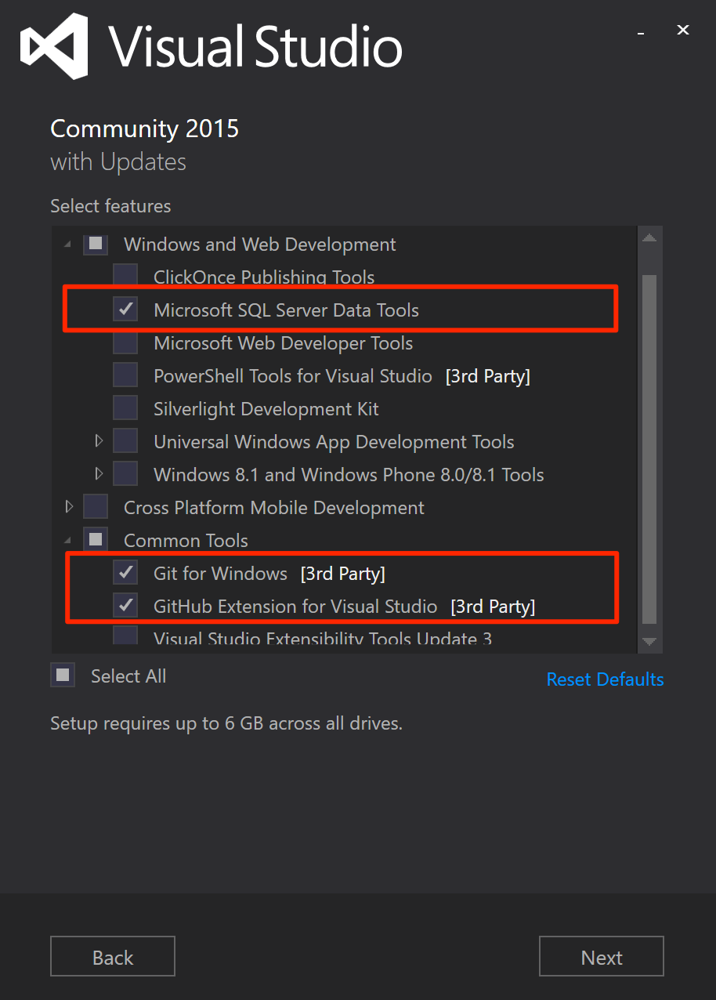
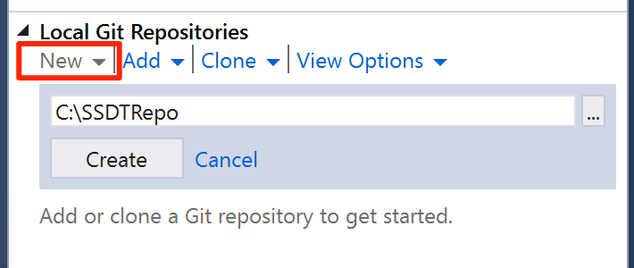
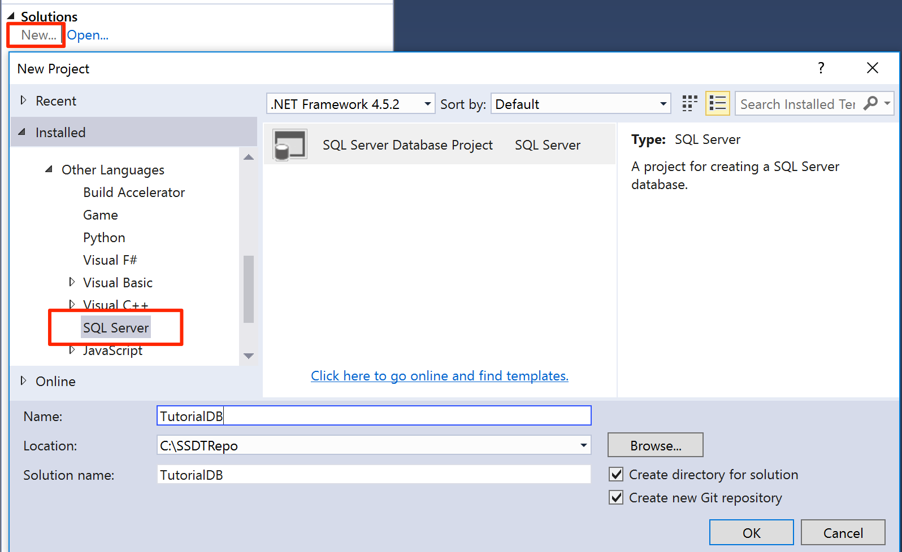
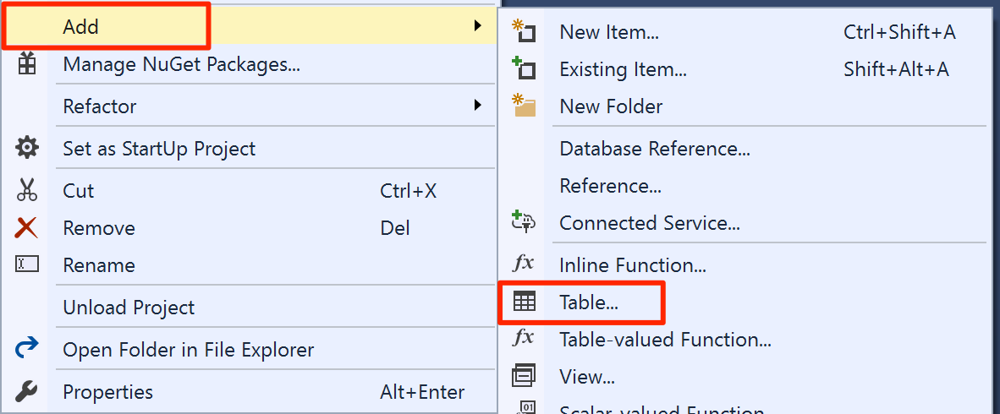
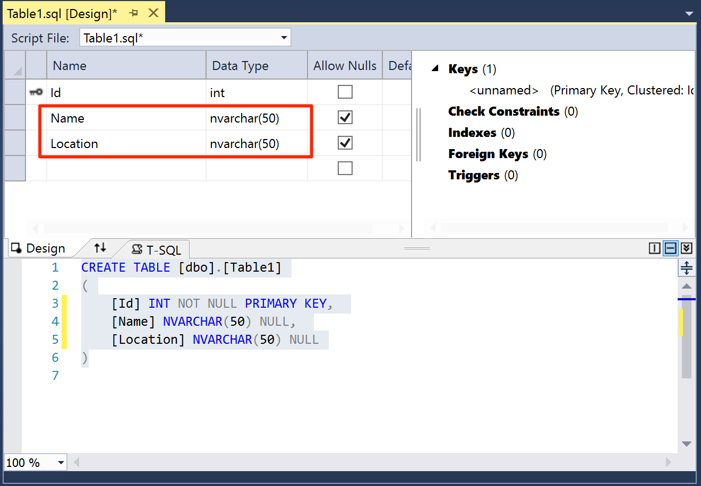
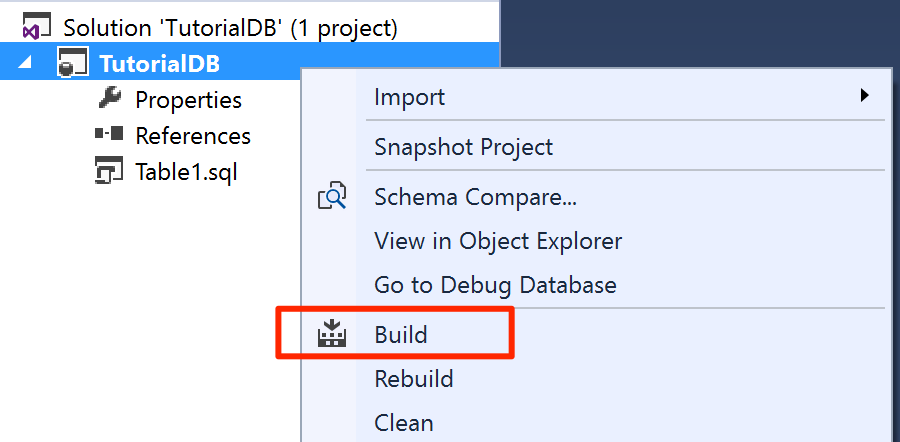
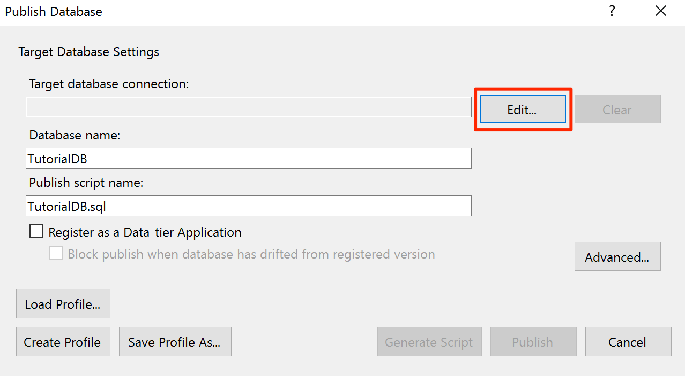
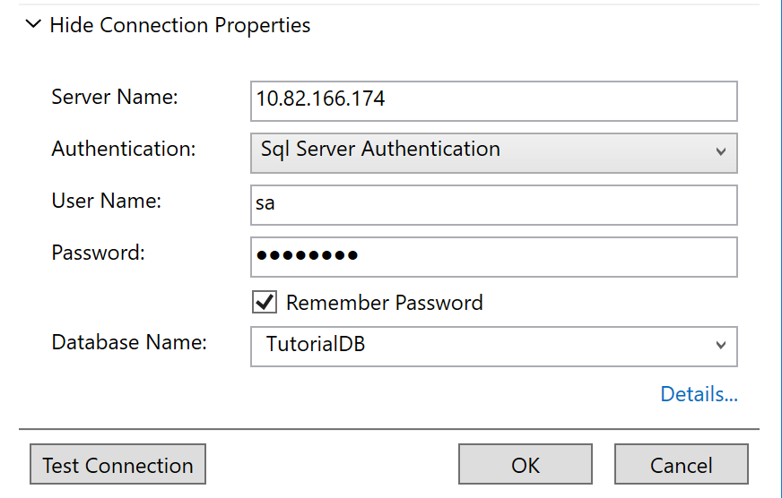
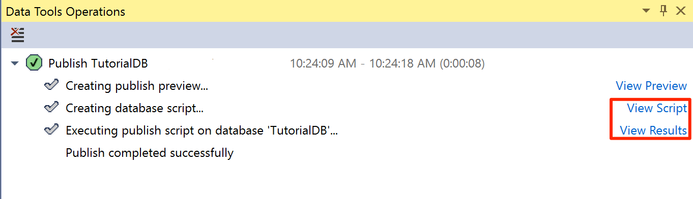

# Use Visual Studio to create databases for SQL Server on Linux

[!INCLUDE [SQL Server - Linux](../includes/applies-to-version/sql-linux.md)]

SQL Server Data Tools (SSDT) turns Visual Studio into a powerful development and database lifecycle management (DLM) environment for SQL Server on Linux. You can develop, build, test, and publish your database from a source-controlled project. Like you develop your application code.

## Install Visual Studio and SQL Server Data Tools

1. If you haven't already installed Visual Studio on your Windows machine, [Download and Install Visual Studio](https://visualstudio.microsoft.com/downloads/). If you don't have a Visual Studio license, Visual Studio Community edition is a free, fully featured IDE for students, open-source, and individual developers.

2. During the Visual Studio installation, select **Custom** for the **Choose the type of installation** option. Click **Next**

3. Select **Microsoft SQL Server Data Tools**, **Git for Windows**, and **GitHub Extension for Visual Studio** from the feature selection list.

   

4. Continue and finish the installation of Visual Studio. It can take a few minutes.

## Upgrade SQL Server Data Tools to SSDT 17.0 RC release

SQL Server on Linux is supported by SSDT version 17.0 RC or later.

* [Download and Install SSDT 17.0 RC2](https://go.microsoft.com/fwlink/?linkid=837939).

## Create a new database project in source control

1. Launch Visual Studio.

2. Select **Team Explorer** on the **View** menu. 

3. Click **New** in **Local Git Repository** section on the **Connect** page.

   

4. Click **Create**. After the local Git repository is created, double-click **SSDTRepo**.

5. Click **New** in the **Solutions** section. Select **SQL Server** under **Other Languages** node in the **New Project** dialog.

   

6. Type in **TutorialDB** for the name and click **OK** to create a new database project.

## Create a new table in the database project

1. Select **Solution Explorer** on the **View** menu.

2. Open the database project menu by right-clicking on **TutorialDB** in Solution Explorer.

3. Select **Table** under **Add**.

   

4. Using table designer, add two columns, Name `nvarchar(50)` and Location `nvarchar(50)`, as shown in the picture. SSDT generates the `CREATE TABLE` script as you add the columns in the designer.

   

5. Save the **Table1.sql** file.

## Build and validate the database

1. Open the database project menu on **TutorialDB** and select **Build**. SSDT compiles .sql source code files in your project and builds a Data-tier Application package (dacpac) file. This can be used to publish a database to your SQL Server instance on Linux. 

   

2. Check the build success message in **Output** window in Visual Studio. 

## Publish the database to SQL Server instance on Linux

1. Open the database project menu on **TutorialDB** and select **Publish**.

2. Click **Edit** to select your SQL Server instance on Linux.

   

3. On the connection dialog, type in the IP address or host name of your SQL Server instance on Linux, user name and password.

   

4. Click the **Publish** button on the publish dialog.

5. Check the publish status in the **Data Tools Operations** window.

6. Click **View Results** or **View Script** to see details of the database publish result on your SQL Server on Linux.

   

You've successfully created a new database on SQL Server instance on Linux and learned the basics of developing a database with a source-controlled database project.

## Next steps

If you're new to T-SQL, see [Tutorial: Writing Transact-SQL Statements](../t-sql/tutorial-writing-transact-sql-statements.md).

For more information about developing a database with SQL Data Tools, see the below articles.

* [Download and Install Visual Studio](https://www.visualstudio.com/downloads/)
* [Download and Install SSDT](https://aka.ms/ssdt-download)
* [SSDT MSDN documents](https://msdn.microsoft.com/library/hh272686(v=vs.103).aspx)
* [Tutorial: Writing Transact-SQL Statements](https://msdn.microsoft.com/library/ms365303.aspx)
* [Transact-SQL Reference (Database Engine)](https://msdn.microsoft.com/library/bb510741.aspx)
