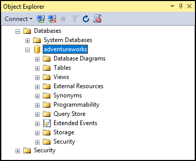
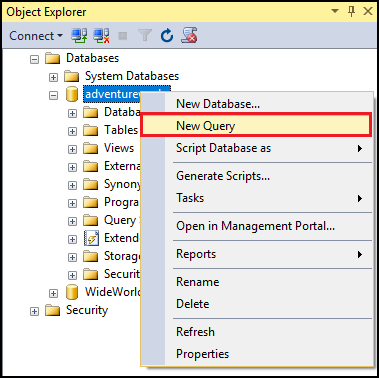
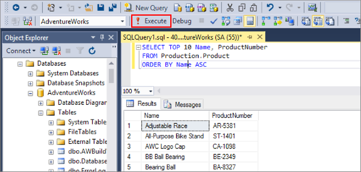

---
# required metadata

title: Manage SQL Server on Linux with SSMS | Microsoft Docs
description: This tutorial shows how to use SQL Server Management Studio on Windows to connect to SQL Server running on Linux. 
author: rothja 
ms.author: jroth 
manager: jhubbard
ms.date: 03/17/2017
ms.topic: article
ms.prod: sql-linux
ms.technology: database-engine
ms.assetid: 30cc4564-f389-4707-9b25-8ba782cc5150

# optional metadata

# keywords: ""
# ROBOTS: ""
# audience: ""
# ms.devlang: ""
# ms.reviewer: ""
# ms.suite: ""
# ms.tgt_pltfrm: ""
# ms.custom: ""

---
# Use SQL Server Management Studio (SSMS) on Windows to manage SQL Server on Linux

This topic shows how to use [SQL Server Management Studio (SSMS)](https://msdn.microsoft.com/library/mt238290.aspx) to connect to SQL Server 2017 RC2 on Linux. SSMS is a Windows application, so use SSMS when you have a Windows machine that can connect to a remote SQL Server instance on Linux. 

After successfully connecting, you run a simple Transact-SQL (T-SQL) query to verify communication with the database.

## Install the newest version of SQL Server Management Studio

When working with SQL Server, you should always use the most recent version of SQL Server Management Studio (SSMS). The latest version of SSMS is continually updated and optimized and currently works with SQL Server 2017 on Linux. To download and install the latest version, see [Download SQL Server Management Studio](https://msdn.microsoft.com/library/mt238290.aspx). To stay up-to-date, the latest version of SSMS prompts you when there is a new version available to download. 

## Connect to SQL Server on Linux

The following steps show how to connect to SQL Server 2017 on Linux with SSMS.

1. Start SSMS by typing **Microsoft SQL Server Management Studio** in the Windows search box, and then click the desktop app.

    

2. In the **Connect to Server** window, enter the following information (if SSMS is already running, click **Connect > Database Engine** to open the **Connect to Server** window):

   | Setting | Description |
   |-----|-----|
   | **Server type** | The default is database engine; do not change this value. |
   | **Server name** | Enter the name of the target Linux SQL Server machine or its IP address. |
   | **Authentication** | For SQL Server 2017 on Linux, use **SQL Server Authentication**. |
   | **Login** | Enter the name of a user with access to a database on the server (for example, the default **SA** account created during setup). |
   | **Password** | Enter the password for the specified user (for the **SA** account, you created this during setup). |

    

3. Click **Connect**.

    > [!TIP]
    > If you get a connection failure, first attempt to diagnose the problem from the error message. Then review the [connection troubleshooting recommendations](sql-server-linux-troubleshooting-guide.md#connection).
 
5. After successfully connecting to your SQL Sever, **Object Explorer** opens and you can now access your database to perform administrative tasks or query data.
 
     
     
## Run sample queries

After you connect to your server, you can connect to a database and run a sample query. If you are new to writing queries, see [Writing Transact-SQL Statements](https://msdn.microsoft.com/library/ms365303.aspx).

1. Identify a database to use to run a query against. This could be a new database you created in the [Transact-SQL tutorial](https://msdn.microsoft.com/library/ms365303.aspx). Or it could be the **AdventureWorks** sample database that you [downloaded and restored](sql-server-linux-migrate-restore-database.md).
2. In **Object Explorer**, navigate to the target database on the server.
2. Right-click the database and then select **New Query**:

	

3. In the query window, write a Transact-SQL query to select data from one of the tables. The following example selects data from the **Production.Product** table of the **AdventureWorks** database.

        SELECT TOP 10 Name, ProductNumber
        FROM Production.Product
        ORDER BY Name ASC

4. Click the **Execute** button:

	

## Next steps

In addition to queries, you can use T-SQL statements to create and manage databases.

If you're new to T-SQL, see [Tutorial: Writing Transact-SQL Statements](https://msdn.microsoft.com/library/ms365303.aspx) and the [Transact-SQL Reference (Database Engine)](https://msdn.microsoft.com/library/bb510741.aspx).

For more information on how to use SSMS, see [Use SQL Server Management Studio](https://msdn.microsoft.com/library/ms174173.aspx).
