# Use Visual Studio Code to create and run Transact-SQL scripts for SQL Server

[!INCLUDE[tsql-appliesto-sslinx-only_md](../../docs/includes/tsql-appliesto-sslinx-only_md.md)]

This topic shows how to use the **mssql** extension for Visual Studio Code (VS Code) to develop SQL Server databases.

Visual Studio Code is a graphical code editor for Linux, macOS, and Windows that supports extensions. The [**mssql** extension for VS Code] enables you to connect to SQL Server, query with Transact-SQL (T-SQL), and view the results.

## Install VS Code
1. If you have not already installed VS Code, [Download and install VS Code] on your machine.

2. Start VS Code.

## Install the mssql extension
The following steps explain how to install the mssql extension. 

1. Press **CTRL+SHIFT+P** (or **F1**) to open the Command Palette in VS Code. 

2. Select **Install Extension** and type **mssql**.
   > [!TIP] 
   > For macOS, the **CMD** key is equivalent to **CTRL** key on Linux and Windows.

2. Click install **mssql**. 
   
   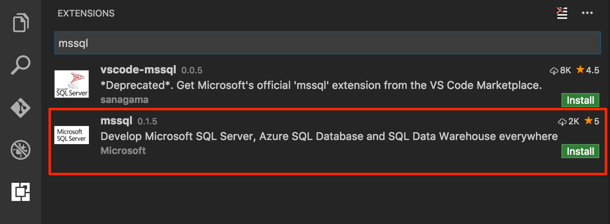

3. The **mssql** extension takes up to one minute to install. Wait for the prompt that tells you it successfully installed.

   

   > [!NOTE]
   > For macOS, you must install OpenSSL. This is a pre-requisite for .Net Core used by the mssql extension. Follow the **install pre-requisite** steps in the [.Net Core instructions]. Or, you can run the following commands in your macOS Terminal.
   >
   >   ```bash
   >   brew update
   >   brew install openssl
   >   ln -s /usr/local/opt/openssl/lib/libcrypto.1.0.0.dylib /usr/local/lib/
   >   ln -s /usr/local/opt/openssl/lib/libssl.1.0.0.dylib /usr/local/lib/
   >   ```
   
   > [!NOTE]
   > For Windows 8.1, Windows Server 2012 or lower versions, you must download and install the [Windows 10 Universal C Runtime]. Download and open the zip file. Then run the installer (.msu file) targeting your current OS configuration.

## Create or open a SQL file

The **mssql** extension enables mssql commands and T-SQL IntelliSense in the editor when the language mode is set to **SQL**.

1. Press **CTRL+N**. Visual Studio Code opens a new 'Plain Text' file by default. 

2. Press **CTRL+K,M** and change the language mode to **SQL**. 

   

3. Alternatively, open an existing file with .sql file extension. The language mode is automatically **SQL** for files that have the .sql extension.  

## Connect to SQL Server

The following steps show how to connect to SQL Server with VS Code.

1. In VS Code, press **CTRL+SHIFT+P** (or **F1**) to open the Command Palette.

2. Type **sql** to display the mssql commands.

   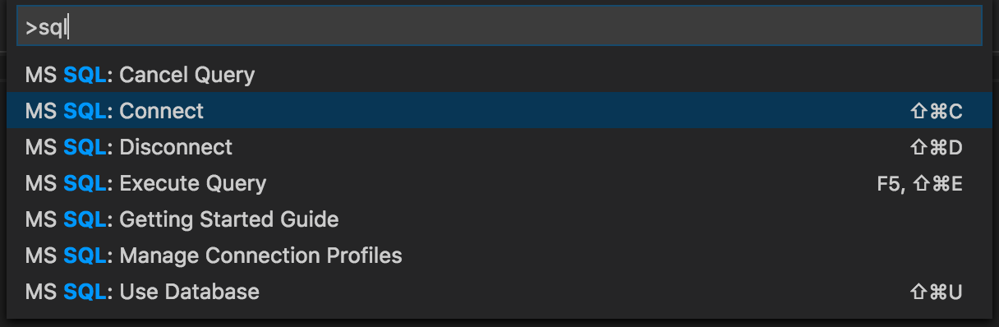
   

3. Select the **MS SQL: Connect** command. You can simply type **sqlcon** and press **ENTER**.

4. Select **Create Connection Profile**. This creates a connection profile for your SQL Server instance.

5. Follow the prompts to specify the connection properties for the new connection profile. After specifying each value, press **ENTER** to continue. 

   The following table describes the Connection Profile properties.

   | Setting | Description |
   |-----|-----|
   | **Server name** | The SQL Server instance name. For this tutorial, use **localhost** to connect to the local SQL Server instance on your machine. If connecting to a remote SQL Server, enter the name of the target SQL Server machine or its IP address. |
   | **[Optional] Database name** | The database that you want to use. For purposes of this tutorial, don't specify a database and press **ENTER** to continue. |
   | **User name** | Enter the name of a user with access to a database on the server. For this tutorial, use the default **SA** account created during the SQL Server setup. |
   | **Password (SQL Login)** | Enter the password for the specified user. | 
   | **Save Password?** | Type **Yes** to save the password. Otherwise, type **No** to be prompted for the password each time the Connection Profile is used. |
   | **[Optional] Enter a name for this profile** | The Connection Profile name. For example, you could name the profile **localhost profile**. 

   > [!Tip] 
   > You can create and edit connection profiles in User Settings file (settings.json). Open the settings file by selecting **Preference** and then **User Settings** in the VS Code menu. For more details, see [manage connection profiles].

6. Press the **ESC** key to close the info message that informs you that the profile is created and connected.

   > [!TIP]
   > If you get a connection failure, first attempt to diagnose the problem from the error message in the **Output** panel in VS Code (select **Output** on the **View** menu). Then review the [connection troubleshooting recommendations].

7. Verify your connection in the status bar.

   

## Create a database

1. In the editor, type **sql** to bring up a list of editable code snippets. 

   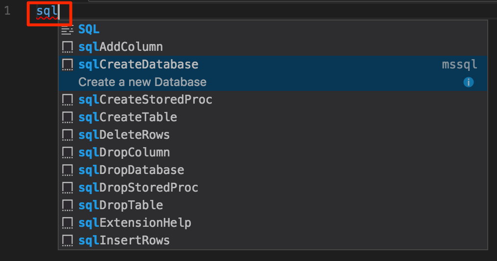

2. Select **sqlCreateDatabase**.

3. In the snippet, type **TutorialDB** for the database name.

   ```sql
   USE master
   GO
   IF NOT EXISTS (
      SELECT name
      FROM sys.databases
      WHERE name = N'TutorialDB'
   )
   CREATE DATABASE [TutorialDB]
   GO
   ```
   
4. Press **CTRL+SHIFT+E** to execute the Transact-SQL commands. View the results in the query window.

   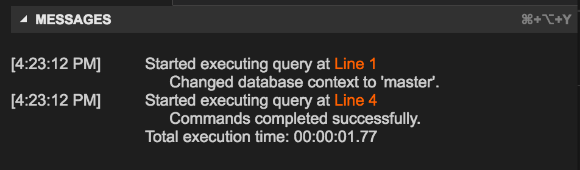

   > [!TIP]
   > You can customize shortcut key bindings for the mssql extension commands. See [customize shortcuts].

## Create a table

1. Remove the contents of the editor window.

2. Press **F1** to display the Command Palette.

3. Type **sql** in the Command Palette to display the SQL commands or type **sqluse** for **MS SQL:Use Database** command.

4. Click **MS SQL:Use Database**, and select the **TutorialDB** database. This changes the context to the new database created in the previous section.

   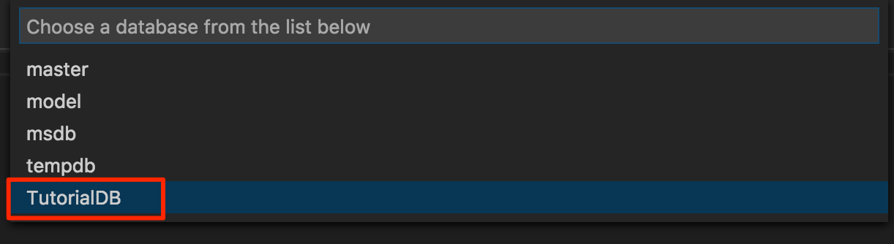

3. In the editor, type **sql** to display the snippets, and then select **sqlCreateTable** and press **enter**.

4. In the snippet, type **Employees** for the table name.

5. Press **Tab**, and then type **dbo** for the schema name.

   > [!NOTE]
   > After adding the snippet, you must type the table and schema names without changing focus away from the VS Code editor.

6. Change the column name for **Column1** to **Name** and **Column2** to **Location**.

   ```sql
   -- Create a new table called 'Employees' in schema 'dbo'
   -- Drop the table if it already exists
   IF OBJECT_ID('dbo.Employees', 'U') IS NOT NULL
   DROP TABLE dbo.Employees
   GO
   -- Create the table in the specified schema
   CREATE TABLE dbo.Employees
   (
      EmployeesId        INT    NOT NULL   PRIMARY KEY, -- primary key column
      Name      [NVARCHAR](50)  NOT NULL,
      Location   [NVARCHAR](50)  NOT NULL
   );
   GO
   ```

7. Press **CTRL+SHIFT+E** to create the table.

## Insert and query

1. Add the following statements to insert four rows into the **Employees** table. Then select all the rows.

   ```sql
   -- Insert rows into table 'Employees'
   INSERT INTO Employees
      ([EmployeesId],[Name],[Location])
   VALUES
      ( 1, N'Jared', N'Australia'),
      ( 2, N'Nikita', N'India'),
      ( 3, N'Tom', N'Germany'),
      ( 4, N'Jake', N'United States')   
   GO   
   -- Query the total count of employees
   SELECT COUNT(*) as EmployeeCount FROM dbo.Employees;
   -- Query all employee information
   SELECT e.EmployeesId, e.Name, e.Location 
   FROM dbo.Employees as e
   GO
   ```

   > [!TIP]
   > While you type, use the assistance of the T-SQL IntelliSense.
   >   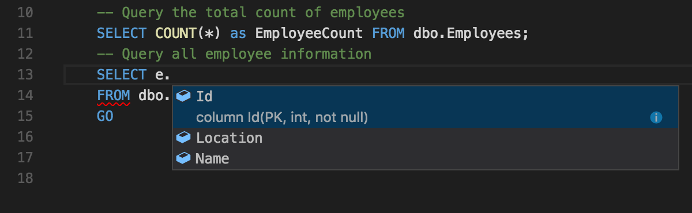

2. Press **CTRL+SHIFT+E** to execute the commands. The two result sets display in the **Results** window. 

   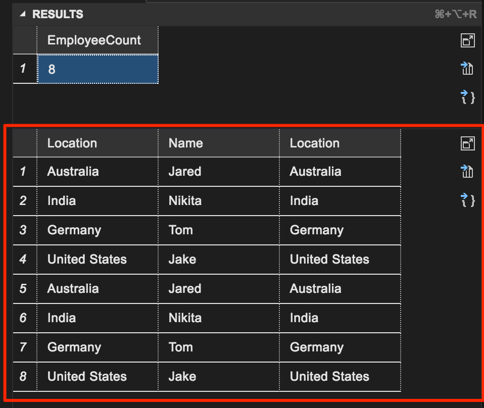

## View and save the result

1. On the **View** menu, select **Toggle Editor Group Layout** to switch to vertical or horizontal split layout.

   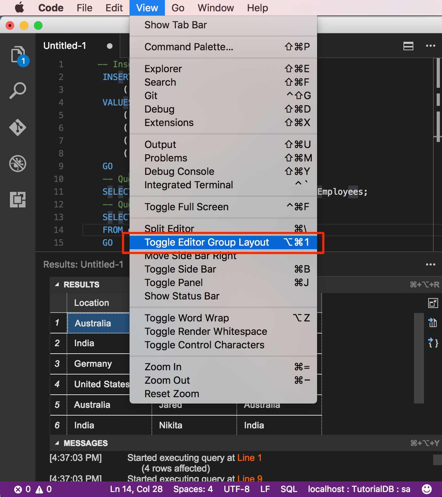

2. Click the **Results** and **Messages** panel header to collapse and expand the panel.

   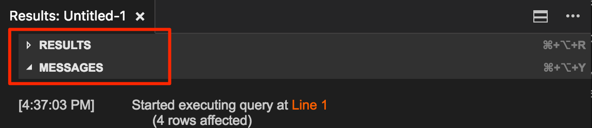

   > [!TIP]
   > You can customize the default behavior of the mssql extension. See [customize extension options].

2. Click the maximize grid icon on the second result grid to zoom in.

   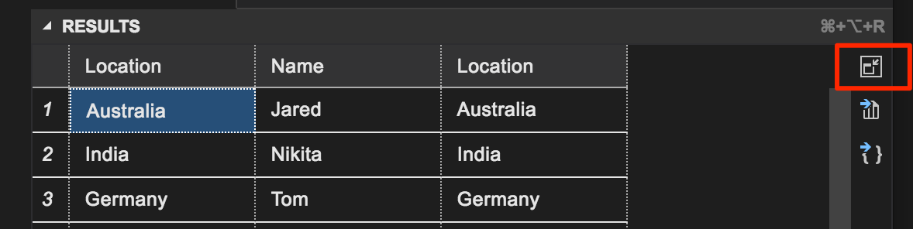

   > [!NOTE]
   > The maximize icon displays when your T-SQL script has two or more result grids.

3. Open the grid context menu with the right mouse button on a grid. 

   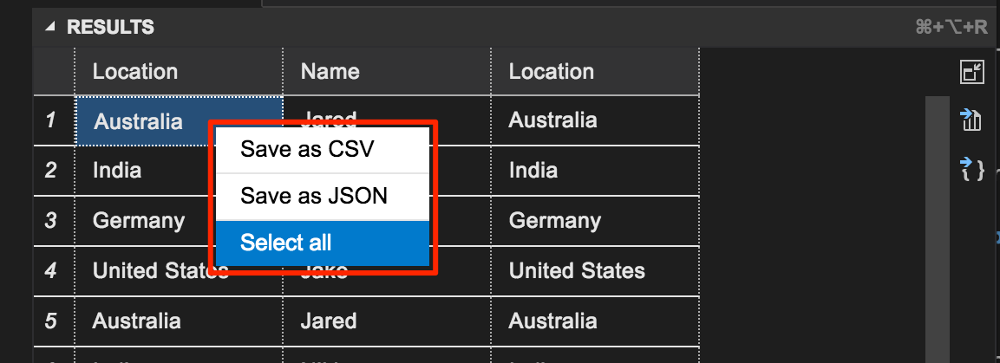

4. Select **Select All**.

5. Open the grid context menu and select **Save as JSON** to save the result to a .json file.

6. Specify a file name for the JSON file. For this tutorial, type **employees.json**.

7. Verify that the JSON file is saved and opened in VS Code.

   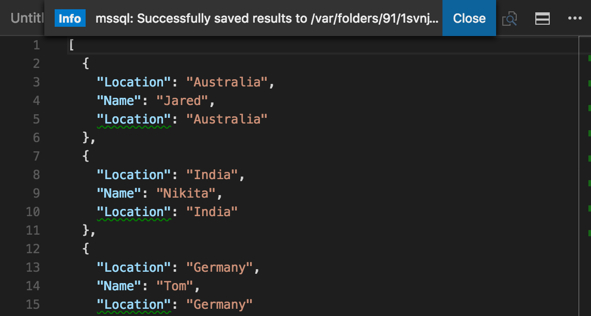

## Next steps

In a real-world scenario, you might create a script that you need to save and run later (either for administration or as part of a larger development project). In this case, you can save the script with a **.sql** extension.

If you're new to T-SQL, see [Tutorial: Writing Transact-SQL Statements] and the [Transact-SQL Reference (Database Engine)].

For more information on using or contributing to the mssql extension, see [the mssql extension project wiki].

For more information on using VS Code, see the [Visual Studio Code documentation](https://code.visualstudio.com/docs).

[**mssql** extension for VS Code]:https://aka.ms/mssql-marketplace
[Download and install VS Code]:https://code.visualstudio.com/Download
[.Net Core instructions]:https://www.microsoft.com/net/core
[manage connection profiles]:https://github.com/Microsoft/vscode-mssql/wiki/manage-connection-profiles
[connection troubleshooting recommendations]:./sql-server-linux-troubleshooting-guide.md#connection
[customize shortcuts]:https://github.com/Microsoft/vscode-mssql/wiki/customize-shortcuts
[Tutorial: Writing Transact-SQL Statements]:https://msdn.microsoft.com/library/ms365303.aspx
[Transact-SQL Reference (Database Engine)]:https://msdn.microsoft.com/library/bb510741.aspx
[Visual Studio Code documentation]:https://code.visualstudio.com/docs
[Windows 10 Universal C Runtime]:https://github.com/Microsoft/vscode-mssql/wiki/windows10-universal-c-runtime-requirement
[customize extension options]: https://github.com/Microsoft/vscode-mssql/wiki/customize-options
[the mssql extension project wiki]: https://github.com/Microsoft/vscode-mssql/wiki
