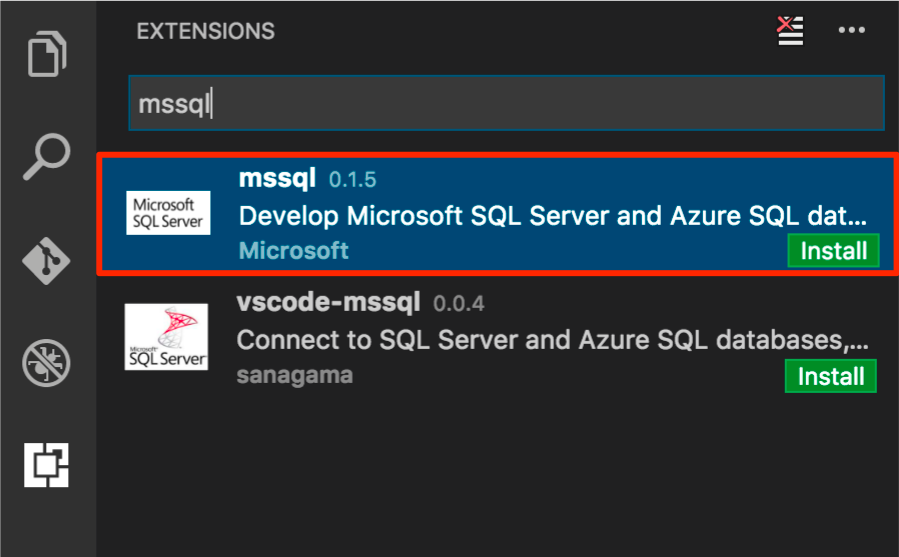

---
# required metadata

title: Use Visual Studio Code with SQL Server on Linux | SQL Server vNext CTP1
description: 
author: erickangMSFT 
ms.author: erickangMSFT 
manager: jhubbard
ms.date: 11/03/2016
ms.topic: article
ms.prod: sql-linux
ms.technology: database-engine
ms.assetid: 9766ee75-32d3-4045-82a6-4c7968bdbaa6

# optional metadata

# keywords: ""
# ROBOTS: ""
# audience: ""
# ms.devlang: ""
# ms.reviewer: ""
# ms.suite: ""
# ms.tgt_pltfrm: ""
# ms.custom: ""

---
# Use the Visual Studio Code with SQL Server on Linux

This topic shows how to use mssql for Visual Studio Code (VS Code) to develop SQL Server vNext CTP1 databases on Linux.

Visual Studio Code is a graphical code editor for Linux, MAC OS and Windows that supports extensions. The [**mssql** extension for VS Code] enables you to connect to SQL Server, query using Transact-SQL and view the results.

In this tutorial, we will walk you through how to:
* Install VS Code and the **mssql** extension

* Connect to SQL Server vNext CTP1 on Linux.

* Easily write T-SQL scripts with IntelliSense, TSQL snippets, syntax colorization and real-time error validation.

* Execute the scripts against the connected database.

* View results in a grid based view.

* Save results to json or csv file format.

## Install Visual Studio Code
1. If you have not already installed VS Code, [Download and install VS Code] on your Linux, Mac OS or Windows machine.

2. Start VS Code.

## Install the mssql extension
The following steps explain how to install the mssql extension. 

1. Press **ctrl+shift+p** (or **F1**) to open the command palette in VS Code. Select **Install Extension** and type **mssql**.
    > [!TIP] 
    > For Mac OS, **cmd** key is equivalent to **ctrl** key on Linux and Windows.

2. Click install **mssql**. 
    
    

    > [!NOTE]
    > **vscode-mssql** is a prototype version and it will retire from the extension Markeplace soon. If you have already installed the vscode-mssql extension, please remove it.

3. The **mssql** extension takes up to one minute to install. Wait for the prompt that tells you it is installed successfully.

    

    > [!NOTE]
    > For Mac OS, you will need to install OpenSSL. This is a pre-requiste for .Net Core which mssql extension uses. Follow the 'install pre-requisite' steps in the [.Net Core instructions].
    > Or simply run the following commands in your Mac OS Terminal.
    
    ```bash
    brew update
    brew install openssl
    ln -s /usr/local/opt/openssl/lib/libcrypto.1.0.0.dylib /usr/local/lib/
    ln -s /usr/local/opt/openssl/lib/libssl.1.0.0.dylib /usr/local/lib/
    ```
    
    > [!NOTE]
    > For Windows 8.1, Windows Server 2012 or lower versions, you will need to download and install [Windows 10 Universal C Runtime]. Download and open the zip file, then run the installer (.msu file) targeting your current OS configuration.

## Open a new or existing *.sql file
1. Press **ctrl+n**. Visual Studio Code opens a new 'Plain Text' file by default. Press **ctrl+k,m** and change the language mode to **SQL**. 

    

2. Alternatively, open an existing file with .sql file extension. 

    > The **mssql** extension enables mssql commands and TSQL IntelliSense in the editor for a file with .sql extension or when the language mode is **SQL**.

## Connect to SQL Server

The following steps show how to connect to SQL Server vNext on Linux with VS Code.

1. In VS Code, press **ctrl+shift+p** (or **F1**) to open the Command Palette.

2. Type 'sql' to display the mssql commands.

    
   

3. Select the **MS SQL: Connect** command. You can simply type **sqlcon** and press **enter**.

4. Select **Create Connection Profile**. This creates a connection profile for your SQL Server instance.

5. Follow the prompts to specify the connection properties for the new connection profile. After specifying each value, press **enter** to continue. 

    The following table describes the Connection Profile properties.

   | Setting | Description |
   |-----|-----|
   | **Server name** | The SQL Server instance name. For this tutorial, use **localhost** to connect to the local SQL Server instance on your machine. If connecting to a remote SQL Server, enter the name of the target SQL Server machine or its IP address. |
   | **[Optional] Database name** | The database that you want to use. For purposes of this tutorial, don't specify a database and press **enter** to continue. |
   | **User name** | Enter the name of a user with access to a database on the server. For this tutorial, use the default **SA** account created during the SQL Server setup. |
   | **Password (SQL Login)** | Enter the password for the specified user. | 
   | **Save Password?** | Type **Yes** to save the password. Otherwise, type **No** to be prompted for the password each time the Connection Profile is used. |
   | **[Optional] Enter a name for this profile** | The Connection Profile name. For example, you could name the profile **localhost profile**. 

    > [!Tip] 
    > You can create and edit connection profiles in User Settings file (settings.json). Open the settings file with **Preference**-->**User Settings** menu in VS Code. For more details, see [manage connection profiles].

6. Press **esc** key to close the info message that informs you that the profile is created and connected.

    > [!TIP]
    > If you get a connection failure, first attempt to diagnose the problem from the error message in the **Output** panel in VS Code (**View** --> **Output** menu). Then review the [connection troubleshooting recommendations].

7. Verify your connection in the status bar.

   

## Create a database

1. In the editor, type **sql** to bring up a list of editable code snippets. 

   

2. Select **sqlCreateDatabase**.

3. In the snippet, type **TutorialDB** for the database name.

    ```sql
    USE master
    GO
    IF NOT EXISTS (
        SELECT name
        FROM sys.databases
        WHERE name = N'TutorialDB'
    )
    CREATE DATABASE [TutorialDB]
    GO
    ```
    
4. Press **ctrl+shift+e** to execute the Transact-SQL commands. View the results in the query window.

    

    > [!TIP]
    > You can customize shortcut key bindings for the mssql extension commands. See [customize shortcuts].

## Create a table

1. Remove the contents of the editor window.

2. Press **F1** to display the Command Palette.

3. Type **sql** in the Command Palette to display the SQL commands or type **sqluse** for **MS SQL:Use Database** command.

4. Click **MS SQL:Use Database**, and select the **TutorialDB** database. This changes the context to the new database created in the previous section.

    

3. In the editor, type **sql** to display the snippets, and then select **sqlCreateTable** and press **enter**.

4. In the snippet, type **Employees** for the table name.

5. Press **Tab**, and then type **dbo** for the schema name.

    > [!NOTE]
    > After adding the snippet, you must type the table and schema names without changing focus away from the VS Code editor.

6. Change the column name for **Column1** to **Name** and **Column2** to **Location**.

    ```sql
    -- Create a new table called 'Employees' in schema 'dbo'
    -- Drop the table if it already exists
    IF OBJECT_ID('dbo.Employees', 'U') IS NOT NULL
    DROP TABLE dbo.Employees
    GO
    -- Create the table in the specified schema
    CREATE TABLE dbo.Employees
    (
        EmployeeId          INT     NOT NULL    PRIMARY KEY, -- primary key column
        Name        [NVARCHAR](50)  NOT NULL,
        Location    [NVARCHAR](50)  NOT NULL
    );
    GO
    ```

7. Press **ctrl+shift+e** to create the table.

## Insert and query

1. Add the following statements using TSQL IntelliSense to insert four rows and then select all the rows from the **Employees** table.

    ```sql
    -- Insert rows into table 'Employees'
    INSERT INTO Employees
        ([EmployeesId],[Name],[Location])
    VALUES
        ( 1, N'Jared', N'Australia'),
        ( 2, N'Nikita', N'India'),
        ( 3, N'Tom', N'Germany'),
        ( 4, N'Jake', N'United States')   
    GO    
    -- Query the total count of employees
    SELECT COUNT(*) as EmployeeCount FROM dbo.Employees;
    -- Query all employee information
    SELECT e.EmployeesId, e.Name, e.Location 
    FROM dbo.Employees as e
    GO
    ```
    
    

2. Press **ctrl+shift+e** to execute the commands. The two result sets display in the Results window. 

    

## View and save the result

1. Select VS Code menu: **View** --> **Toggle Editor Group Layout** to switch to vertical or horizontal split layout.

    

2. Click the **Results** and **Messages** panel header to collapse and expand the panel.

    

    > [!TIP]
    > You can customize the default behavior of the mssql extension. See [customize extension options].

2. Click the maximize grid icon on the second result grid to zoom in.

    

    > [!NOTE]
    > Maximize icon displays when your TSQL script has two or more result grids.

3. Open the grid context menu with the right mouse button on a grid. 

    

4. Select **Save All**

5. Open the grid context menu and select **Save as JSON** to save the result to a .json file.

6. Specify a file name for the json file. For this tutorial, type **employees.json**.

7. Check the json file is saved and opened in VS Code.

    

## Next steps

In a real-world scenario, you might create a script that you need to save and run later (either for administration or as part of a larger development project). In this case, you can save the script with a **.sql** extension.

If you're new to T-SQL, see [Tutorial: Writing Transact-SQL Statements] and the [Transact-SQL Reference (Database Engine)].

For more information on using or contributing to the mssql extension, see [the mssql extension project wiki].

For more information on using VS Code, see the [Visual Studio Code documentation](https://code.visualstudio.com/docs).

[**mssql** extension for VS Code]:https://aka.ms/mssql-marketplace
[Download and install VS Code]:https://code.visualstudio.com/Download
[.Net Core instructions]:https://www.microsoft.com/net/core
[manage connection profiles]:https://github.com/Microsoft/vscode-mssql/wiki/manage-connection-profiles
[connection troubleshooting recommendations]:./sql-server-linux-connect-and-query.md#troubleshoot
[customize shortcuts]:https://github.com/Microsoft/vscode-mssql/wiki/customize-shortcuts
[Tutorial: Writing Transact-SQL Statements]:https://msdn.microsoft.com/library/ms365303.aspx
[Transact-SQL Reference (Database Engine)]:https://msdn.microsoft.com/library/bb510741.aspx
[Visual Studio Code documentation]:https://code.visualstudio.com/docs
[Windows 10 Universal C Runtime]:https://github.com/Microsoft/vscode-mssql/wiki/windows10-universal-c-runtime-requirement
[customize extension options]: https://github.com/Microsoft/vscode-mssql/wiki/customize-options
[the mssql extension project wiki]: https://github.com/Microsoft/vscode-mssql/wiki
