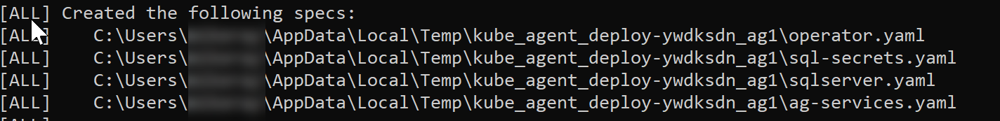

# Create deployment script for SQL Server Always On Availability Group

This article describes how to deploy an availability group on a Kubernetes cluster in a single command with an example deployment script. `deploy-ag.py` is a Python script that creates the `.yaml` files for the cluster and can apply them to a Kubernetes cluster.

Download the files file from [sql-server-samples](https://github.com/Microsoft/sql-server-samples/tree/master/samples/features/high%20availability/Kubernetes/sample-deployment-script).

## Before you start

Install the following tools on your workstation.

* [Python](https://www.python.org/downloads/) (3.5 or 3.6)
* [PyYAML](https://pyyaml.org/) - Python Packages
* [Kubernetes Client](https://github.com/kubernetes-client/python) - Python Package

Add python paths to the environment variables (for Windows).

### Install the Required Components

The following example The above installs the PyYAML and Kubernetes Client packages for Python.

After you install Python, download and extract the sample folder. 

To configure the required files, run the following command. Replace `<path>` with the location of the extracted sample files.

```cmd
pip install --user -r "C:\<path>\requirements.txt"
```

## Create Cluster and download config file

The following example creates the cluster in Azure Kubernetes Service (AKS).

Before you run the script, update the values in angle brackets - `<>`.

```azcli
az aks create  --resource-group <GroupName> --name <ClusterName> --generate-ssh-keys --node-count 4 --kubernetes-version 1.11.1

az aks get-credentials --resource-group=<GroupName> --name=<ClusterName>
```

>[!NOTE]
>Availability groups requires Kubernetes version 1.11.0 or higher. The example specifies 1.11.1.

## Run the deployment script

The following examples demonstrate how to run `deploy-ag.py`.

### Help

```cmd
python ./deploy-ag.py --help
```

* **usage**: `deploy-ag.py [-h] {deploy | failover} ...`
* **optional arguments**:
  * `-h, --help` show this help message and exit
* **subcommands**:
  * Actions on k8s agent {deploy | failover}

  `deploy`

   Deploy a set of SQL Servers in an Availability Group

  `failover`

   Fail over to a target replica.

### Deploy help

```cmd
python ./deploy-ag.py deploy --help
```

* **usage**:

  ```
  python ./deploy-ag.py deploy [-h] [--verbose] [--ag AG] [-n NAMESPACE]
    [--dry-run] [-s SQL_SERVERS [SQL_SERVERS ...]]
    [-p SA_PASSWORD] [-e {ON_PREM,AKS}]
    [--skip-create-namespace]
  ```

  Deploy SQL Server and k8s Agents in namespace(AG name)

* **optional arguments**:
  
  `-h, --help`
  
  show this help message and exit
  
  `--verbose, -v`
  
  Verbosity of output
  
  `--ag AG`
  
  name of the Availability Group. Default=ag1
  
  `-n NAMESPACE, --namespace NAMESPACE`
  
  name of the k8s namespace. Defaults to AG name if not specified.

  `--dry-run`
  
  Create the manifests, but do not apply them.
  
  `-s SQL_SERVERS [SQL_SERVERS ...], --sql-servers SQL_SERVERS [SQL_SERVERS ...]`

  names of SQL Server instances (up to 5, separated by spaces) Default=['mssql1', 'mssql2', 'mssql3']
  
  `-p SA_PASSWORD, --sa-password SA_PASSWORD`
  
  SA Password. Default='SAPassword2018'
  
  `-e {ON_PREM,AKS}, --env {ON_PREM,AKS}`
  
  `--skip-create-namespace`
  
  Skip namespace creation.

### Failover help

```cmd
python ./deploy-ag.py failover --help
```
* **usage**: 

  ```cmd
  python deploy-ag.py failover [-h] [--verbose] [--ag AG]
    [--namespace NAMESPACE] [--dry-run]
    target_replica
  ```

  Manually failover

* **positional arguments**:
  `target_replica`

  name of target SQL Server replica for failover

* **optional arguments**:

  `-h, --help`
  
  show this help message and exit

  `--verbose, -v`
  
  Verbosity of output

  `--ag AG`
  
  name of the Availability Group. Default=ag1

  `--namespace NAMESPACE`

  name of the k8s namespace. Defaults to AG name if not specified

  `--dry-run`
  
  Create, but do not apply the manifests.

### Create the manifests - don't apply

The following script creates the manifest files but does not apply them.

```cmd
python ./deploy-ag.py deploy --dry-run
```

The following example creates the manifests for an availability group under namespace `AG1` with three replicas. Before you run the script, replace `<MyC0m91exP@55w0r!>` with a complex password.

```cmd
python ./deploy-ag.py deploy --ag ag1 --namespace AG1 --sa-password '<MyC0m91exP@55w0r!>' --env AKS --dry-run
```

The previous command generates the sample yaml files directory.

In this case, the command output shows where the manifest files are created.


	
### Create the manifests and apply

The following example creates the manifests for an availability group under namespace `ag1` with three replicas and applies it to your Kubernetes cluster. The cluster will then create the availability group. Before you run the script, replace `<MyC0m91exP@55w0r!>` with a complex password.

```
python ./deploy-ag.py deploy --ag ag1 --namespace ag1 --sa-password '<MyC0m91exP@55w0r!>' --env AKS --verbose
```

After the script completes, the Kubernetes operator  creates the storage, the SQL Server instances, the load balancer services. You can monitor the deployment with [Kubernetes dashboard](https://docs.microsoft.com/azure/aks/kubernetes-dashboard).

After Kubernetes creates the SQL Server containers:

1. [Connect](sql-server-linux-kubernetes-connect.md) to a SQL Server instance in the cluster.

1. Create a database.

1. Take a full backup of the database to start the log chain.

1. Add the database to the availability group.

The availability group is created with automatic seeding so SQL Server will automatically create the secondary databases on the appropriate replicas.

### Manually failover

The following example fails over the primary replica.

```cmd
python ./deploy-ag.py failover --ag ag1 --namespace ag1 --verbose mssql1-0
```

## Next steps

[SQL Server availability group on Kubernetes cluster](sql-server-ag-kubernetes.md)
