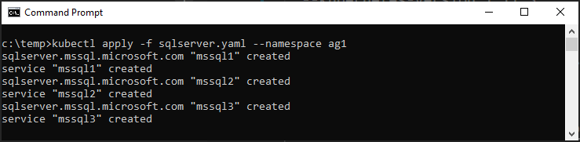
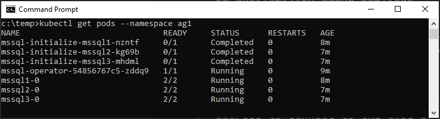
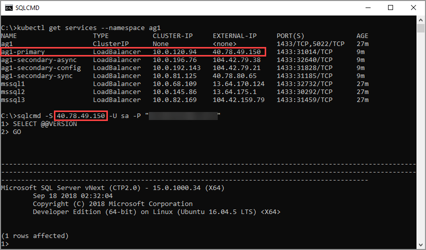
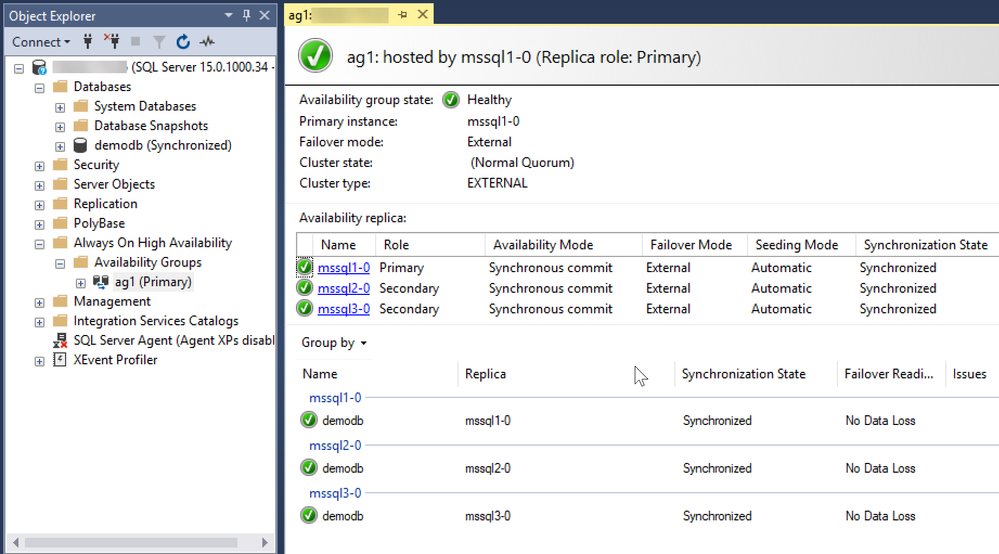

# Deploy a SQL Server Always On availability group on a Kubernetes cluster

The example in this article deploys a SQL Server Always On availability group on a Kubernetes cluster with three replicas. The secondary replicas are in synchronous commit mode.

On Kubernetes, the deployment includes a SQL Server operator, the SQL Server containers, and load balancer services. The operator orchestrates the availability group automatically. This article explains how to:

- Deploy the operator, SQL Server containers, and load-balancing services.
- Connect to the availability group with the services.
- Add a database to the availability group.

## Requirements

- An AKS Kubernetes cluster with the latest version
- At least three nodes
- [kubectl](https://kubernetes.io/docs/tasks/tools/install-kubectl/)
- Access to the [sql-server-samples](https://github.com/Microsoft/sql-server-samples/tree/master/samples/features/high%20availability/Kubernetes/sample-manifest-files) GitHub repository

> [!NOTE]
> You can use any type of Kubernetes cluster. To create a Kubernetes cluster on Azure Kubernetes Service (AKS), see [Create an AKS cluster](https://docs.microsoft.com/azure/aks/create-cluster).
>
> Use the latest version of Kubernetes. The specific version depends on your subscription and region. See [Supported Kubernetes versions in AKS](https://docs.microsoft.com/en-us/azure/aks/supported-kubernetes-versions).  
>
> The following script creates a four-node Kubernetes cluster in Azure. Before you run the script replace `<latest version>` with the latest available version. For example `1.12.5`.
>
> ```azure-cli
> az aks create --resource-group myResourceGroup --name myAKSCluster --node-count 4 --kubernetes-version <latest version> --generate-ssh-keys
> ```

## Deploy the operator, SQL Server containers, and load-balancing services

1. Create a [namespace](https://kubernetes.io/docs/concepts/overview/working-with-objects/namespaces/).

      This example uses a namespace called `ag1`. Run the following command to create the namespace.
    
      ```azurecli
      kubectl create namespace ag1
      ```
    
      All objects belonging to this solution are in the `ag1` namespace.

1. Configure and deploy the SQL Server operator manifest.

      Copy the SQL Server [`operator.yaml`](https://github.com/Microsoft/sql-server-samples/tree/master/samples/features/high%20availability/Kubernetes/sample-manifest-files/operator.yaml) file from [sql-server-samples](https://github.com/Microsoft/sql-server-samples/tree/master/samples/features/high%20availability/Kubernetes/sample-manifest-files).
    
      The `operator.yaml` file is the deployment manifest for the Kubernetes operator.
    
      Apply the manifest to the Kubernetes cluster.
    
      ```azurecli
      kubectl apply -f operator.yaml --namespace ag1
      ```
    
1. Create a secret for Kubernetes with passwords for the `sa` account, and the SQL Server instance master key.

      Create the secret with `kubectl`.
      
      The following example creates a secret named `sql-secrets` in the `ag1` namespace. The secret stores two passwords:
      
      - `sapassword` stores the password for the SQL Server `sa` account.
      - `masterkeypassword` stores the password used to create the SQL Server master key. 
    
   Copy the script to your terminal. Replace each `<>` with a complex password, and run the script to create the secret.
    
   >[!NOTE]
   >The password can't use `&` or `` ` `` characters.
    
   ```azurecli
   kubectl create secret generic sql-secrets --from-literal=sapassword="<>" --from-literal=masterkeypassword="<>"  --namespace ag1
   ```

1. Deploy the SQL Server custom resource.

      Copy the SQL Server manifest [`sqlserver.yaml`](https://github.com/Microsoft/sql-server-samples/tree/master/samples/features/high%20availability/Kubernetes/sample-manifest-files/sqlserver.yaml) from [sql-server-samples](https://github.com/Microsoft/sql-server-samples/tree/master/samples/features/high%20availability/Kubernetes/sample-manifest-files).
    
      >[!NOTE]
      >The `sqlserver.yaml` file describes the SQL Server containers, persistent volume claims, persistent volumes, and load-balancing services that are required for each SQL Server instance.
    
      Apply the manifest to the Kubernetes cluster.
    
      ```azurecli
      kubectl apply -f sqlserver.yaml --namespace ag1
      ```
      
The following image shows successful application of `kubectl apply` for this example.



After you apply the SQL Server manifest, the operator deploys the SQL Server containers.

Kubernetes places the containers in pods. Use `kubectl get pods --namespace ag1` to see the status of the pods. The following image shows the example deployment after the SQL Server pods are deployed. 



### Monitor the deployment

You can use the [Kubernetes dashboard with Azure Kubernetes Service](https://docs.microsoft.com/azure/aks/kubernetes-dashboard) to monitor the deployment.

Use `az aks browse` to launch the dashboard. 

## Connect to the availability group with the services

The [`ag-services.yaml`](https://github.com/Microsoft/sql-server-samples/tree/master/samples/features/high%20availability/Kubernetes/sample-manifest-files/ag-services.yaml) from [sql-server-samples](https://github.com/Microsoft/sql-server-samples/tree/master/samples/features/high%20availability/Kubernetes/sample-manifest-files) example describes load-balancing services that can connect to availability group replicas. 

- `ag1-primary` provides an endpoint to connect to the primary replica.
- `ag1-secondary` provides an endpoint to connect to any secondary replica.

When you apply the manifest file, Kubernetes creates the load-balancing services for each type of replica. The load-balancing service includes an IP address. Use this IP address to connect to the type of replica you need.

To deploy the services, run the following command.

```azurecli
kubectl apply -f ag-services.yaml --namespace ag1
```

After you deploy the services, use `kubectl get services --namespace ag1` to identify the IP address for the services.

With the IP address, you can connect to the SQL Server instance that hosts each type of replica.

The following image shows:

- The output from `kubectl get services` for the namespace `ag1`.

- The load-balancing services that are created for each SQL Server container. Use these IP addresses as endpoints to connect directly to the instances of SQL Server in the cluster.

- The `sqlcmd` connection to the primary replica, with the `sa` account via the load-balancer endpoint.



## Add a database to the availability group

>[!NOTE]
>At this time, SQL Server Management Studios can't add a database to an availability group. Use Transact-SQL.

After Kubernetes creates the SQL Server containers, complete the following steps to add a database to the availability group.

1. [Connect](sql-server-linux-kubernetes-connect.md) to a SQL Server instance in the cluster.

1. Create a database.

      ```sql
      CREATE DATABASE [demodb]
      ```

1. Take a full backup of the database to start the log chain.

      ```sql
      USE MASTER
      GO
      BACKUP DATABASE [demodb] 
      TO DISK = N'/var/opt/mssql/data/demodb.bak'
      ```

1. Add the database to the availability group.

      ```sql
      ALTER AVAILABILITY GROUP [ag1] ADD DATABASE [demodb]
      ```
    
The availability group is created with automatic seeding so that SQL Server automatically creates the secondary replicas.

You can view the state of the availability group from the SQL Server Management Studio Availability Groups dashboard.



## Next steps

- [Connect to a SQL Server availability group on a Kubernetes cluster](sql-server-linux-kubernetes-connect.md)

- [Manage a SQL Server availability group on a Kubernetes cluster](sql-server-linux-kubernetes-manage.md)

- [SQL Server supports availability groups on containers in a Kubernetes cluster](sql-server-ag-kubernetes.md)
