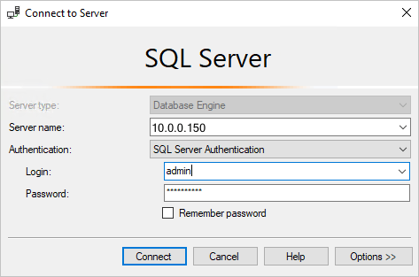
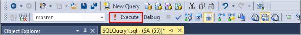

# Use SQL Server Management Studio on Windows to manage SQL Server on Linux

[!INCLUDE[appliesto-ss-xxxx-xxxx-xxx-md-linuxonly](../includes/appliesto-ss-xxxx-xxxx-xxx-md-linuxonly.md)]

This article introduces [SQL Server Management Studio (SSMS)](../ssms/sql-server-management-studio-ssms.md) and walks you through a couple of common tasks. SSMS is a Windows application, so use SSMS when you have a Windows machine that can connect to a remote SQL Server instance on Linux.

> [!TIP]
> If you do not have a Windows machine to run SSMS on, consider the new [Azure Data Studio](../azure-data-studio/index.md). It provides a graphical tool for managing SQL Server and runs on both Linux and Windows.

[SQL Server Management Studio (SSMS)](../ssms/sql-server-management-studio-ssms.md) is part of a suite of SQL tools that Microsoft offers free of charge for your development and management needs. SSMS is an integrated environment to access, configure, manage, administer, and develop all components of SQL Server. It can connect to SQL Server running on any platform both on-premises, in Docker containers, and in the cloud. It also connects to Azure SQL Database and Azure SQL Data Warehouse. SSMS combines a broad group of graphical tools with a number of rich script editors to provide access to SQL Server to developers and administrators of all skill levels.

SSMS offers a broad set of development and management capabilities for SQL Server, including tools to:

- Configure, monitor, and administer single or multiple instances of SQL Server
- Deploy, monitor, and upgrade data-tier components such as databases and data warehouses
- Backup and restore databases
- Build and execute T-SQL queries and scripts and see results
- Generate T-SQL scripts for database objects
- View and edit data in databases
- Visually design T-SQL queries and database objects such as views, tables, and stored procedures

See [What is SSMS?](../ssms/sql-server-management-studio-ssms.md) for more information on SSMS.

## Install the newest version of SQL Server Management Studio (SSMS)

When working with SQL Server, you should always use the most recent version of SQL Server Management Studio (SSMS). The latest version of SSMS is continually updated and optimized and currently works with SQL Server on Linux. To download and install the latest version, see [Download SQL Server Management Studio](../ssms/download-sql-server-management-studio-ssms.md). To stay up-to-date, the latest version of SSMS prompts you when there is a new version available to download.

> [!NOTE]
> Before using SSMS to manage Linux, review the [known issues](sql-server-linux-release-notes.md) for SSMS on Linux.

## Connect to SQL Server on Linux

Use the following basic steps to get connected:

1. Start SSMS by typing **Microsoft SQL Server Management Studio** in the Windows search box, and then click the desktop app.

    

1. In the **Connect to Server** window, enter the following information (if SSMS is already running, click **Connect > Database Engine** to open the **Connect to Server** window):

   | Setting | Description |
   |-----|-----|
   | **Server type** | The default is database engine; do not change this value. |
   | **Server name** | Enter the name of the target Linux SQL Server machine or its IP address. |
   | **Authentication** | For SQL Server on Linux, use **SQL Server Authentication**. |
   | **Login** | Enter the name of a user with access to a database on the server (for example, the default **SA** account created during setup). |
   | **Password** | Enter the password for the specified user (for the **SA** account, you created this during setup). |

    

1. Click **Connect**.

    > [!TIP]
    > If you get a connection failure, first attempt to diagnose the problem from the error message. Then review the [connection troubleshooting recommendations](sql-server-linux-troubleshooting-guide.md#connection).
 
1. After successfully connecting to your SQL Server, **Object Explorer** opens and you can now access your database to perform administrative tasks or query data.

## Run Transact-SQL queries

After you connect to your server, you can connect to a database and run Transact-SQL queries. Transact-SQL queries can be used for almost any database task.

1. In **Object Explorer**, navigate to the target database on the server. For example, expand **System Databases** to work with the **master** database.

1. Right-click the database and then select **New Query**.

1. In the query window, write a Transact-SQL query to select return the names of all databases on your server.

   ```sql
   SELECT [Name]
   FROM sys.Databases
   ```

   If you are new to writing queries, see [Writing Transact-SQL Statements](../t-sql/tutorial-writing-transact-sql-statements.md).

1. Click the **Execute** button to run the query and see the results.

   

Although it is possible to do almost any management task with Transact-SQL queries, SSMS is a graphical tool that makes is easier to manage SQL Server. The following sections provide some examples of using the graphical user interface.

## Create and manage databases

While connected to the *master* database, you can create databases on the server and modify or drop existing databases. The following steps describe how to accomplish several common database management tasks through Management Studio. To perform these tasks, make sure you are connected to the *master* database with the server-level principal login that you created when you set up SQL Server on Linux.

### Create a new database

1. Start SSMS and connect to your server in SQL Server on Linux

2. In Object Explorer, right-click on the *Databases* folder, and then click *New Database..."

3. In the *New Database* dialog, enter a name for your new database, and then click *OK*

The new database is successfully created in your server. If you prefer to create a new database using T-SQL, then see [CREATE DATABASE (SQL Server Transact-SQL)](../t-sql/statements/create-database-sql-server-transact-sql.md).

### Drop a database

1. Start SSMS and connect to your server in SQL Server on Linux

2. In Object Explorer, expand the *Databases* folder to see a list of all the database on the server.

3. In Object Explorer, right-click on the database you wish to drop, and then click *Delete*

4. In the *Delete Object* dialog, check *Close existing connections* and then click *OK*

The database is successfully dropped from your server. If you prefer to drop a database using T-SQL, then see [DROP DATABASE (SQL Server Transact-SQL)](../t-sql/statements/drop-database-transact-sql.md).

## Use Activity Monitor to see information about SQL Server activity

The [Activity Monitor](../relational-databases/performance-monitor/activity-monitor.md) tool is built into SQL Server Management Studio (SSMS) and displays information about SQL Server processes and how these processes affect the current instance of SQL Server.

1. Start SSMS and connect to your server in SQL Server on Linux

1. In Object Explorer, right-click the *server* node, and then click *Activity Monitor*

Activity Monitor shows expandable and collapsible panes with the following information:

- Overview
- Processes
- Resource Waits
- Data File I/O
- Recent Expensive Queries
- Active Expensive Queries

When a pane is expanded, Activity Monitor queries the instance for information. When a pane is collapsed, all querying activity stops for that pane. You can expand one or more panes at the same time to view different kinds of activity on the instance.

## See also
- [What is SSMS?](../ssms/sql-server-management-studio-ssms.md)
- [Export and Import a database with SSMS](sql-server-linux-migrate-ssms.md)
- [Tutorial: SQL Server Management Studio](../ssms/tutorials/tutorial-sql-server-management-studio.md)
- [Tutorial: Writing Transact-SQL Statements](../t-sql/tutorial-writing-transact-sql-statements.md)
- [Server Performance and Activity Monitoring](../relational-databases/performance/server-performance-and-activity-monitoring.md)
